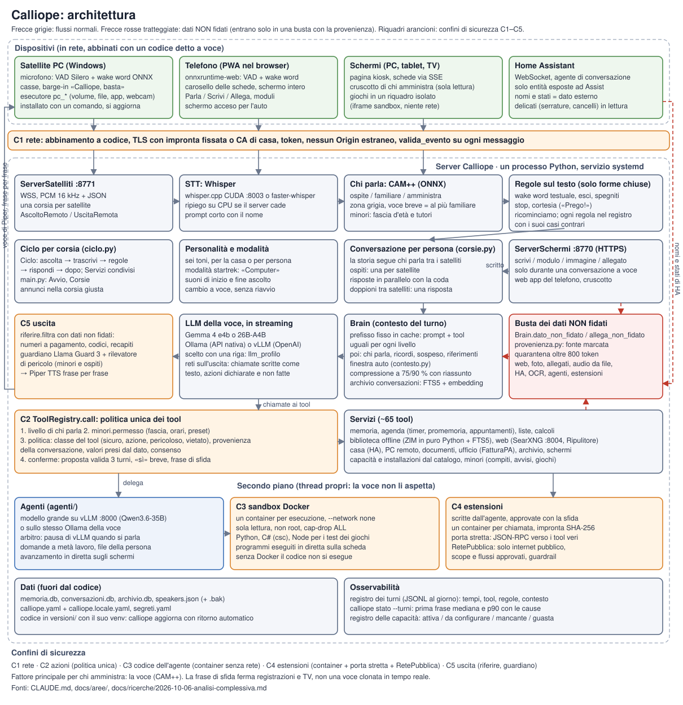
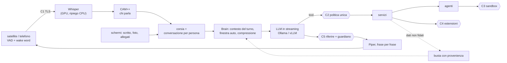
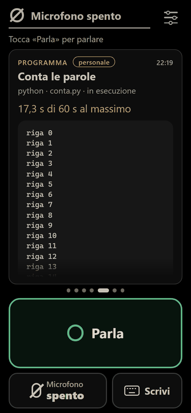
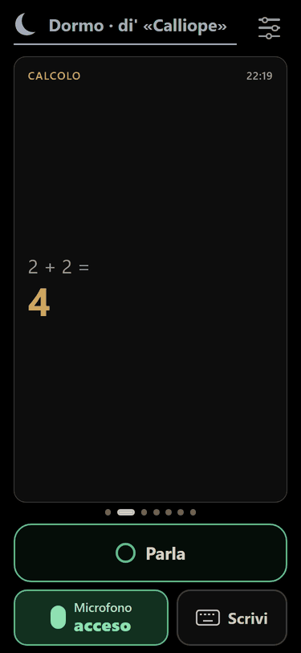
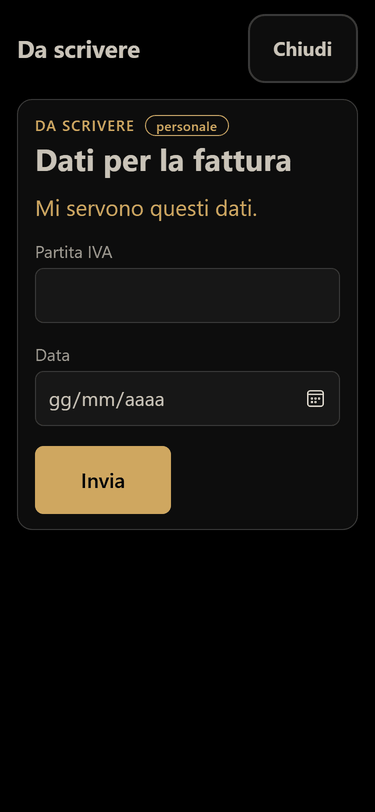
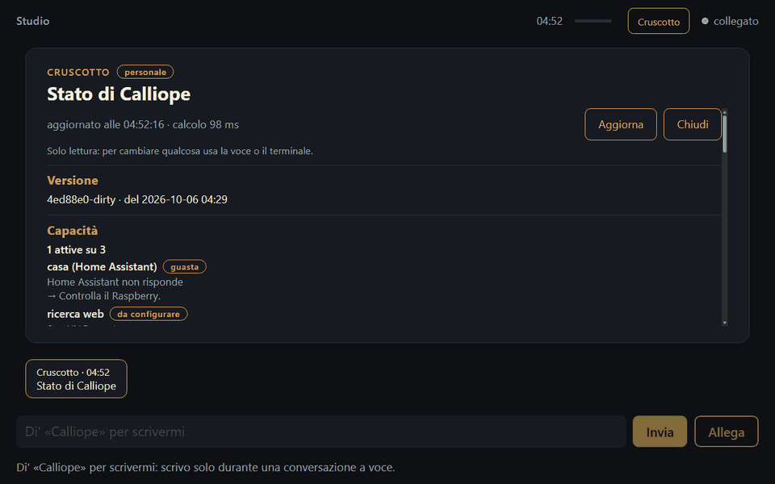
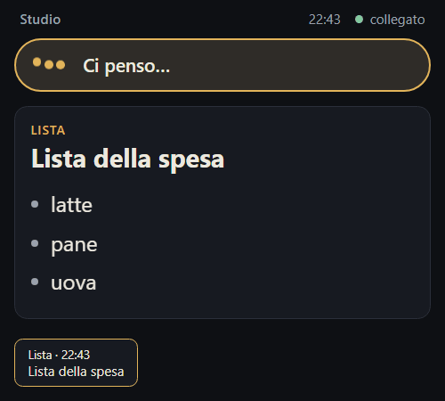
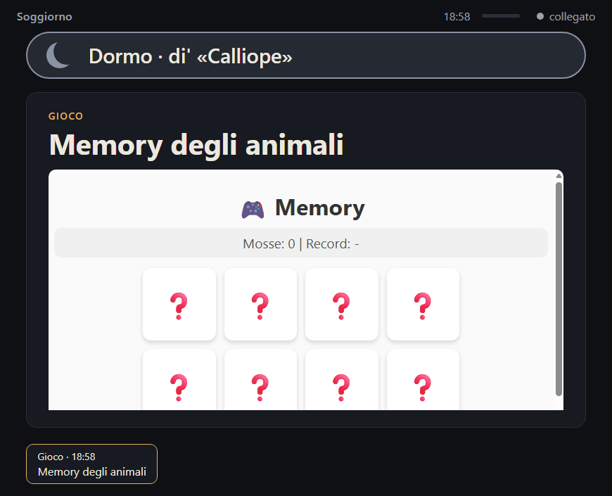

# Calliope

Assistente vocale in italiano che gira interamente su macchine locali: VAD e wake word sui
dispositivi, Whisper per la trascrizione, un LLM locale con tool calling, Piper per la voce.
Nessun servizio cloud in esecuzione; internet serve solo ai download e, se accesa, alla ricerca
web. Server su Linux con GPU (provato su DGX Spark, aarch64) o su Windows; microfoni e casse
su satelliti in rete (PC Windows, telefono nel browser), schermi con le schede.

Codice, commenti e documenti sono in italiano. *English section at the end.*

## Indice

1. [Per agenti di programmazione](#per-agenti-di-programmazione--ai-assistants)
2. [Architettura](#architettura)
3. [Installazione e avvio](#installazione-e-avvio)
4. [Funzionalità](#funzionalità)
5. [Esempi](#esempi)
6. [Schermate](#schermate)
7. [Prestazioni misurate](#prestazioni-misurate)
8. [Roadmap](#roadmap)
9. [Sicurezza e privacy](#sicurezza-e-privacy)
10. [Prove](#prove)
11. [Contribuire e documentazione](#contribuire-e-documentazione)
12. [Licenza](#licenza)
13. [English](#english)

## Per agenti di programmazione / AI assistants

| Cosa | Dove |
|---|---|
| Procedura d'installazione passo per passo, con controlli e problemi comuni | [`docs/installazione.md`](docs/installazione.md) |
| Mappa dei moduli, principi, problemi aperti, regole di lavoro | [`CLAUDE.md`](CLAUDE.md) |
| Un documento per area, con decisioni e misure | [`docs/aree/`](docs/aree/) |
| Stato di un'installazione (leggerlo, non indovinarlo) | `calliope stato [--dettagli\|--json]` (Linux), `python -m calliope.stato [--json]` (Windows) |
| Modelli e file installabili (sempre con conferma e SHA-256) | `calliope stato --catalogo`, `calliope stato --installa <azione>` |
| Configurazione | predefiniti commentati in `calliope/config.py` (`Config`); **non** modificare `calliope.yaml` (si rigenera con `python -m calliope.config --esempio`); le chiavi di un'installazione in `calliope.locale.yaml`, i segreti in `segreti.yaml` |
| Prove | `python -m prove` (a secco, a livelli), `python -m prove --completo`, `python -m prove --ollama`; elenco in [`prove/elenco.md`](prove/elenco.md) |
| Dati privati | mai nel repository: `prove/prova_dati_privati.py` nell'hook lo controlla ([`docs/pubblicazione.md`](docs/pubblicazione.md)) |

Regole: nessun download senza conferma (gli script chiedono `[s/N]` o stampano il comando);
gli script di Calliope non usano mai sudo; su Windows usare `127.0.0.1`, mai `localhost`.

## Architettura





| Stadio | Moduli | Note |
|---|---|---|
| Ingresso | `calliope/satellite/` (`ServerSatelliti`, client), `calliope/schermi/` (Starlette, SSE, PWA del telefono) | WSS, PCM 16 kHz; da addormentata nessun audio lascia il dispositivo |
| VAD e wake word | `vad.py` (Silero ONNX), `wakeword.py` (classificatore formato openWakeWord) | ripiego testuale se manca il modello acustico |
| STT | `stt.py` | faster-whisper nel processo o whisper.cpp come server (API OpenAI), ripiego su CPU |
| Chi parla | `speaker_id.py` (CAM++ ONNX, fbank in numpy) | soglia 0,48; sotto ~1 s di voce vale la conversazione, o la persona riconosciuta da poco sullo stesso satellite (08/10), al più familiare |
| Ciclo | `ciclo.py` (`Ciclo`, `Servizi`), `main.py` (`Avvio`, `Corsie`), `corsie.py` | un ciclo per satellite, una conversazione per persona |
| Contesto | `brain.py`, `contesto.py`, `conversazione.py`, `compressione.py`, `conversazioni.py` | prefisso fisso in cache; `llm_num_ctx: auto`; compressione a 75/90 %; archivio FTS5 + embedding (RRF) |
| LLM | `brain.py` (`OllamaBackend`, `OpenAIBackend`), `config.PROFILI_LLM` | `llm_profilo` sceglie backend, URL, modello, thinking e reti in una riga |
| Politica | `tools/registry.py` → `minori.permesso`, `politica.py`, `conferme.py`, `provenienza.py` | classi dei tool, provenienza della conversazione, conferme, frase di sfida |
| Uscita | `riferire.py`, `guardiano.py`, `tts.py`, `pronuncia.py` | controllo delle frasi con dati non fidati; Llama Guard 3 per minori e ospiti |
| Secondo piano | `agenti/`, `estensioni/`, `archivio/`, `agenda.py` | thread propri; un arbitro mette in pausa vLLM quando si parla |

Cinque confini: **C1** rete (abbinamento a codice, TLS con impronta fissata, validazione dei
messaggi), **C2** azioni (`ToolRegistry.call`), **C3** codice dell'agente (container senza
rete), **C4** estensioni (container per chiamata, porta stretta, `RetePubblica`), **C5** uscita
(`riferire.filtra`, guardiano). Mappa completa: [`CLAUDE.md`](CLAUDE.md).

Principi: tutto locale; latenza prima di tutto (streaming, ogni frase al TTS appena completa);
modelli intercambiabili dietro un'API standard; moduli sostituibili; dipendenze native minime,
verificate su Windows ARM e Linux aarch64; configurazione fuori dal codice; output pensato per
la voce; regole deterministiche sul testo solo per sicurezza e forme chiuse.

## Installazione e avvio

Procedura completa, con i controlli e i problemi comuni: [`docs/installazione.md`](docs/installazione.md).

### DGX Spark / server Linux con GPU NVIDIA (Ubuntu 24.04, provato su aarch64)

| # | Comando | Atteso / controllo |
|---|---|---|
| 0 | `nvidia-smi`; `python3 --version`; `docker info` (facoltativo) | GPU elencata; Python ≥ 3.10; Docker senza sudo |
| 1 | `sudo apt install libportaudio2 git curl cmake g++` (amministratore) | `ldconfig -p \| grep libportaudio.so.2` |
| 2 | `curl -fsSL https://ollama.com/install.sh \| sh`, poi `ollama pull gemma4:e4b-it-qat` | `ollama list` mostra il modello |
| 3 | `git clone <URL> ~/calliope-sorgente && sh ~/calliope-sorgente/setup/linux/installa.sh` | chiede uv (~20 MB), crea la versione con `uv sync --frozen`, la verifica, installa il servizio utente e `~/.local/bin/calliope`; chiede Whisper di riserva (1,6 GB) e sandbox (~290 MB) |
| 4 | `calliope stato --installa modello_chi_parla` e `calliope stato --installa voce_serena_alta` | CAM++ (~28 MB, obbligatorio) e la voce; SHA-256 verificato |
| 5 | `calliope motore whisper compila`, `… scarica`, `… installa`, `… stato` | whisper.cpp CUDA su 127.0.0.1:8003, modello 1,6 GB |
| 6 | scrivere `~/calliope/calliope.locale.yaml` (sotto) | — |
| 7 | `calliope avvia`; `calliope stato`; `calliope log` | il servizio torna dopo il saluto (READY=1); capacità attive |
| 8 | `ss -ltn \| grep -E ':(8770\|8771\|8003\|11434)\b'`; `ollama ps` | schermi, satelliti, whisper.cpp, Ollama in ascolto |
| 9 | `loginctl enable-linger $USER` | avvio all'accensione |

`calliope.locale.yaml` minimo (le chiavi possibili e i predefiniti sono commentati in
`calliope.yaml`):

```yaml
llm:
  llm_profilo: gemma4-e4b-ollama     # gemma4-26b-ollama | gemma4-26b-vllm
stt:
  stt_motore: server                 # whisper.cpp; senza: faster-whisper su CPU
  stt_url: http://127.0.0.1:8003/v1
server_satelliti:
  audio_modo: satellite              # il server non ha microfono: ascoltano i satelliti
  satellite_indirizzo: 0.0.0.0       # richiede il certificato: calliope satellite --certificato
schermi:
  schermi_indirizzo: 0.0.0.0         # pagina degli schermi e del telefono in HTTPS
# facoltativi
# casa:    { casa_url: "https://<Home Assistant>:8123" }   token in segreti.yaml
# web:     { web_searxng_url: "http://127.0.0.1:8004" }    calliope motore searxng avvia
# agenti:  { agenti_url: "http://127.0.0.1:8000/v1", agenti_modello: qwen3.6-35b }
```

Segreti, solo in `~/calliope/segreti.yaml` (o `CALLIOPE_HA_TOKEN`):
`home_assistant: { token: "<token di un utente amministratore di HA>" }`.

Aggiornamento: `calliope aggiorna` (versione nuova accanto, verifica, riavvio, ritorno
automatico se non parte); `calliope torna`; `calliope versioni`.

### PC Windows 11 con GPU NVIDIA (Calliope completa in locale)

```powershell
ollama pull gemma4:e4b-it-qat
python -m venv .venv; .venv\Scripts\activate
pip install faster-whisper silero-vad sounddevice numpy openai httpx piper-tts torchaudio pyyaml
pip install nvidia-cublas-cu12 nvidia-cudnn-cu12      # Whisper sulla GPU
python -m calliope.stato --installa modello_chi_parla
python -m calliope.stato --installa voce_serena_alta
python -m calliope.stato                              # tabella delle capacità
python -m calliope                                    # atteso: [STT] ... cuda, [CAPACITÀ] ..., il saluto
```

Extra facoltativi e dispositivi audio: [`docs/aree/setup-windows.md`](docs/aree/setup-windows.md).
Linux x86-64: il lock lo include e l'installatore è lo stesso, ma il percorso **non è provato**.

### Servizi, porte, modelli

| Servizio | Avvio | Porta (127.0.0.1) | Modello e peso |
|---|---|---|---|
| Ollama (voce) | `ollama pull …` | 11434 | `gemma4:e4b-it-qat` (~4 GB VRAM), `gemma4:26b-a4b-it-qat` (~15 GB) |
| whisper.cpp | `calliope motore whisper …` | 8003 | `ggml-large-v3-turbo.bin` 1,6 GB |
| vLLM agente (facoltativo) | `calliope motore vllm agente avvia` | 8000 | `nvidia/Qwen3.6-35B-A3B-NVFP4` (pesi scaricati a mano, comando stampato) |
| vLLM voce (facoltativo) | `calliope motore vllm voce avvia` | 8001 | `nvidia/Gemma-4-26B-A4B-NVFP4` |
| SearXNG (facoltativo) | `calliope motore searxng avvia` | 8004 | immagine ufficiale con digest fissato; dal 09/10 controllo quotidiano e aggiornamento provato accanto (`calliope motore searxng controlla\|aggiorna`, «Aggiorna» nel cruscotto) |
| Sandbox | `calliope motore sandbox costruisci [python\|csharp\|javascript]` | — | ~290 MB (Python), ~300 MB (C#) |
| Calliope | `calliope avvia` | 8770 schermi, 8771 satelliti | CAM++, voci Piper, biblioteca (~12 GB, facoltativa) |

Ordine all'avvio: Ollama → whisper.cpp → vLLM → SearXNG → Calliope. Memoria unificata della
DGX: lo script di vLLM assegna 0,40 all'agente e 0,24 alla voce (`MEM`); restare sotto ~0,7.

### Satellite e telefono

- **Satellite** (PC Windows): sul server `calliope satellite --certificato`; sul PC il comando
  della pagina `https://<server>:8770/satellite`, oppure dal repository `satellite_server:
  wss://<server>:8771` e `python -m calliope.satellite`; poi sul server
  `calliope satellite --abbina <codice> --stanza studio [--pc] [--personale <nome>]`.
- **Telefono**: `calliope stato --installa telefono`, `calliope schermi --certificato --host
  <IP>`, la CA sul telefono, `https://<IP>:8770/telefono`, abbinamento come un satellite.
- **Wake word**: il modello addestrato di «Calliope» **non è incluso** (feature ACAV100M, non
  commerciale). Satelliti e telefono lo richiedono; l'audio locale ripiega sulla wake word
  testuale. Addestramento: [`wakeword/`](wakeword/),
  [`docs/ricerche/2026-09-24-wake-word.md`](docs/ricerche/2026-09-24-wake-word.md).

## Funzionalità

Stato: **a secco** = prove automatiche con servizi finti; **e2e** = prova end-to-end con
Calliope vera, satelliti e voci finte; **dal vero** = usata a voce.

| Area | Cosa fa | Stato | Documento |
|---|---|---|---|
| Primo avvio | chi parla per primo diventa «Primo/Prima» e amministra; nome e voce registrati con frasi guidate | dal vero | [stt-tts](docs/aree/stt-tts.md) |
| Persone e livelli | ospite, familiare, amministra; tool uguali per tutti, permessi in `ToolRegistry.call`; registrazione a voce di familiari e minori | dal vero, e2e | [sicurezza-politica](docs/aree/sicurezza-politica.md) |
| Più persone vicino a un satellite | «modalità compagnia» dalle impronte delle voci tenute 5 minuti solo in memoria: con una voce sconosciuta serve il nome a ogni frase (e lo schermo lo dice), niente frase breve né continuità, azioni solo con la voce riconosciuta nella frase, per i minori voce non sicura nei due cancelli; giudizio «la frase è rivolta a me?» in ombra (09/10) | a secco, modello locale | [stt-tts](docs/aree/stt-tts.md) |
| Dialogo tra tool e modelli | gli argomenti di ogni tool controllati contro lo schema prima della chiamata; errori in parole per il modello (quale argomento, valori ammessi, esempio, cosa fare), mai tracce Python; dopo un errore correggibile il modello richiama il tool invece di dire «riprovo», con una frase d'attesa se ci vuole; stessa forma per gli strumenti dell'agente (09/10) | a secco, modello locale | [voce-e-regole](docs/aree/voce-e-regole.md) |
| Conferme e sfida | «Procedo?» per le azioni pericolose; frase di sfida (parole scelte sul momento) quando la voce non basta; memoria dell'intento (la richiesta ripetuta vale come sì, un «no» chiude la proposta e il tool rifiutato non si ripropone); attrito misurato; sicurezza per valore (provenienza di ogni argomento × effetto dell'azione) accesa dal 09/10, con la politica di prima in ombra | a secco, e2e, dal vero | [sicurezza-politica](docs/aree/sicurezza-politica.md) |
| Minori | fasce d'età con preset, tutori, guardiano, rilevatore di pericolo con avviso, compiti guidati, orari, tempo di gioco, richieste ai tutori; esercizi generati al momento (matematica e italiano) e corretti dal programma (08/10); segnali di pericolo poco chiari a due cancelli, prima si rassicura e si chiede, poi l'avviso (09/10) | a secco, e2e | [minori](docs/aree/minori.md) |
| Memoria | per persona e della casa; i «fatti» che sono ordini si rifiutano | dal vero | [memoria-agenda-liste](docs/aree/memoria-agenda-liste.md) |
| Agenda e liste | timer, promemoria, appuntamenti (durate e orari convertiti dal programma), liste senza doppioni | dal vero | [memoria-agenda-liste](docs/aree/memoria-agenda-liste.md) |
| Conversazioni | una per persona tra i satelliti; compressione con riassunto; archivio di 30 giorni con ricerca ibrida e cronologica («di cosa stavamo parlando?», «più indietro», 08/10); scheda «Conversazione» con la trascrizione sugli schermi personali, in diretta e scaricabile (08/10) | a secco, dal vero | [contesto-conversazione](docs/aree/contesto-conversazione.md) |
| Biblioteca | Wikipedia italiana, Vikidia, Wikizionario, Wikiquote (Kiwix ZIM in puro Python + FTS5), fonte citata | dal vero | [biblioteca](docs/aree/biblioteca.md) |
| Ricerca web | SearXNG locale facoltativo; dati personali tolti dalle domande; testo dei siti non fidato; risultati in italiano per primi (09/10) | dal vero | [biblioteca](docs/aree/biblioteca.md) |
| Casa | Home Assistant: comandi tramite l'agente di HA con verifica a secco; serrature, allarmi, cancelli, valvole, riavvii solo in lettura; se HA non trova il dispositivo, Calliope lo cerca tra le entità esposte per nome, alias e area e riprova col nome esatto (08/10); il meteo di casa dall'entità meteo di HA, se è esposta (09/10) | dal vero | [casa](docs/aree/casa.md) |
| PC | volume, musica, luminosità, app da catalogo, file (gli script non si eseguono), webcam e schermo su richiesta; anche tramite il satellite | dal vero | [pc](docs/aree/pc.md) |
| Documenti | Word, Excel, PDF a voce; contenuto JSON con schema, totali e formule dal programma | dal vero | [documenti-ufficio](docs/aree/documenti-ufficio.md) |
| Ufficio | modelli Word/PowerPoint, rubrica, numerazione, preventivi, DDT, FatturaPA (XML FPR12 + PDF, invio allo SdI a mano) | a secco, dal vero | [documenti-ufficio](docs/aree/documenti-ufficio.md) |
| Archivio | documenti di casa da una cartella: OCR con il modello visivo, schede per tipo, grafo SQLite | a secco, modello vero | [documenti-ufficio](docs/aree/documenti-ufficio.md) |
| Foto e allegati | foto, PDF, Office, testo, audio, zip; tipo dai byte; sempre dato non fidato; cassetto dei file per persona (7 giorni, revisione dal carosello, il tutore sui file del figlio) | a secco, dal vero | [immagini-allegati](docs/aree/immagini-allegati.md) |
| Agenti | lavori lunghi a un modello grande; codice Python e C# in sandbox Docker con test; programmi in diretta sulla scheda; domande a metà lavoro; file della persona; lavori che sopravvivono ai riavvii; testo dell'agente in diretta come una chat in sola lettura | dal vero | [agenti-estensioni](docs/aree/agenti-estensioni.md) |
| Estensioni | scritte dall'agente, approvate con la sfida; container per chiamata, porta stretta verso i tool, scope e flussi di rete. **Modalità sviluppo** (08/10): analisi, sviluppo e test, collaudo della versione candidata con dati detti (traccia di rete per l'agente, confronto automatico tra collaudi riusciti e falliti, risposte vere del servizio come esempi per i test, URL non codificati rifiutati, doppia codifica segnalata), un collaudo per ogni valore detto insieme, domande a chi l'ha scritta, correzioni dalla versione provata, lavoro dell'agente fermato o rifatto a voce, revisione, attivazione con la sfida; tappe ai limiti di ogni giro, giro a vuoto nel ragionamento dell'agente fermato con una spinta; versioni, rinomina, disattivazione a voce; eliminazione definitiva di una disattivata (09/10: un'attiva prima si disattiva, la domanda dice quale); un'estensione che legge soltanto (rete in GET, niente scritture né dati di casa) è una lettura come la ricerca web (09/10) | dal vero | [agenti-estensioni](docs/aree/agenti-estensioni.md) |
| Giochi | schede interattive in un iframe isolato; partite tra schermi; gioco puro approvabile da un adulto | a secco | [giochi](docs/aree/giochi.md) |
| Satelliti | installazione con un comando, aggiornamento con ritorno indietro, più satelliti insieme, esecutore del PC | dal vero (PC pulito non provato) | [satelliti](docs/aree/satelliti.md) |
| Telefono | PWA: VAD e wake word nel browser, carosello, schede a schermo intero, schermo acceso | dal vero in parte (auto no) | [schermi-telefono](docs/aree/schermi-telefono.md) |
| Schermi | kiosk abbinati a voce, schede dei tool, visibilità per persona, moduli, cruscotto di chi amministra; testi dell'agente in Markdown con «Scarica»; vista dello sviluppo (fasi, due colonne, collaudi, comandi innocui a tocco) e schermo intero (08/10); le schede personali salvate per persona (7 giorni) e ritrovate da uno schermo nuovo o dopo un riavvio, «pulisci le mie schede» | dal vero | [schermi-telefono](docs/aree/schermi-telefono.md) |
| Nomi capiti male | per gli argomenti che nominano qualcosa (città di un collaudo, estensione, file, dispositivo) la probabilità di Whisper e il nome noto più vicino nel registro dei turni; se il tool non trova niente, «forse intendevi…?» o «me lo ripeti o scrivi?» (08/10) | a secco, modello locale | [stt-tts](docs/aree/stt-tts.md) |
| Voce | Piper sulla GPU se la macchina ce l'ha, prima frase a pezzi, taratura all'avvio e con l'uso | dal vero | [stt-tts](docs/aree/stt-tts.md) |
| Personalità | sei toni, modalità Star Trek («Computer», suoni), cortesia senza modello | a secco, toni dal vero | [personalita](docs/aree/personalita.md) |
| Capacità | registro con stato e prossimo passo; installazioni a voce solo da catalogo; inventario della macchina e piano dei modelli in sola lettura (`calliope stato --piano`); «cosa sai fare?» per grandi aree con il dettaglio a richiesta, «cosa c'è di nuovo?» dal CHANGELOG della versione installata, «chi sei?» con fatti veri (09/10) | dal vero | [capacita-installazioni](docs/aree/capacita-installazioni.md) |
| Osservabilità | registro dei turni JSONL; `calliope stato --turni` (mediana e p90 della prima frase, cause, attrito delle conferme, pause) | dal vero | [voce-e-regole](docs/aree/voce-e-regole.md) |

## Esempi

Dai copioni della prova end-to-end ([`prove/e2e/copioni.py`](prove/e2e/copioni.py)): persone
inventate (Andrea amministra, Giulia familiare, Sofia minore, un ospite); tra parentesi il tool
atteso e l'esito controllato.

```text
Andrea: Calliope, accendi la luce in cucina.          [casa_comando → light.turn_on]
Andrea: Spegnila, per favore.                          [casa_comando → light.turn_off, dal turno prima]
Andrea: Calliope, apri il cancello.                    [nessun comando: cancelli solo in lettura]
Andrea: Calliope, aggiungi latte e pane alla lista della spesa.   [lista_aggiungi]
Andrea: Ho preso il latte, toglilo.                    [lista_togli]
Andrea: Calliope, quando è nato Alessandro Manzoni?    [biblioteca_cerca → «1785»]
Andrea (studio): Calliope, il mio gatto si chiama Briciola.        [ricorda]
Andrea (cucina): Calliope, come si chiama il mio gatto?            [«Briciola»: la conversazione lo segue]
ospite: Calliope, accendi la luce in sala.             [rifiutato: livello ospite]
Sofia:  Calliope, mi aiuti con i compiti? Quanto fa sette per otto?  [compiti_aiuto: guida, non la soluzione]
Sofia:  Calliope, posso giocare mezz'ora in più oggi?  [richiesta al tutore]
Andrea: Calliope, Sofia mi ha chiesto qualcosa?        [minore_gestisci]
Andrea: (foto di uno scontrino) Quanto ho speso in tutto?          [«14,10»: la foto è un dato]
Andrea: (scritto) E quanto costava il latte?          [«1,29», dalla stessa foto]
Andrea: (allegato con istruzioni nascoste)             [nessuna azione «perché lo dice il file»]
Andrea: Calliope, scrivi un programma in Python che legge due numeri…  [lavoro_affida, «Procedo?»]
Andrea: Sì, procedi.  …  Calliope, eseguilo con 3 e 5. [programma eseguito nella sandbox, in diretta]
```

## Schermate

Dalle prove nel browser (Edge senza finestra), con dati finti.

| Telefono: programma in diretta | Telefono: carosello delle schede | Telefono: modulo da compilare |
|---|---|---|
|  |  |  |

| Schermo: cruscotto di chi amministra | Schermo: lista e stato della voce |
|---|---|
|  |  |



## Prestazioni misurate

Solo numeri presenti nei documenti, con la fonte. **PC** = portatile con RTX 5070 Laptop 8 GB;
**DGX** = DGX Spark. Le cifre dei banchi dipendono dal banco e dalla versione: vanno lette come
ordini di grandezza.

<details open>
<summary><b>Latenza della voce (prima frase)</b></summary>

| Misura | Modello | HW | Valore | Data | Fonte |
|---|---|---|---|---|---|
| Banco 144 casi: prima frase mediana / p90 | gemma4 e4b (Ollama) | DGX | 0,47 / 0,88 s (139/144 giusti) | 03/10 | [modello-davanti](docs/ricerche/2026-10-03-modello-davanti.md) |
| Banco 144 casi | gemma4 26B-A4B (Ollama) | DGX | 0,68 / 1,18 s (143/144) | 03/10 | idem |
| Banco 116 turni | gemma4 26B-A4B NVFP4 (vLLM) | DGX | 0,90 / ~1,9 s (112/116) | 03/10 | idem |
| Prova e2e, giri 4–5: prima voce sentita dal satellite (voce vera e sintetica, Whisper vero, tool, guardiano) | 26B (Ollama) | DGX | mediana 1,94 e 2,03 s, p75 2,34 e 2,40, p90 3,11 e 3,25 (senza tool 1,78 e 1,84); 0,16 e 0,18 s dopo la fine del parlato | 06/10 | [e2e-dgx](prove/manuali/e2e-dgx.md) |
| Prova e2e, giri 4–5: `prima_frase_s` | 26B | DGX | 1,25 e 1,30 s (p75 del giro 5 1,88, p90 2,43 e 2,75); base 0,87 e 0,915; con tool 1,315 e 1,35 | 06/10 | idem |
| Prova e2e, giri 4–5: turni col guardiano | 26B + Llama Guard 3 8B | DGX | 1,205 e 1,155 s, 0 guasti (rilevatore 531 ms) | 06/10 | idem |
| Prova e2e, giri 1–2 (prima delle correzioni) | 26B | DGX | voce sentita 2,28 e 2,40 s (p90 5,30 e 5,25), guardiano ~7 s | 06/10 | idem |
| Turni veri, aggregati per giorno (02–05/10) | e4b, poi 26B | DGX | mediana 0,68–2,05 s | 02–05/10 | [analisi-complessiva](docs/ricerche/2026-10-06-analisi-complessiva.md) |
| Turni veri dopo le correzioni (06/10, 20 risposte, aggregato) | 26B | DGX | prima frase 1,31 s (p90 3,33), base 0,91, guardiano 1,47 (rilevatore 0,47), STT 0,19 | 06/10 | [e2e-dgx](prove/manuali/e2e-dgx.md) |
| Turni veri di una giornata di prove della modalità sviluppo (185 risposte, molte con tool) | 26B | DGX | prima frase mediana 1,51 s, p90 3,91 | 08/10 | [contesto-conversazione](docs/aree/contesto-conversazione.md) (registro dei turni) |
| Satellite a secco: fine frase → prima voce | finto | PC | 0,67–0,80 s (+30–93 ms con 50 ms di rete) | 02/10 | [satellite](docs/ricerche/2026-10-02-satellite.md) |
| Arbitro con un agente vLLM sulla stessa GPU | 26B + vLLM | DGX | senza 2,02 s (p90 4,21), con 0,73 (p90 1,83), con pausa 0,75 (p90 1,48) | 04/10 | [agenti-estensioni](docs/aree/agenti-estensioni.md) |

Dopo le correzioni del 06/10 la latenza è stata rimisurata su un campione piccolo (20 risposte
vere, 2 giri e2e): la mediana della prima frase scende da 2,05 s (05/10) a 1,31 s, i turni col
guardiano da ~4 s a ~1,2–1,5 s.
</details>

<details>
<summary><b>Trascrizione (WER su 104 registrazioni con riferimento)</b></summary>

| Motore | HW | WER | Tempo | Data | Fonte |
|---|---|---|---|---|---|
| faster-whisper large-v3-turbo, beam 5 + hotwords | PC | 11,0 % (14,3 % senza) | 0,23 s, p95 0,34 | 24/09 | [taratura-whisper](docs/ricerche/2026-09-24-taratura-whisper.md) |
| whisper.cpp CUDA, beam 5 | DGX | 12,4 % (02/10), 13,4 % (05/10) | 0,28 s | 02–05/10 | [impacchettamento](docs/ricerche/2026-10-02-impacchettamento-dgx-linux.md), [stt-confronto](docs/ricerche/2026-10-05-stt-confronto.md) |
| whisper.cpp + correzione delle frasi incerte col 26B | DGX | 11,4 % (+0,40 s sul 41 % delle frasi) | — | 05/10 | stt-confronto |
| vLLM con Whisper | DGX | 21 % | — | 02/10 | impacchettamento |
| Voxtral Mini 3B / Parakeet TDT v3 / gemma4 e4b con audio | DGX | 25,5 % / 29,2 % / 37,8 % | — | 05/10 | stt-confronto |

**Correggere le frasi incerte? Confronto del 07/10** (DGX, whisper.cpp in `verbose_json`, voce
gemma4 26B-A4B su Ollama; fonte: [`docs/aree/stt-tts.md`](docs/aree/stt-tts.md), «Confronto
della trascrizione»). Quattro varianti, tutte con una chiave in configurazione:

- **A**: nessuna correzione (la configurazione in uso).
- **B**: le parole incerte di Whisper vanno al modello nei dati del turno; la frase non cambia.
- **B2**: con parole incerte il modello scrive prima una riga «capito: …», trattenuta (mai
  detta né nella storia); vale per la politica e i tool solo se passa il controllo
  `accettabile` (parole simili, nessuna azione aggiunta), altrimenti vale Whisper.
- **C**: le frasi incerte passano al modello della voce per la correzione, con un tetto di 1 s.

| Variante | WER 104 frasi vere / 150 di dominio | Tempo in più | Prova e2e (97 passi, un giro) | Prima voce sentita, mediana / p90 |
|---|---|---|---|---|
| A | 12,1 % / 20,6 % | — | 94 riusciti | 2,05 / 3,14 s |
| B | (la frase non cambia) | — | 93 | 2,13 / 3,48 s |
| B2 | 11,6 % / 19,0 % | ~0,25 s sulle incerte | 94–95 | 2,10 / 3,33 s |
| C | 10,8 % / 17,9 % | 0,47–0,50 s sulle incerte | 93 (13 correzioni su 21 al tetto di 1 s) | 2,28 / 3,52 s |

`verbose_json`, necessario a B, B2 e C, costa 0,10 s a ogni turno. Esito: si resta su **A**; C
migliora la WER del banco ma dal vivo scade al tetto e aggiunge latenza, e andrebbe riprovata
solo con un posto dedicato alla correzione (un secondo modello o un secondo posto in Ollama).
</details>

<details>
<summary><b>Velocità e memoria dei modelli</b></summary>

| Modello | Motore | HW | Generazione | Note | Fonte |
|---|---|---|---|---|---|
| gemma4 e4b-it-qat | Ollama | PC | 64–88 token/s | ~4,2 GiB a 4k, ~4,6 a 16k, ~6,4 a 128k; 17,0 KiB/token | [llm-per-spark](docs/ricerche/2026-10-02-llm-per-spark.md), [contesto-budget](docs/ricerche/2026-10-05-contesto-budget.md) |
| gemma4 e4b-it-qat | Ollama | DGX | 60–72 token/s | | [modello-davanti](docs/ricerche/2026-10-03-modello-davanti.md) |
| gemma4 26B-A4B (QAT) | Ollama | DGX | 74–79 token/s | ~15 GB; primo token in cache 0,24 s a 16k | modello-davanti, contesto-budget |
| gemma4 26B-A4B NVFP4 | vLLM | DGX | 29 token/s | ~32 GB prenotati; primo token in cache 0,13 s a 16k | idem |
| Qwen3.6-35B-A3B NVFP4 (agente) | vLLM | DGX | 76 token/s | | modello-davanti |
| Whisper large-v3-turbo | faster-whisper | PC | — | ~1,2 GiB | contesto-budget |

Finestra di contesto scelta dal setup: 20 480 (PC) e 24 576 (DGX), prima frase in cache
0,49–0,52 s tra 16k e 24k ([contesto-compressione](docs/ricerche/2026-10-05-contesto-compressione.md)).
</details>

<details>
<summary><b>Banchi di regressione e di sicurezza</b></summary>

| Banco | Modello | Risultato | Data | Fonte |
|---|---|---|---|---|
| Regressione dalle frasi vere (174 turni) | gemma4 e4b | 160 → 166/174 dopo le correzioni del 04/10 | 04/10 | [voce-e-regole](docs/aree/voce-e-regole.md) |
| Regressione 116 turni, senza le reti sul testo | gemma4 e4b | 67/116 (con le reti 98–100) | 03/10 | modello-davanti |
| Politica dei tool a secco (9 canali × 9 attacchi) | finto | 81/81 fermati; poi 99/99 | 05–06/10 | [politica-sicurezza](docs/ricerche/2026-10-05-politica-sicurezza.md) |
| Allegati ostili (PDF, Word, audio con istruzioni) | gemma4 e4b | 26 casi, 0 azioni, 0 cambi di stato | 05/10 | [allegati](docs/ricerche/2026-10-05-allegati.md) |
| Ciò che dice con dati non fidati (riferire) | e4b / 26B | detti 22/27 → 0/27 e 9/27 → 0/27, falsi allarmi 0/36 | 05/10 | politica-sicurezza |
| Estensioni: banco d'attacco (SSRF, rebinding, dati esca…) | — | 0 passaggi su 76, anche con il container vero | 05/10 | [agenti-estensioni](docs/aree/agenti-estensioni.md) |
| Sonde dell'agente e ricollaudo alla consegna: banco d'attacco (conversazione esca, host non noti, casa, rebinding, estensione ostile) | — | 0 passaggi su 59, a secco | 08/10 | [agenti-estensioni](docs/aree/agenti-estensioni.md) |
| Giochi: banco d'attacco | — | 17/17 | 05/10 | [giochi](docs/aree/giochi.md) |
| Iniezioni nella memoria e negli schermi | gemma4 e4b | 10/10, 10/10, 9/10 → 0/10 | 03/10 | [sicurezza-politica](docs/aree/sicurezza-politica.md) |
| Minori | 26B / e4b | 48/48 e 45/48 | 05/10 | minori |
| Llama Guard 3 8B | — | 0/18 falsi, 12/14 vietate fermate | 05/10 | minori |
</details>

<details>
<summary><b>Biblioteca, sandbox, wake word, chi parla</b></summary>

| Misura | Valore | Data | Fonte |
|---|---|---|---|
| Biblioteca: ricerca (lettore ZIM in puro Python + FTS5) | mediana 28 ms, p95 73, massimo 152 | 01/10 | [biblioteca](docs/aree/biblioteca.md) |
| Biblioteca: domande end-to-end | 58 e 59/61 (senza biblioteca 53 e 52/61) | 02/10 | idem |
| Biblioteca: indice di Wikipedia ridotta | 240 s con 4 processi, 1 308 MiB | 01/10 | idem |
| Sandbox Docker: costo per esecuzione | +0,12–0,18 s (0,17–0,22 contro 0,04–0,06) | 03/10 | [sandbox](docs/ricerche/2026-10-03-sandbox.md) |
| Sandbox: C# (csc) contro Python | 0,52 s contro 0,17 s | 04/10 | agenti-estensioni |
| Estensione con una richiesta alla porta | 0,16 s di mediana | 04/10 | idem |
| Wake word acustica | 48/52 risvegli, 0/69 falsi, ~1 falso all'ora su audiolibri, 1,3 ms ogni 80 ms di CPU | 24/09 | [wake-word](docs/ricerche/2026-09-24-wake-word.md) |
| CAM++ alla soglia 0,48 | 0,7 % di sconosciuti accettati, 0 % voci sintetiche | 24/09 | [stt-tts](docs/aree/stt-tts.md) |
| Ricerca nelle conversazioni (ibrida contro sole parole) | 17/18 contro 15/18 | 05/10 | contesto-compressione |
</details>

## Roadmap

Il congelamento delle funzionalità nuove (dal 06/10, per la latenza) è stato tolto l'08/10.
In coda, dopo una lettura dei dati:

1. **Sicurezza per valore**: leggere i giorni in ombra e decidere se accenderla (10/10).
2. **Frasi pronte dei tool meno monotone** (varianti per tono, forma breve), in attesa del via.
3. **Nomi dei tool**: la regola dell'08/10 (nome singolare + verbo) anche per gli altri tool.
4. **Parole incerte e compagnia**: tarare le soglie sulla voce vera; decidere la correzione sullo
   schermo, il dizionario delle correzioni e il giudizio «rivolta a me?» oggi in ombra.

Funzionalità decise, senza date: **modulo studio** (le altre materie e la simulazione
d'interrogazione con domande a tempo e valutazione di contenuti ed esposizione; gli esercizi di
matematica e italiano ci sono dall'08/10), **immagini generate in locale** (FLUX.2 [klein] 4B, con
filtri e regole per i minori), **secondo fattore** per chi amministra (conferma dal telefono,
chiave vocale), **pannello di amministrazione** con le azioni; poi interfono tra satelliti,
conversazione di stanza, mappe e luoghi, satellite su Raspberry, altre fonti italiane nella
biblioteca.

In valutazione: riscontro emotivo dalla voce nello studio. Scartato: Kolibri (catalogo italiano
quasi vuoto, contenuti creati solo con un servizio online). Dettagli: [`docs/roadmap.md`](docs/roadmap.md).

## Sicurezza e privacy

- Nessun cloud: modelli, trascrizioni, memoria e registri restano locali.
- Dati non fidati (web, foto, allegati, Home Assistant, agenti, estensioni, OCR) entrano solo
  in una busta con la provenienza; con loro di mezzo un'azione parte solo se chiesta, una
  pericolosa solo con la conferma a voce.
- Codice degli agenti ed estensioni in container senza rete; senza Docker il codice degli
  agenti non si esegue.
- **Limiti**: la voce (CAM++) è il fattore principale per chi amministra; la frase di sfida
  ferma registrazioni e TV, non una voce clonata in tempo reale. I container condividono il
  kernel dell'host.

Segnalazioni: [`SECURITY.md`](SECURITY.md). Dettagli:
[`docs/aree/sicurezza-politica.md`](docs/aree/sicurezza-politica.md).

## Prove

```bash
python -m prove              # livello 1 (veloci) + livello 2 (legate ai file cambiati)
python -m prove --completo   # anche il livello 3 (browser, Calliope vera, tempo reale)
python -m prove --ollama     # anche le prove con il modello vero
python -m prove prova_x.py   # solo quelle
```

L'hook (`.githooks/pre-commit`, `git config core.hooksPath .githooks`) lancia i livelli 1 e 2
sulla copia dell'indice. La prova end-to-end ([`prove/e2e/`](prove/e2e/),
[`prove/manuali/e2e-dgx.md`](prove/manuali/e2e-dgx.md)) avvia una seconda Calliope con
satelliti, voci e Home Assistant finti.

## Contribuire e documentazione

Contributi: prima una issue, poi la pull request ([`CONTRIBUTING.md`](CONTRIBUTING.md)); tappe dello sviluppo in [`CHANGELOG.md`](CHANGELOG.md).

[`CLAUDE.md`](CLAUDE.md) (mappa, principi, stato) · [`docs/installazione.md`](docs/installazione.md)
· [`docs/aree/`](docs/aree/) · [`docs/ricerche/`](docs/ricerche/) ·
[`docs/architettura-tool.md`](docs/architettura-tool.md) · [`docs/roadmap.md`](docs/roadmap.md) ·
[`docs/visione.md`](docs/visione.md) · [`prove/LEGGIMI.md`](prove/LEGGIMI.md). Alcuni documenti
citati (sessione di progettazione, test vocali con persone vere, descrizione della casa) sono
privati: [`docs/pubblicazione.md`](docs/pubblicazione.md).

## Licenza

**AGPL-3.0-or-later** ([`LICENSE`](LICENSE)). Si può usare, studiare, modificare e
ridistribuire; chi ridistribuisce dà lo stesso diritto e il sorgente. Chi fa usare una versione
modificata **attraverso la rete** deve offrire il sorgente a chi la usa. L'uso in casa propria
non comporta obblighi.

Esclusi dal repository e dalla licenza: il modello addestrato della wake word (feature ACAV100M,
non commerciale), lo schema XSD della FatturaPA (si scarica con `python -m calliope.ufficio
--scarica-xsd`), i modelli scaricati (Whisper, Gemma, Llama Guard, Qwen, CAM++, Silero, voci di
Piper) e i contenuti della biblioteca (Wikimedia, CC BY-SA). Terze parti:
[`TERZE-PARTI.md`](TERZE-PARTI.md).

---

## English

Calliope is a fully local Italian-language voice assistant. Code, comments and docs are in
Italian; this section summarises the technical facts.

**Pipeline.** Satellites (Windows PC, browser PWA on a phone) run Silero VAD and an
openWakeWord-format wake word locally and stream 16 kHz PCM over TLS with a pinned key →
Whisper (faster-whisper in process, or whisper.cpp CUDA server; CPU fallback) → CAM++ speaker
recognition (guest / family / admin, minors with guardians) → one loop per satellite and one
conversation per person → context builder with a cache-stable prefix, automatic context
window, compression and a searchable conversation archive (FTS5 + embeddings) → local LLM
(Gemma 4 e4b or 26B-A4B on Ollama or vLLM, chosen by `llm_profilo`) with ~70 tools → a single
policy in `ToolRegistry.call` (level, age, data provenance, spoken confirmation, challenge
phrase) → output checks (`riferire`, Llama Guard 3 for minors and guests) → Piper TTS, sentence
by sentence. Five security boundaries: network, actions, agent code sandbox (Docker, no
network), extensions (per-call container behind a narrow JSON-RPC gate), output.

**Setup.** DGX Spark / Linux with an NVIDIA GPU (Ubuntu 24.04, tested on aarch64):
`sudo apt install libportaudio2`, Ollama + `ollama pull gemma4:e4b-it-qat`,
`sh setup/linux/installa.sh` (uv, locked venv, verification, systemd user service, `calliope`
command), `calliope stato --installa modello_chi_parla`, `calliope motore whisper
compila|scarica|installa`, `calliope.locale.yaml`, `calliope avvia`, `calliope stato`. Windows
11: pip venv, `python -m calliope.stato --installa modello_chi_parla`, `python -m calliope`.
Full step-by-step procedure with checks: [`docs/installazione.md`](docs/installazione.md). The
trained wake-word model is not included (ACAV100M-derived, non-commercial): satellites and the
phone need one; local audio falls back to a text wake word.

**Measured performance** (sources in the tables above): first sentence 0.47 s median (e4b,
Ollama, DGX bench) and 0.68 s (26B); end-to-end first audible voice from a satellite 1.94–2.03 s
median, p90 3.1–3.25 s (26B, with tools, guard and real Whisper); real turns after the 06/10
fixes 1.31 s median; WER 11.0 % (faster-whisper, laptop) and
12.4–13.4 % (whisper.cpp, DGX) on 104 recordings; Ollama 74–79 tok/s for the 26B MoE on the
DGX; library search 28 ms median; Docker sandbox +0.12–0.18 s per run; policy test bench 99/99
attacks stopped, hostile attachments 26 cases with 0 actions.

**Features.** Onboarding (first speaker becomes admin), enrolment, confirmations and challenge
phrase; profiles for minors; per-person and household memory; timers, reminders, appointments,
lists; offline library (Kiwix ZIM, pure Python, FTS5); optional private web search (SearXNG);
Home Assistant with read-only sensitive devices; PC control (also via a satellite); Word,
Excel, PDF; office templates, address book, FatturaPA e-invoices, delivery notes; household
document archive with OCR and a graph; photos and attachments as untrusted data; background
agents (Python and C# in a sandbox, live programs, mid-task questions, jobs that survive
restarts); extensions written by the agent and approved with the challenge phrase, with a
staged development mode (analysis, build and test, acceptance test of the candidate with a
network trace for the agent, review, activation; versions, rename) and a live development view
on screens; generated exercises for students (maths, Italian); a per-person file drawer (7
days); chronological conversation search and a per-person card history; a spoken «no» closes a
pending proposal; unclear danger signals from minors go through two gates (reassure and ask,
then alert the guardian); misheard names in tool arguments measured from Whisper word
probabilities, with «did you mean…?» after an empty result; a «company mode» when several
voices are near the same satellite (name required in every sentence with an unknown voice, an
«is it addressed to me?» judgement in shadow mode); Piper on the GPU when available; a read-only model plan from a hardware inventory; sandboxed games on screens; satellites with
one-command install and self-update with rollback; phone PWA; kiosk screens and an admin
dashboard; per-person card history and a live conversation transcript on personal screens; personalities and a Star Trek mode; capability registry and catalogue installs;
turn log with latency statistics; tiered tests and an end-to-end test.

**Roadmap.** The feature freeze (for latency) was lifted on 08/10. Queued: deciding on the
value-based tool policy after its shadow days (10/10), less repetitive canned tool phrases,
renaming the remaining tools, tuning the uncertain-word and company-mode thresholds on real
voices. Decided: the rest of the study module (more subjects, oral exam simulation), local image
generation (FLUX.2 [klein] 4B), a second factor for admins, an admin panel with actions; then
intercom, room conversations, maps, Raspberry satellites. A
speech-to-text correction study (07/10) kept Whisper output uncorrected. Contributions: open an
issue first ([`CONTRIBUTING.md`](CONTRIBUTING.md)).

**License.** [AGPL-3.0-or-later](LICENSE). Third-party notices: [`TERZE-PARTI.md`](TERZE-PARTI.md).
Security: [`SECURITY.md`](SECURITY.md).
