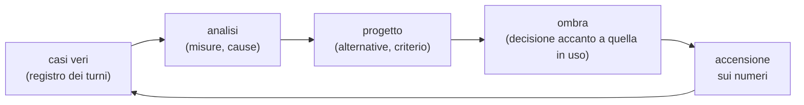

# Come lavoriamo: dai casi veri alle decisioni

*Il metodo con cui nascono e cambiano le scelte di Calliope (10/10/2026), con quattro esempi. Le
persone degli esempi hanno nomi di fantasia e i casi sono riscritti senza i dettagli della casa vera;
i numeri sono quelli dei documenti citati. L'architettura che ne è uscita è in
[`docs/architettura.md`](architettura.md), le decisioni in [`docs/decisioni/`](decisioni/).*

## Il ciclo

1. **Casi veri.** Calliope scrive un registro dei turni (`registro/`, un file JSONL al giorno, sul
   server): tempi di ogni fase, chi parla e con quale sicurezza, tool ed esiti, regole scattate,
   decisioni in ombra. Il registro resta in casa; per l'analisi se ne leggono solo i campi senza
   testo, con persone e satelliti resi anonimi. Un difetto parte da un turno preciso («quella sera uno
   stop ha fatto perdere la proposta»), non da un'impressione.
2. **Analisi.** Si misura quanto è frequente e da dove viene: la causa vera, non il sintomo. Le
   analisi stanno in [`docs/ricerche/`](ricerche/), con il metodo e i limiti scritti.
3. **Progetto.** Si scrivono le alternative con i loro numeri, e un **criterio per accendere**
   deciso prima di vedere i risultati. Le decisioni di chi amministra entrano nel documento.
4. **Ombra.** Se la modifica può eseguire o fermare un'azione, si calcola accanto alla decisione in
   uso e si scrive nel registro senza effetto ([0019](decisioni/0019-ombra-prima-di-accendere.md)).
5. **Accensione sui numeri**, con una riga di `calliope.locale.yaml` per tornare indietro. Dopo, la
   decisione di prima resta in ombra al contrario.

Due regole tengono il ciclo onesto. **Prima la classe, poi il caso**: una correzione che sa solo del
caso visto («notizie senza domanda») si rifiuta, e si cerca il meccanismo generale. **Prima di
aggiungere una regola si cerca dove lo stesso ingresso è già giudicato**, e si cambia quella.

## Esempio 1: la doppia codifica dell'URL nella modalità sviluppo

*Fonti: [agenti-estensioni](aree/agenti-estensioni.md), giri 3 e 5 e «Diagnosi dei collaudi»;
[`2026-10-08-sonde-agente.md`](ricerche/2026-10-08-sonde-agente.md);
decisioni [0016](decisioni/0016-modalita-sviluppo-con-collaudo.md) e [0017](decisioni/0017-ricollaudo-e-sonde.md).*

Bianca chiede a voce un'estensione del meteo per città. La modalità sviluppo è appena nata: l'agente
scrive il codice, Calliope lo collauda con le città che Bianca dice, poi lo si approva.

**Primo giro.** Una città di una parola va, «Pratofiorito Maggiore» no. L'estensione costruiva l'URL
del servizio a mano e lo spazio la rompeva; il servizio rispondeva «collegamento non riuscito» in
15 ms, l'estensione lo traduceva in «non ho trovato il meteo», e all'agente arrivava solo quella
frase. Nella sandbox l'agente non ha rete, e i suoi test usavano un servizio finto che rispondeva a
qualunque URL: cinque correzioni alla cieca, due diagnosi sicure e sbagliate.

*Analisi*: l'agente non vedeva la causa. *Decisione*: la porta delle estensioni rifiuta un URL non
codificato e lo dice («c'è uno spazio nel parametro "name"»), con la stessa regola nel servizio finto
dei test; all'agente arriva la **traccia di rete** del collaudo.

**Secondo giro, la sera.** Le città di due parole ancora non vanno. Questa volta l'estensione
codificava il nome **due volte** (`quote_plus` e poi `urlencode`): lo spazio diventava `%2B`, cioè
un «+» letterale, e il servizio rispondeva vuoto. L'agente **aveva** la traccia con quell'URL e la
risposta di 32 byte, e ha scritto: «the trace shows %2B which is correct for space». I suoi test
passavano 24 su 24, contro un servizio finto scritto da lui.

*Analisi*: la traccia non basta se il modello la legge male, e i test dell'agente misurano il suo
servizio immaginario. Una regola sul caso («avvisa della doppia codifica») è stata aggiunta, ma solo
come **avviso**: un `%2B` può essere voluto («C++»). La domanda di chi amministra ha spostato il
lavoro: «e se domani il problema fosse un altro?».

*Decisione generale*: due meccanismi che non sanno nulla della codifica:

- il **confronto** tra collaudi riusciti e falliti verso lo stesso servizio (parametri com'erano
  scritti e decodificati, risposta), messo davanti all'agente;
- le **risposte vere** del servizio salvate come esempi per i test dell'agente.

Misura con un modello di prova: con la sola traccia 0 casi su 4 diagnosticati, con il confronto 4 su
4. E poi, la stessa notte: il **ricollaudo** della versione consegnata con i casi falliti della
persona prima di dire «è pronto», e le **sonde** solo verso host già visti nel collaudo, perché
l'agente provava l'URL scritto da lui, non quello costruito dal codice.

## Esempio 2: il falso allarme al telefono e i due cancelli

*Fonti: [minori](aree/minori.md), «Pericolo poco chiaro: il giro a due cancelli»;
[`2026-10-09-piu-persone.md`](ricerche/2026-10-09-piu-persone.md); decisione
[0025](decisioni/0025-minori-due-cancelli.md).*

Una sera Matteo, che amministra, usa Calliope dal telefono in un locale rumoroso. Con lui c'è un
amico, la cui voce non è registrata. Luca, il figlio tredicenne di Matteo, è registrato anche lui, ma
non è lì.

L'amico parla. La sua voce prende sul profilo di Luca un punteggio appena sotto la soglia: è nella
zona incerta, e nella zona incerta Calliope sceglie il **profilo più protetto**, cioè il minore. Una
sua frase di mezzo secondo, una battuta, viene giudicata **pericolo** dal rilevatore. Scattano la
protezione (i numeri d'aiuto) e un avviso urgente al tutore, che Calliope dice a voce sullo stesso
telefono poco dopo. Luca non c'era.

*Analisi.* Nessun componente aveva sbagliato da solo: il profilo più protetto è la scelta giusta con
una voce incerta, e un rilevatore di pericolo per un minore deve essere sensibile. Il problema era
che un segnale poco chiaro andava dritto all'avviso. Misura su frasi di fantasia: il rilevatore
diceva pericolo su 10 frasi poco chiare su 12 («Addio.», «Che palle, mi sparo.»).

*Progetto.* La decisione di chi amministra: «un minore venga prima rassicurato, poi si cerca di
capire se il problema è reale; solo superato il secondo cancello si manda la notifica», con una
condizione: un falso negativo su un minore in pericolo è peggio di un falso positivo. Quindi:

- un segnale **esplicito** («voglio morire», «mi picchia») va come prima, subito;
- un segnale **poco chiaro** apre il primo cancello: una frase che rassicura e chiede, senza parlare
  di allarmi;
- la risposta decide il secondo: conferma (anche una reticenza) → avviso urgente; smentita → niente;
  silenzio → un avviso non urgente; due segnali poco chiari in mezz'ora → confermato;
- l'avviso non si dice mai a voce vicino al minore.

*Senza ombra*, questa volta, perché il rischio era nel non avvisare: si è acceso subito, con le
scelte prudenti segnate «da confermare» e da rimisurare. Misure: esplicite giudicate acute 13 su 13,
poco chiare giudicate dubbie 11 su 12 («Aiuto.» resta acuto, e va bene così). Il giorno stesso
l'analisi di quando parlano più persone ha aggiunto la **compagnia**: con più voci vicino al
satellite la voce di un minore non è mai «sicura», e una frase sotto un secondo non eredita il minore
della conversazione. Con quella regola, la battuta dell'amico sarebbe stata quella di un ospite.

## Esempio 3: la sicurezza per valore, dall'attrito ai numeri dell'ombra

*Fonti: [`2026-10-07-sicurezza-per-valore.md`](ricerche/2026-10-07-sicurezza-per-valore.md);
[sicurezza-politica](aree/sicurezza-politica.md), fasi 1–4; decisione
[0015](decisioni/0015-sicurezza-per-valore.md).*

La politica unica dei tool funzionava: 99 attacchi su 99 fermati a secco. Ma chi la usava ogni giorno
la sentiva: «più il contesto è complesso, più la sicurezza non riesce a stare dietro». Un pomeriggio
Elena ha impiegato dieci turni e quasi due minuti per aprire un foglio Excel che Calliope aveva appena
creato: sette domande, una frase di sfida, due errori del tool e un «Fatto.» falso, perché nella
conversazione c'era una foto («C'è di mezzo una foto, quindi chiedo a te»).

*Analisi* (registri di tre giorni): **15,8 domande ogni 100 turni**, di cui **28 su 41 inutili** (68 %),
nessun attacco vero. Il problema non era che la politica fosse deterministica ma che fosse
**grossolana**: decideva per conversazione («c'è un dato di mezzo, chiedo»), non per argomento né per
effetto, e non ricordava cosa la persona aveva già chiesto.

*Progetto.* Si sono lette le proposte della letteratura (CaMeL, FIDES, MELON, i giudici LLM) e si è
presa l'idea, non l'architettura: niente secondo modello che pianifica (troppo lento per la voce e
troppo debole a 4–26B), ma la **provenienza di ogni argomento** (detto dalla persona, scelto da un
elenco, preso dal dato…) incrociata con l'**effetto** dell'azione (da E0 lettura a E4 sicurezza
fisica), e una **memoria dell'intento** (ripetere la richiesta vale come sì; un «no» chiude). Criterio
scritto prima: nessuna esecuzione con un bersaglio preso dal dato, attrito simulato non oltre 3.

*Ombra*, due giorni:

| Giorno | Turni | Attrito vero | Eseguite con bersaglio dal dato | Attrito simulato |
|---|---|---|---|---|
| 08/10 | 251 | 6,4 | 0 | 0,0 |
| 09/10 | 126 | 3,2 | 0 | 1,6 |

Ogni decisione diversa dalla politica in uso è stata letta a mano. *Accensione* il 09/10 sera, con la
politica di prima in ombra al contrario e una riga per tornare indietro. La stessa sera l'analisi
delle regole (esempio 4) ha trovato due regressioni (un'azione d'installazione senza la sfida della
sua classe), corrette subito: la sfida della classe è diventata un pavimento che nessuna matrice
scavalca.

## Esempio 4: l'analisi delle regole e la macchina a stati

*Fonti: [`2026-10-01-regole-deterministiche.md`](ricerche/2026-10-01-regole-deterministiche.md),
[`2026-10-09-regole-incongruenze.md`](ricerche/2026-10-09-regole-incongruenze.md),
[`2026-10-10-macchina-stati.md`](ricerche/2026-10-10-macchina-stati.md); decisioni
[0008](decisioni/0008-regole-deterministiche-solo-in-forma-chiusa.md),
[0022](decisioni/0022-macchina-a-stati-del-dialogo.md), [0023](decisioni/0023-tabella-dichiarativa-dei-permessi.md).*

Il 01/10 un inventario delle regole sul testo aveva fissato il principio 10: il significato lo decide
il modello; una regola è ammessa solo per sicurezza, conversioni, ciò che il modello non vede e forme
chiuse dette per intero. La misura che l'ha deciso: dopo «Lo apro?», con una riga di contesto il
modello apriva il file 24 volte su 24 quando la persona acconsentiva e 0 su 27 quando no; la regola
«sì → apri» apriva anche su «Sì, ma prima aggiungi la data».

Otto giorni dopo le regole erano cresciute insieme alle funzioni, e la sera del 09/10, dopo una
giornata di correzioni sui casi veri, chi amministra ha chiesto un giro sulle regole stesse: ce ne
sono che si pestano i piedi e ne genereranno altre?

*Analisi* (registro 02–09/10, 1437 turni, solo campi senza testo, e le stesse frasi passate da tutte
le regole del sì e del no): **276 nomi** di regole, 132 scattate almeno una volta, 180 mai. Prese una
per una erano quasi tutte ragionevoli; i problemi nascevano dove più regole guardavano lo stesso
ingresso. «Questo sì basta?» si decideva in **sei punti** con criteri diversi; sei lessici del sì e
del no non coincidevano («Sì, non c'è problema» non era un consenso per uno di loro); uscite e stop
venivano valutati prima della proposta, così che Sara, dicendo «Sì, puoi andare» dopo «Lo apro?»,
avrebbe fatto addormentare Calliope senza aprire il file (esempio costruito); i dati del turno si
contraddicevano fino a oltre 6000 caratteri. Il progetto del giorno dopo ha trovato nel registro anche un
caso vero dello stesso tipo: uno stop detto mentre Calliope stava facendo una proposta l'ha fatta perdere.

*Progetto* (10/10). Chi amministra ha chiesto di «razionalizzare una macchina a stati più coerente» e
di verificare che tutti gli stati restassero gestiti. Ne sono usciti dieci stati che già oggi
rischiano di non essere gestiti, e due decisioni: la macchina **non interpreta il linguaggio** (tiene
lo stato, i vincoli e le priorità, e valida), il modello interpreta la risposta in forma strutturata
con un tool e una corsia veloce riconosce solo le forme chiuse; gli scambi tra macchina e modello
**non entrano nella storia** della conversazione. Poi il «percorso corto»: in ombra solo le parti che
decidono se un'azione si esegue (l'interprete e il consenso unico), il resto acceso direttamente; e
una **tabella dichiarativa dei permessi** che raccoglie in un posto ciò che oggi è sparso in cinque
moduli.

*Stato*: in corso. Il passo 0 scrive una prova per ciascuno dei dieci stati a rischio; il passo 1
mette l'interprete in ombra, con il confronto nel registro.

## Cosa resta uguale in tutti gli esempi

- Un caso vero apre il lavoro; il lavoro si chiude su una **classe** di casi, con una prova per i casi
  contrari.
- I numeri si leggono con un criterio deciso prima.
- Nel repository i casi si raccontano riscritti, con nomi di fantasia; i registri restano in casa
  ([`docs/pubblicazione.md`](pubblicazione.md)).
- Ogni documento d'area è un diario datato: una scelta superata non si cancella, si segna come
  storica.
