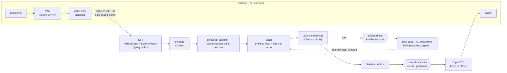

# Architettura di Calliope: com'è fatta e perché

*Documento d'ingresso per chi arriva al progetto (10/10/2026). Spiega le scelte di fondo e rimanda,
per ogni parte, al documento d'area con le misure e i casi veri ([`docs/aree/`](aree/)), alle
ricerche che hanno portato alle decisioni ([`docs/ricerche/`](ricerche/)) e al registro delle
decisioni ([`docs/decisioni/`](decisioni/)). Il metodo di lavoro, dai casi veri all'accensione di una
funzione, è in [`docs/analisi.md`](analisi.md). In fondo, un riassunto in inglese.*

## Indice

1. [Che cos'è, e i vincoli](#1-che-cosè-e-i-vincoli)
2. [La pipeline della voce](#2-la-pipeline-della-voce)
3. [Il cervello: Brain, tool e dati del turno](#3-il-cervello-brain-tool-e-dati-del-turno)
4. [Contesto e conversazioni](#4-contesto-e-conversazioni)
5. [Sicurezza](#5-sicurezza)
6. [Agenti, estensioni e modalità sviluppo](#6-agenti-estensioni-e-modalità-sviluppo)
7. [Satelliti, telefono e schermi](#7-satelliti-telefono-e-schermi)
8. [Configurazione e installazione](#8-configurazione-e-installazione)
9. [Osservabilità](#9-osservabilità)
10. [Prove](#10-prove)
11. [La direzione: la macchina a stati del dialogo](#11-la-direzione-la-macchina-a-stati-del-dialogo)
12. [Dove leggere di più](#12-dove-leggere-di-più)
13. [Summary in English](#13-summary-in-english)

## 1. Che cos'è, e i vincoli

Calliope è un'assistente vocale **in italiano** che gira **interamente su macchine di casa**. Una
famiglia le parla da più stanze: lei riconosce chi parla, conversa, ricorda, consulta una biblioteca
offline, comanda la casa e i PC, scrive documenti e, per i lavori lunghi, fa lavorare degli agenti in
secondo piano. Risponde solo quando sente il suo nome (la wake word è «Calliope»).

Quattro vincoli spiegano quasi tutte le scelte:

| Vincolo | Conseguenza | Decisione |
|---|---|---|
| **Niente cloud**: voce, trascrizione e modelli non escono di casa; internet è un extra | modelli locali, biblioteca offline, ricerca web con un motore locale | [0001](decisioni/0001-tutto-in-locale.md), [0021](decisioni/0021-ricerca-web-searxng.md), [0024](decisioni/0024-niente-internet-se-non-serve.md) |
| **Voce**: conta il tempo tra la fine della frase e la prima parola di Calliope | streaming frase per frase, prompt stabile in cache, latenza misurata ogni giorno | [0007](decisioni/0007-streaming-e-latenza.md) |
| **Hardware da 8 GB a 128 GB**: un portatile con una RTX da 8 GB di VRAM, una DGX Spark (aarch64, memoria unificata), domani un PC RTX Spark con Windows su ARM | modelli intercambiabili con una riga, modelli MoE dove la banda di memoria è il limite | [0002](decisioni/0002-llm-dietro-api-intercambiabile.md), [0010](decisioni/0010-server-di-casa-e-satelliti.md) |
| **Windows su ARM** | moduli sostituibili, dipendenze native verificate una per una, nessuna libreria senza wheel ARM | [0003](decisioni/0003-moduli-sostituibili.md), [0005](decisioni/0005-python.md) |

Oggi Calliope gira sulla **DGX Spark** come servizio Linux; il portatile e il telefono sono satelliti.
Il codice è un package Python (`calliope/`), la configurazione è fuori dal codice
([0004](decisioni/0004-configurazione-fuori-dal-codice.md)). La visione completa, con musica,
allarme e famiglia, è in [`docs/visione.md`](visione.md).

## 2. La pipeline della voce

Il percorso, stadio per stadio (i moduli sono in `calliope/`; dettagli in
[stt-tts](aree/stt-tts.md) e [voce-e-regole](aree/voce-e-regole.md)):

- **VAD e wake word** girano sul dispositivo che ha il microfono (`vad.py`, `wakeword.py`). La wake
  word è un piccolo classificatore nel formato di openWakeWord, addestrato sul nome: 48 risvegli su 52,
  nessun falso su 69 frasi, ~1 falso all'ora su audiolibri, 1,3 ms di CPU ogni 80 ms. Da addormentato,
  il satellite non manda nulla in rete. Il modello addestrato non è nel repository (le feature usate
  per addestrarlo hanno una licenza non commerciale); senza, si ripiega su una wake word testuale.
- **STT**: Whisper large-v3-turbo. Sulla DGX gira **whisper.cpp** come server CUDA (WER 12–13 % su
  104 registrazioni vere, 0,28 s); sul portatile faster-whisper; il ripiego su CPU c'è sempre
  (`stt.py`). La trascrizione non si corregge col modello ([0020](decisioni/0020-trascrizione-senza-correzione.md)).
- **Chi parla**: un'impronta della voce con CAM++ in ONNX (`speaker_id.py`), soglia 0,48 (0,7 % di
  sconosciuti accettati, nessuna voce sintetica). Il livello della persona (ospite, familiare, chi
  amministra, minore) viene da qui. Sotto ~1 s di voce l'impronta non decide e vale la conversazione
  in corso; con più voci vicino allo stesso satellite scatta la **modalità compagnia** (`compagnia.py`):
  con una voce sconosciuta serve il nome in ogni frase.
- **LLM in streaming**: il testo del modello va al **divisore di frasi**; ogni frase completa va subito
  al TTS e si sintetizza la successiva mentre si riproduce quella corrente
  ([0007](decisioni/0007-streaming-e-latenza.md)).
- **TTS**: Piper, con una voce femminile italiana, sulla GPU se la macchina ce l'ha (`tts.py`); gli
  inglesismi hanno una pronuncia corretta (`pronuncia.py`). Le risposte sono pensate per la voce:
  brevi, senza markdown, elenchi, emoji o URL.
- **Half-duplex con il barge-in sul nome**: mentre Calliope parla non si trascrive (sentirebbe sé
  stessa), ma la wake word resta accesa e «Calliope, basta» la interrompe; dove l'eco è già cancellata
  (cuffie, microfono del portatile) anche la voce di una persona registrata
  ([0006](decisioni/0006-half-duplex-e-barge-in.md)).

## 3. Il cervello: Brain, tool e dati del turno

`calliope/brain.py` (`Brain`) costruisce la richiesta al modello, legge lo streaming, esegue i tool e
ripete fino alla risposta finale. Le scelte principali (dettagli in [voce-e-regole](aree/voce-e-regole.md)
e [`architettura-tool.md`](architettura-tool.md)):

- **Modello intercambiabile**: due backend, l'API nativa di Ollama (predefinita, l'unica che rispetta
  la finestra di contesto `num_ctx`) e l'API compatibile OpenAI (per vLLM e come ripiego). Il modello
  della voce si sceglie con una riga, `llm_profilo`; oggi sulla DGX è gemma4 26B-A4B (MoE) su Ollama
  ([0002](decisioni/0002-llm-dietro-api-intercambiabile.md)).
- **Prefisso fisso**: prompt di sistema e schemi dei tool sono identici byte per byte per ogni persona
  e livello, così Ollama li tiene in cache. Il modello vede **tutti i tool** (72 sulla DGX); il
  permesso lo decide il codice a ogni esecuzione in `ToolRegistry.call`
  ([0009](decisioni/0009-tool-uguali-per-ogni-livello.md)).
- **Dati del turno**: ciò che cambia (chi parla, ricordi, agenda, una proposta in sospeso, lo stato
  della modalità sviluppo) va in messaggi brevi **subito prima della domanda**, mai nel prefisso.
- **Reti e spinte**: una *rete* corregge la forma di una scelta già fatta dal modello (per esempio una
  chiamata di tool scritta come testo, recuperata da `TextCallGuard`); una *spinta* chiede al modello
  di riconsiderare («hai promesso un'azione senza chiamare il tool»). Le reti dipendono dal modello: il
  profilo dice quali spegnere. Le regole che decidono al posto del modello sono ammesse solo nei casi
  stretti del principio 10 ([0008](decisioni/0008-regole-deterministiche-solo-in-forma-chiusa.md)).
- **Dialogo dei tool**: gli argomenti si controllano contro lo schema prima della chiamata; un errore
  torna al modello in parole, con un esempio e «cosa fare», mai una traccia Python. Se il modello dice
  «riprovo» senza richiamare il tool, un **giro di correzione** glielo chiede (al più due)
  ([0018](decisioni/0018-errori-dei-tool-strutturati.md)).
- **Tool nativi** in `calliope/tools/`: memoria, agenda e liste, biblioteca, ricerca web, casa (Home
  Assistant), PC, documenti e ufficio, schermi, lavori degli agenti, sviluppo, estensioni, minori.

## 4. Contesto e conversazioni

Dettagli in [contesto-conversazione](aree/contesto-conversazione.md).

- **Finestra di contesto dal setup** (`contesto.py`): all'avvio Calliope misura memoria e modelli
  caricati e sceglie `num_ctx` (20 480 token sul portatile, 24 576 sulla DGX).
- **Compressione** (`compressione.py`): oltre il 75 % della finestra la parte vecchia della
  conversazione si riassume in secondo piano (dall'agente o dalla voce), oltre il 90 % subito; con un
  tetto di tempo, poi tagli.
- **Archivio delle conversazioni** (`conversazioni.py`): 30 giorni in SQLite con FTS5 e vettori,
  ricerca ibrida (17/18 contro 15/18 con le sole parole) e cronologica («di cosa parlavamo ieri?»).
- **Una conversazione per persona** (`corsie.py`): ogni satellite ha la sua corsia (un ciclo `Ciclo`
  in un thread); ogni persona riconosciuta ha la sua conversazione, che la segue da una stanza
  all'altra. Ospiti e voci incerte hanno una conversazione anonima per satellite.
- **Latenza**: la prima frase nei turni veri è 1,28 s di mediana (09/10), con una base senza tool di
  1,18 s; testo→voce 0,35 s, STT 0,18 s. Il 09/10 la latenza è stata dichiarata accettata.

## 5. Sicurezza

Calliope ascolta una casa e può agire sul mondo: la sicurezza è la parte più lavorata del progetto.
Dettagli in [sicurezza-politica](aree/sicurezza-politica.md) e [minori](aree/minori.md).

**Cinque confini.**

| | Confine | Dove |
|---|---|---|
| C1 | rete | satelliti e telefono con TLS, impronta fissata, abbinamento a codice, messaggi validati |
| C2 | azioni | `ToolRegistry.call`: livello, minori, politica, conferme |
| C3 | codice dell'agente | container Docker senza rete ([0012](decisioni/0012-sandbox-docker.md)) |
| C4 | estensioni | container per chiamata, porta stretta, `RetePubblica` ([0013](decisioni/0013-estensioni-porta-stretta.md)) |
| C5 | uscita | `riferire.py` (ciò che dice con dati non fidati), guardiano per minori e ospiti |

**Politica unica e provenienza** ([0014](decisioni/0014-politica-unica-dati-in-busta.md)). Ogni testo
d'altri (web, foto, allegati, Home Assistant, agenti, estensioni, OCR) entra nella conversazione da una
porta sola, in una **busta** che ne dice la provenienza. Ogni tool ha una classe; senza classe vale
«pericoloso». Con un dato non fidato di mezzo un'azione parte solo se chiesta dalla persona, una
pericolosa solo con la conferma a voce. Banco a secco: 99 attacchi su 99 fermati.

**Sicurezza per valore ed effetto** ([0015](decisioni/0015-sicurezza-per-valore.md)). La politica
decideva per conversazione e chiedeva troppo (15,8 domande ogni 100 turni, 68 % inutili). Dal 09/10
decide **per argomento** (da dove viene ogni valore) e **per effetto** (da E0 lettura a E4 fiducia e
sicurezza fisica), con la memoria di ciò che la persona ha già chiesto. È stata accesa dopo due giorni
in ombra senza nessuna esecuzione con un bersaglio preso da un dato.

**Conferme e frase di sfida.** «Procedo?» per le azioni pericolose. Quando la voce non basta (una
voce incerta, l'approvazione di un'estensione) Calliope chiede di ripetere tre parole e un numero
scelti sul momento: una registrazione o la TV non li contengono. Limite dichiarato: la voce è il
fattore principale per chi amministra, e una voce clonata in tempo reale non si ferma così; un
**secondo fattore** (telefono, chiave vocale) è progettato
([`2026-10-06-secondo-fattore.md`](ricerche/2026-10-06-secondo-fattore.md)).

**Minori.** Profili per fascia d'età, tutori, orari, compiti guidati. Il **guardiano** (Llama Guard 3)
controlla le risposte; un **rilevatore di pericolo** guarda ciò che il minore dice. Un segnale poco
chiaro passa da **due cancelli**: prima Calliope rassicura e chiede, poi avvisa il tutore solo se la
risposta conferma ([0025](decisioni/0025-minori-due-cancelli.md)).

**Compagnia.** Con più voci vicino a un satellite (impronte tenute 5 minuti solo in memoria): con una
voce sconosciuta serve il nome a ogni frase, niente seguiti brevi, azioni solo con la voce
riconosciuta nella frase. Il giudizio «la frase è rivolta a Calliope?» è in ombra
([`2026-10-09-piu-persone.md`](ricerche/2026-10-09-piu-persone.md)).

**Agenti ed estensioni.** Il codice gira solo in container senza rete; le estensioni parlano con
Calliope da una porta stretta, si approvano con la sfida, e leggono internet solo attraverso
`RetePubblica`. Le **sonde** dell'agente vanno solo verso host già noti, con valori presi dal caso
([0017](decisioni/0017-ricollaudo-e-sonde.md)). Banchi d'attacco: 0 passaggi su 76 (estensioni) e su
59 (sonde).

**Ciò che dice.** Con dati non fidati di mezzo ogni frase si controlla prima della voce
(`riferire.py`): numeri di pagamento, segreti, contatti, istruzioni. Detti con dati ostili: da 22/27 a
0/27.

## 6. Agenti, estensioni e modalità sviluppo

Dettagli in [agenti-estensioni](aree/agenti-estensioni.md).

- **Modello davanti, agenti dietro** ([0011](decisioni/0011-modello-davanti-agenti-dietro.md)): la
  voce risponde subito o delega; un agente (Qwen3.6-35B-A3B su **vLLM**) lavora in secondo piano, con
  lavori che sopravvivono ai riavvii e domande a metà lavoro. Il ciclo dell'agente è scritto in
  proprio, senza framework.
- **Arbitro**: voce e agente condividono la GPU; quando qualcuno parla l'arbitro mette in **pausa**
  vLLM e lo riprende dopo. Con un agente al lavoro la prima frase passa da 2,02 s a 0,75 s.
- **Sandbox**: il codice dell'agente (Python, C#) gira in un container usa-e-getta senza rete, +0,12–0,18 s
  per esecuzione ([0012](decisioni/0012-sandbox-docker.md)).
- **Estensioni**: tool nuovi scritti dall'agente, che restano in Calliope; codice non fidato per
  sempre ([0013](decisioni/0013-estensioni-porta-stretta.md)).
- **Modalità sviluppo** ([0016](decisioni/0016-modalita-sviluppo-con-collaudo.md)): analisi → sviluppo
  e test → **collaudo** con i dati detti dalla persona, **prima** dell'approvazione → revisione →
  attivazione con la sfida. All'agente arrivano la traccia di rete del collaudo e il confronto tra
  collaudi riusciti e falliti. Alla consegna un **ricollaudo** con i casi falliti della persona
  ([0017](decisioni/0017-ricollaudo-e-sonde.md)). Sugli schermi una vista dello sviluppo.

## 7. Satelliti, telefono e schermi

Dettagli in [satelliti](aree/satelliti.md) e [schermi-telefono](aree/schermi-telefono.md);
decisione in [0010](decisioni/0010-server-di-casa-e-satelliti.md).

- **Satelliti**: un WebSocket proprio con TLS e impronta fissata, audio PCM 16 kHz. Un PC Windows si
  installa con un comando e si aggiorna da solo con il ritorno indietro; fa anche da esecutore delle
  azioni sul PC. Barge-in locale in 28–83 ms.
- **Telefono**: una web app installabile (PWA) servita da Calliope, con VAD e wake word nel browser
  (onnxruntime-web); stesso protocollo dei satelliti.
- **Schermi**: pagine kiosk (Starlette, eventi SSE) su PC, tablet e TV, abbinate a voce; schede dei
  tool, visibilità per persona, cruscotto di chi amministra. Si può anche **scrivere invece di
  parlare**.

## 8. Configurazione e installazione

- **Configurazione** ([0004](decisioni/0004-configurazione-fuori-dal-codice.md)): predefiniti
  commentati nella dataclass `Config` (`calliope/config.py`); `calliope.yaml` si rigenera da lì; i
  valori di una casa in `calliope.locale.yaml` (fuori da git), i segreti in `segreti.yaml`; le
  variabili `CALLIOPE_*` vincono su tutto.
- **Linux (DGX)**: git + uv + servizio systemd utente; `calliope aggiorna` prepara la versione nuova
  accanto, la verifica, riavvia e torna indietro da sola se non parte
  ([setup-dgx](aree/setup-dgx.md)). **Windows**: [setup-windows](aree/setup-windows.md). Procedura
  passo per passo: [`docs/installazione.md`](installazione.md).
- **Capacità**: un registro dice cosa è installato, cosa manca e il prossimo passo; modelli e file
  si installano solo da un catalogo, con conferma e SHA-256 ([capacita-installazioni](aree/capacita-installazioni.md)).

## 9. Osservabilità

- **Registro dei turni** (`turnlog.py`, `registro/`, un file JSONL al giorno): per ogni turno i tempi
  di ogni fase, chi parla e con quale sicurezza, i tool e il loro esito, le **regole** scattate (ogni
  regola sul testo scrive il suo nome), le decisioni **in ombra**. Resta sul server.
- **`calliope stato --turni`**: per giorno mediana, p75 e p90 della prima frase, la base senza tool, le
  cause, l'attrito delle conferme, la politica in ombra, la compagnia. Avvisi automatici oltre 1,2 s di
  mediana e oltre 3 domande ogni 100 turni ([`latenza.py`](../calliope/latenza.py), `attrito.py`).
- **Ombra**: una decisione nuova che può eseguire o fermare un'azione si calcola accanto a quella in
  uso e si accende sui numeri ([0019](decisioni/0019-ombra-prima-di-accendere.md)).

## 10. Prove

Dettagli in [`prove/LEGGIMI.md`](../prove/LEGGIMI.md) ed elenco in [`prove/elenco.md`](../prove/elenco.md).

- **Livelli**: 1, prove veloci sempre; 2, prove legate ai file cambiati; 3, browser, Calliope vera e
  tempo reale. Più le prove con il modello vero (`--ollama`) e i passi manuali.
- **Hook**: a ogni commit `python -m prove --hook --staged` (livelli 1 e 2 sulla copia dell'indice,
  ~15–60 s), compresa `prova_dati_privati` (nessun dato vero nel repository, che è pubblico). Prima di
  unire un ramo, `python -m prove --completo` (~8 min).
- **Banchi d'attacco**: politica (99/99), sicurezza per valore, estensioni (0/76), sonde (0/59),
  giochi, ciò che dice.
- **Prova end-to-end**: una seconda Calliope sulla DGX con satelliti, voci, Home Assistant e PC finti,
  e copioni ricavati dai turni veri anonimizzati ([`prove/manuali/e2e-dgx.md`](../prove/manuali/e2e-dgx.md)).
- Una regola sul testo ha sempre i suoi **casi contrari** (`prove/prova_testo.py`).

## 11. La direzione: la macchina a stati del dialogo

Il 09/10 un'analisi delle regole ha trovato 276 nomi di regole e la stessa domanda («questo sì
basta?») decisa in sei punti con criteri diversi. Il progetto del 10/10
([`2026-10-10-macchina-stati.md`](ricerche/2026-10-10-macchina-stati.md),
[0022](decisioni/0022-macchina-a-stati-del-dialogo.md)) raccoglie lo stato del dialogo in una
**macchina a stati** (uno stato per persona, uno per satellite):

- la macchina **non interpreta il linguaggio**: tiene lo stato e i vincoli e valida;
- il **modello** interpreta la risposta della persona e la restituisce strutturata con un tool;
- una **corsia veloce** riconosce solo le forme chiuse dette per intero («sì», «no», «annulla»);
- gli scambi tra macchina e modello non entrano nella storia della conversazione;
- un errore del modello costa al più una conferma in più, mai un'azione sbagliata.

Insieme al consenso unico arriverà una **tabella dichiarativa dei permessi** (tool × effetto ×
provenienza × chi parla → esegui, chiedi, sfida o rifiuta), verificata da una prova e leggibile dal
cruscotto ([0023](decisioni/0023-tabella-dichiarativa-dei-permessi.md)). Il lavoro è in corso: il
passo 0 (una prova per ciascuno dei dieci stati a rischio) e il passo 1 (l'interprete in ombra).
Più avanti, da tenere d'occhio: la fine del turno decisa da un modello piccolo e i modelli voce→voce
in full duplex.

## 12. Dove leggere di più

| Cosa | Dove |
|---|---|
| Mappa dei moduli, principi, stato e problemi aperti | [`CLAUDE.md`](../CLAUDE.md) |
| Decisioni, una per file | [`docs/decisioni/`](decisioni/) |
| Come lavoriamo, con esempi | [`docs/analisi.md`](analisi.md) |
| Un documento per area, diari datati con misure e casi | [`docs/aree/`](aree/) |
| Ricerche e analisi | [`docs/ricerche/`](ricerche/) |
| Tool, livelli e permessi | [`docs/architettura-tool.md`](architettura-tool.md) |
| Visione e roadmap | [`docs/visione.md`](visione.md), [`docs/roadmap.md`](roadmap.md) |
| Cosa si pubblica e cosa no | [`docs/pubblicazione.md`](pubblicazione.md) |

I documenti d'area sono diari: un'affermazione superata non si cancella ma si segna come storica, con
la data. Quando questo documento e un documento d'area non coincidono, vale il documento d'area più
recente.

## 13. Summary in English

Calliope is a fully local, Italian-speaking voice assistant for a household. Design constraints: no
cloud at runtime (models, transcripts and memory stay at home; the web is optional, through a local
SearXNG), low latency for speech, hardware from an 8 GB laptop GPU to a DGX Spark (aarch64, unified
memory), and a future Windows-on-ARM target, hence swappable modules and minimal native dependencies.
The pipeline is VAD and wake word on the satellite → Whisper (whisper.cpp, CPU fallback) → CAM++
speaker recognition → one conversation per person → a local LLM (Gemma 4 MoE on Ollama, chosen with
one config line) with tool calling, streamed sentence by sentence to Piper TTS; half-duplex with
barge-in on the wake word. All tools are shown to the model at every level to keep the prompt prefix
cached; permissions are enforced in code (`ToolRegistry.call`). Untrusted data (web, photos,
attachments, agents, extensions) enters in a provenance envelope; a single tool policy decides per
argument provenance and action effect, with spoken confirmations and a challenge phrase. Long jobs go
to a background agent (Qwen3.6 on vLLM) with a GPU arbiter that pauses it while someone speaks; agent
code and extensions run in network-less Docker containers. New decisions run in shadow mode, logged in
a JSONL turn log, before being switched on. Next step: a dialogue state machine where the model
interprets replies through a structured tool and the machine validates, plus a declarative permission
table. Decisions are recorded in [`docs/decisioni/`](decisioni/); the working method in
[`docs/analisi.md`](analisi.md).
