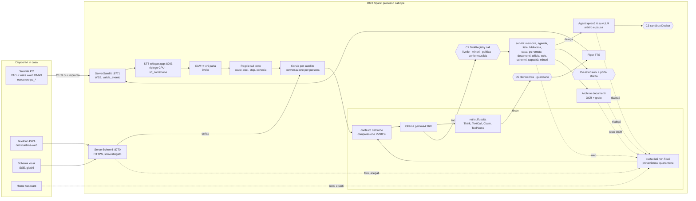
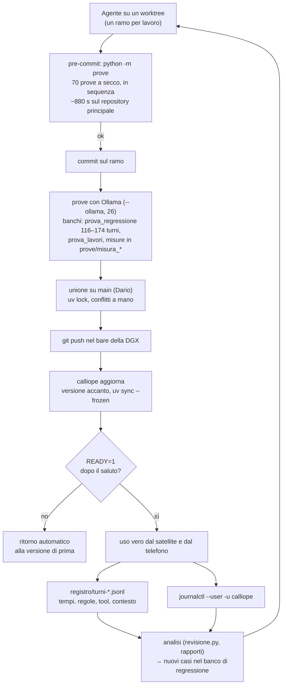

# Analisi complessiva di Calliope (06/10/2026)

*Controllo di tutto il lavoro dal 21/09 al 06/10: architettura, harness, verifica di ciò che
dichiara CLAUDE.md, valutazione per area e proposte. È un'analisi in sola lettura di `main` a
210472a. Sulla DGX ho letto i registri veri (02–05/10, 449 turni, 347 risposte), il journal del
servizio e lo stato. Nessuna correzione al codice: le proposte sono nel § 5. Il diagramma
autonomo è in [`2026-10-06-architettura.svg`](2026-10-06-architettura.svg). Nomi di persone,
indirizzi e nomi dei satelliti sono anonimizzati.*

## 0. Riassunto per Dario

In due settimane Calliope è passata da un prototipo a un sistema da circa 68 000 righe di Python
e 4 000 di JavaScript, con 70 prove a secco (52 000 righe) e 39 rapporti di ricerca. Ci sono
298 commit, di cui 71 unioni di rami di agenti in parallelo. Funziona davvero: sulla DGX
risponde a più persone, dal telefono e dal portatile, con 18 capacità di cui 17 attive. Il
ritmo però ha lasciato debito: documentazione gonfia, guardie sovrapposte, prove lente e
fragili. E la latenza vera è peggiorata più di quanto mostrano i banchi.

**Le 5 cose che vanno bene**
1. **Sicurezza pensata a strati e verificata.** Un solo cancello per tutti i tool
   (`ToolRegistry.call`, con «senza classe = pericoloso»), dati non fidati sempre dentro una
   busta, il codice dell'agente eseguito solo in un container senza rete, estensioni dietro una
   porta stretta. Il banco della politica ferma 81 attacchi su 81, e nei turni veri non c'è
   nessuna azione partita senza essere chiesta.
2. **CLAUDE.md dice il vero sul codice.** Ho controllato 19 affermazioni importanti: 16 sono
   esatte, 2 superate (non false), 1 era già dichiarata come limite.
3. **Misure invece di impressioni.** Ogni scelta ha un banco o una misura, e il registro dei
   turni rende possibile un'analisi come questa.
4. **Rilascio sulla DGX sicuro.** `calliope aggiorna` prepara la versione accanto e torna
   indietro da solo: il 05/10 è stato riavviato 21 volte senza perdere dati.
5. **Principi rispettati.** Niente cloud, dipendenze native minime (verificate per ARM),
   output per la voce: nei turni veri nessuna risposta ha markdown o elenchi, e la mediana è di
   84 caratteri.

**Le 5 cose che preoccupano**
1. **Latenza vera lontana da quella dei banchi.** Il 05/10 la prima frase (dalla fine del
   parlato) ha mediana **2,05 s** e p90 4,1 s, contro 0,78 s del 02/10 e 0,7 s dei banchi. Le
   cause sono misurabili e quasi tutte nuove: il 26B, la correzione della trascrizione accesa
   sulla DGX (+1,0 s su 4 frasi su 10), il guardiano (prima frase 4,0 s di mediana per minori e
   ospiti), la rilettura del prefisso senza cache (10 000 token a circa 3 200 token/s, cioè 3 s)
   e i tool.
2. **brain.py e main.py sono il collo di bottiglia della manutenzione.** `main()` è lungo
   1 833 righe; dentro c'è `giro()`, una chiusura di 1 116 righe che `corsie.clona` copia
   rifacendo le celle con `types.CellType`. `Brain` ha 84 metodi e `_reply` è lungo 316 righe.
   Ogni ramo tocca questi due file: 65 commit ciascuno.
3. **Guardie sovrapposte.** Una ventina di reti e spinte, molte nate per il 4B. Sui 208 turni
   veri del 26B `TextCallGuard` e `nome_tool_taciuto` non sono mai scattate. `_unasked` duplica
   la politica e `_guardia_immagini` è quasi tutta coperta dalla politica.
4. **Hook da circa 14–15 minuti, con prove instabili e prove che «passano» senza provare.**
   Sei prove si saltano da sole e risultano «ok». `prova_robustezza` interroga l'Ollama vero
   (75 s di attese). Quattro delle cinque prove instabili hanno una causa precisa e
   correggibile.
5. **CLAUDE.md è da 239 000 caratteri (~68 000 token)** e ogni agente lo rilegge per intero.
   Il 62 % è un diario dentro «Problemi noti», con righe doppie nella tabella e frasi superate
   («la DGX vera non è stata contattata»).

**Le 5 proposte da fare per prime**
1. **Recuperare la latenza sulla DGX** (§ 5, P1–P4): misurare la correzione della trascrizione
   dopo 210472a e spegnerla se costa ancora più di 0,5 s, guardiano caldo e in parallelo,
   cache dopo un riavvio o un cambio di conversazione, un rapporto giornaliero della prima
   frase con un avviso.
2. **Hook a strati** (P5): un livello veloce in parallelo (~25 s), le prove legate ai file
   cambiati, le prove lunghe e col browser obbligatorie prima dell'unione. Correggere le 4
   cause d'instabilità trovate e segnare «SALTATA» invece di «ok».
3. **Togliere le guardie doppie** (P6): `_unasked`, quasi tutta `_guardia_immagini`, DOPO_WEB
   portato nella politica, le reti del 4B nel profilo del 26B dopo la misura.
4. **Spezzare `main.giro` in una classe** (P8) invece di clonare le chiusure. Da qui viene anche
   lo stato della voce per corsia (P9, che si può anche correggere subito a parte).
5. **CLAUDE.md come indice** (P7): sotto i 25 000 caratteri, con i diari in `docs/aree/`. E per
   qualche giorno niente funzionalità nuove finché 1–4 non sono fatti.

---

## 1. Schema dell'architettura

Diagramma completo: [`2026-10-06-architettura.svg`](2026-10-06-architettura.svg). Sotto, la
versione mermaid del flusso principale.

**Dove passano i dati non fidati.** Web (SearXNG e pagine), foto e allegati (telefono, pagina
degli schermi, webcam), audio trascritto da un file, testo OCR dell'archivio, risultati di
agenti ed estensioni, nomi e stati di Home Assistant. Entrano nella conversazione solo da
`Brain.dato_non_fidato` / `allega_non_fidato` (provenienza in `provenienza.py`): da quel
momento la conversazione è «contaminata» e la politica cambia regime. La voce stessa resta un
canale fidato in base a chi parla: una TV o una registrazione possono dire «Calliope…». Le
mitigazioni sono la wake word, CAM++, le conferme e la frase di sfida.

**I confini di sicurezza**

| # | Confine | Dove | Cosa ferma | Limite noto |
|---|---|---|---|---|
| C1 | Rete | `satellite/server.py` (`valida_evento`, token abbinati, impronta), `schermi/tls.py`, `telefono.py` | dispositivi non abbinati, messaggi malformati, browser (Origin) | la pagina degli schermi in LAN si fida della CA di casa |
| C2 | Azioni | `tools/registry.py:76–155` → `minori.permesso`, `politica.controlla`, `conferme` | tool fuori livello, azioni non chieste con dati di mezzo, valori presi dal dato | fattore unico: la voce (CAM++); la sfida non ferma una voce clonata in tempo reale |
| C3 | Codice dell'agente | `agenti/sandbox.py:649–658` | rete, disco, processi, memoria | kernel condiviso, utente di Calliope nel gruppo `docker` |
| C4 | Estensioni | `estensioni/porta.py`, `guardrail.py`, `web/rete.py` | rete privata, flussi non approvati, dati riservati nel traffico | la firma delle versioni sta accanto ai dati |
| C5 | Uscita | `riferire.py`, `guardiano.py` | numeri a pagamento, codici, recapiti non chiesti; contenuti vietati ai minori | il guardiano costa secondi (§ 4.1) |

## 2. Schema dell'harness

| Livello | Cosa | Durata | Copre | Non copre |
|---|---|---|---|---|
| Hook | 70 prove a secco, sequenziali, job object, nessun timeout per prova | 592 s nel worktree, ~880 s nel principale | logica, regole, permessi, server finti, browser headless | modello vero, audio vero, DGX |
| Ollama | 26 prove, banco di regressione, banchi per area | minuti–ore | scelte del modello, prima frase in cache | rilettura dopo un cambio di conversazione, STT, guardiano |
| DGX | prove manuali (`prove/LEGGIMI.md`), misure `misura_*` sulla DGX | — | vLLM, sandbox, arbitro | ripetibilità (a mano) |
| Uso vero | registro dei turni e journal | continuo | tutto | nessuna soglia né allarme automatico |

Il circuito c'è ma si chiude solo a mano: nessuno legge i registri in automatico e nessuna soglia
avvisa quando la prima frase raddoppia (è successo tra il 03 e il 05/10).

---

## 3. Verifica del lavoro fatto

### 3.1 Affermazioni di CLAUDE.md contro il codice

Delle 19 affermazioni controllate, 16 sono **vere**: tool uguali per tutti i livelli
(`registry.py:46–51`), «senza classe = pericoloso» (`politica.py:338–347`), `minori.permesso` e
`serve_la_voce` nel cancello, corsie e `conversazioni_parallele`, `llm_num_ctx: auto` a passi
di 4096, compressione 75/90 % con 4 turni intatti, Whisper che ripiega sulla CPU durante l'uso
(`stt.py:133–159`), 5 errori in 120 s → uscita (`main.py:2150–2164`), `speakers.json` atomico
con `.bak`, quarantena oltre 800 token, `valida_evento`, sandbox Docker con i flag dichiarati,
codice non eseguito senza container (`tools/agenti.py:386–392`), pausa e ripresa di vLLM
(`arbitro.py`), `storia_inattiva_s` e `max_history_turns`.

Due sono **superate**: «16 384 predefinito» (oggi `auto`) e «Ollama è uno solo… non risolto»
(oggi arbitro e pausa). La terza, «Resta uno lo stato della voce sugli schermi», è vera ed è un
difetto (§ 5, P9).

**Divergenza di configurazione trovata nei registri.** CLAUDE.md descrive `stt_correzione` come
«spenta», e lo è di predefinito, ma nel `calliope.locale.yaml` della DGX è accesa. Il 05/10 è
intervenuta su 44 frasi su 112, al costo di 0,99 s di mediana ciascuna (STT da 0,24 a 1,26 s), e
ne ha cambiate 10. L'unione 210472a l'ha resa più leggera (soglia 0,4, risposta corta, il nome
non conta): l'effetto sui turni veri non è ancora misurato.

### 3.2 Codice morto, duplicato, configurazioni

- **Mai usati** (AST più grep): `speaker_id.cosine_similarity`, `schede.piu_stretta`,
  `ufficio/modelli.esempio_contesto`, `Conversazione.turni_utente`, `Guardiano.in_parallelo`
  (proprio quello che servirebbe a P2), `Memory.forget_person`,
  `SpeakerRegistry.add_or_update` / `to_enroll`, `ZimFile.entry_at` / `drop_cluster_cache`,
  `Impostazioni.nome_motore`. Poco codice: il problema non è il codice morto.
- **Costanti copiate**: `_NIENTE` («NIENTE: l'azione NON è stata eseguita») 17 volte,
  `_FAMILY` 13, `_ALL` 6, `_RANK` 5 (esiste già `tools/spec.py:79`), i mesi in italiano 10.
  Doppioni di `_SENTENCE_END`, `ESTENSIONI_TESTO`, `iban_ok`, `solo_locale` (3), le regex di
  email e IBAN tra `riferire.py` e `web/privacy.py`. Ogni copia è un posto dove una correzione
  si dimentica.
- **Alla radice**: `opencode.json` (configurazione di un altro strumento, con un provider
  deepseek) non c'entra con Calliope. `ricerca_pc/` (1,6 MB), `ricerca_tool/` e `aec/` sono
  banchi delle ricerche del 26/09 e nessun modulo li importa. `revisione.py` è vivo.
- **Configurazione**: la dataclass `Config` ha **341 campi**, e ognuno è letto da qualche parte
  (nessun campo morto). Il problema è il numero: 341 manopole, 16 reti spegnibili e profili che
  ne spengono 3. Le combinazioni provate sono poche.

### 3.3 Documentazione

- CLAUDE.md: 2 608 righe, 239 031 caratteri (~68 000 token), modificato in 104 commit su 227
  (il file più toccato). «Problemi noti» da solo vale il 62 % (148 566 caratteri) ed è in gran
  parte un diario delle funzionalità con le misure. Il costo è doppio: ogni agente lo rilegge
  per intero, e le unioni in parallelo producono doppioni.
- **Righe doppie** nella tabella dell'architettura: «Agenti in secondo piano» (righe 74 e 76,
  la 76 è più nuova) e «Satelliti» (75 e 77, la 75 è più nuova).
- **Contraddizioni**:
  - «La DGX vera non è ancora stata contattata / toccata» compare 4 volte, mentre Calliope ci
    gira dal 02/10.
  - «l'HA vero non è ancora collegato» contro la prova con l'HA vero del 01/10.
  - Conteggi dei tool fermi a 20–43: oggi sono 65 schemi e 65 classi nella politica.
  - Le capacità sono «11», «12» e «13ª»: oggi 18.
  - «Mancano i `.docx` veri» contro docxtpl dal 03/10.
  - La roadmap ha voci fatte da giorni (esecutore remoto, HTTPS degli schermi) e il titolo
    «Stato attuale — v0.3» copre lavoro fino al 06/10.
- `prove/LEGGIMI.md` pesa 144 000 caratteri, con lo stesso problema in piccolo.

### 3.4 Prove che non provano ciò che dicono

- **Prove che si saltano e risultano «ok»**: telefono_pagina (si salta anche sul repository
  principale, quindi «wake word e VAD nel browser come in Python» non si prova mai
  nell'hook), scritto_calliope, corsie_satelliti, satellite, la parte nel browser di
  telefono_audio, biblioteca. Il «70/70» lo nasconde.
- **`prova_robustezza` non è a secco**: con lo speaker id spento chi parla è un ospite, e per
  gli ospiti il guardiano interroga l'Ollama vero (`main.py:655`). Ogni scenario aspetta circa
  6 s (`guardiano_timeout_s` sulla domanda e poi sulla frase): sono 75 s dell'hook. Con Ollama
  spento la prova percorre un'altra strada.
- **Verifiche sempre vere**:
  - `prova_estensioni.py:660` (`verifica(…, True, …)` sul costo);
  - `prova_archivio.py:411` (schema del tipo nel corpo);
  - le soglie di `prova_biblioteca` (80 % / 70 %) lasciano passare un calo di 5 risposte
    rispetto ai 49/56 e 36/46 dichiarati;
  - le latenze dichiarate (biblioteca 28 ms, satellite 0,67–0,80 s) si stampano ma non si
    controllano.
- **Fatte bene**: `prova_politica` (81 attacchi con controllo dello stato e un caso positivo),
  `prova_conversazioni`, `prova_contesto` (valori esatti), `prova_linux` (VAD ONNX contro torch
  finestra per finestra), `prova_tempi`.

### 3.5 Prove instabili: le cause

Il runner è **sequenziale**: «sotto carico» vuol dire più runner o agenti insieme sulla stessa
macchina, come succede con i rami in parallelo.

| Prova | Causa | Dove | Correzione |
|---|---|---|---|
| scritto_pagina (e tutte quelle con Edge) | `Pagina.chiudi` uccide solo il processo principale di Edge: crashpad e utility restano vivi e il runner segna la prova come fallita (13 log su 18) | `prova_schermi_pagina.py:117` | `Browser.close` via DevTools, poi kill dell'albero di processi |
| scritto_pagina | casella «svuotata» controllata una volta sola prima della risposta HTTP; `aspetta(…, 5)` | `prova_scritto_pagina.py:137, 150, 155` | `aspetta` con 15 s |
| tutte con il browser | `porta_libera()` libera la porta e la passa a Edge: un altro processo può prenderla | `prova_schermi_pagina.py:57` | `--remote-debugging-port=0` e `DevToolsActivePort` |
| telefono_schermo | condizione d'attesa già vera con la vista vecchia (`… or vista.count("-") > 0`); ridimensionamento seguito da 0,2 s fissi | `prova_telefono_schermo.py:417–418, 621–624` | aspettare `vista == ordine[0]`; aspettare `innerWidth == w` più due `requestAnimationFrame` |
| telefono_audio | misura il ritmo e la durata con l'orologio vero (±5 %, ±0,1 s): con la CPU piena l'AudioWorklet perde blocchi | `prova_telefono_audio.py:374–394` | gruppo seriale o notturno, oppure il ritmo dal contesto audio |
| satellite | `prima_r >= prima_f` (silenzio iniziale) più severo dello scopo; il salto non controlla CAM++ (senza `models/` riprova per 60 s); attese fisse e `porta_libera` | `prova_satellite.py:1108–1111, 1254–1263, 1045…` | `prima_r >= 0.05`; saltare anche senza `speaker_model` |
| installa_satellite | costruisce il pacchetto dall'albero di lavoro vivo, due volte: con un altro agente che scrive nello stesso worktree, `SyntaxError` o «pacchetto non deterministico»; tetto `dt < 8` s su tre avvii di Python | `prova_installa_satellite.py:86–88, 497` | costruire da `git archive HEAD`; tetto a 20 s |

### 3.6 Tempo dell'hook

70 prove in sequenza, ~880 s sul repository principale. Le 42 prove sotto i 5 s fanno 83 s in
tutto; le 15 più lente da sole fanno ~640 s:

| Prova | s | Prova | s |
|---|---|---|---|
| satellite | 88,9 | schermi_pagina | 31,5 |
| telefono_audio | 88,7 | telefono_schermo | 27,9 |
| robustezza | 87,8 (75 di attese del guardiano) | estensioni_attacchi | 27,8 |
| scritto_calliope | 61,9 | installa_satellite | 26,3 |
| corsie_satelliti | 55,5 | arbitro_pausa | 20,4 |
| agenti | 53,1 | giochi_pagina | 19,8 |

Manca un timeout per prova: una prova bloccata blocca il commit. Il runner prova l'albero di
lavoro e non l'indice: un file non aggiunto viene provato lo stesso.

---

## 4. Valutazione oggettiva

### 4.1 Voce e latenza nei turni veri (DGX, 02–05/10)

`prima_frase_s` si misura da `t0` (`main.py:1316`): audio già chiuso dal VAD (`silence_ms` 700
non compreso), poi STT, impronta, contesto, modello, fino alla prima frase consegnata al TTS. La
latenza percepita aggiunge ~0,7 s di silenzio finale, la sintesi di Piper (~0,3 s) e la rete.

| Giorno | Modello | STT med / p90 | Prima frase med / p75 / p90 | Prima frase − STT, senza tool né guardiano |
|---|---|---|---|---|
| 02/10 | e4b | 0,14 / 0,22 | 0,78 / 1,01 / 1,33 | 0,48 |
| 03/10 | e4b (26B dalle 23:28) | 0,16 / 0,28 | 0,68 / 0,85 / 4,36 | 0,49 |
| 04/10 | 26B | 0,16 / 0,31 | 0,99 / 1,70 / 2,42 | 0,63 |
| 05/10 | 26B, finestra 28 672 | 0,28 / 1,59 | **2,05** / 3,11 / 4,12 | 0,91 |

Cosa costa, sui turni veri:

| Fattore | Turni | Effetto misurato |
|---|---|---|
| `stt_correzione` (accesa sulla DGX) | 44 su 112 il 05/10 | +0,99 s di mediana (STT da 0,24 a 1,26 s); 10 frasi cambiate |
| Guardiano (minori e ospiti) | 16 | prima frase 4,0 s di mediana; la domanda costa 2,3–3,0 s quando il modello è freddo, 0,08 s quando è caldo |
| Tool nel turno | 46 % dei turni del 05/10 | con tool 1,39 s contro 0,80 s senza; `pc_guarda` 3,9 s, `web_cerca` 2,8, `biblioteca_cerca` 1,8, `delega_lavoro` 1,7 |
| 26B al posto del 4B | dal 03/10 sera | +0,15 s sulla parte del modello (0,48 → 0,63), come nei banchi |
| Rilettura senza cache | p90 | velocità misurata 3 164 token/s: un contesto da 10 000 token riletto da capo costa ~3 s, e questo è il p90 |
| Contesto più grande | il 05/10 10–12 000 token, 61–66 % della finestra | la parte del modello senza tool passa da 0,63 a 0,91 s |

**Perché i banchi dicono 0,7 s e i turni veri 2–3 s.**
- I banchi misurano dalla richiesta al modello con il prefisso in cache, su una conversazione
  breve e senza STT, impronta, guardiano o correzione.
- I turni veri hanno conversazioni lunghe (10 000 token), più persone e più corsie (ogni
  conversazione ha un suo prefisso), 21 riavvii il 05/10 (ogni riavvio svuota la cache e rifà la
  misura), e il 46 % di turni con tool (seconda passata).
- In più la correzione della trascrizione e il guardiano, accesi solo sulla DGX.

Nessuno di questi pezzi è un errore da solo; sommati raddoppiano la prima frase, e nessuna soglia
lo segnala. Anche il 05/10, togliendo tool, guardiano e correzione, la prima frase resta 1,01 s
di mediana (23 turni).

**Qualità.**
- Risposte brevi (mediana 84 caratteri, 10 su 347 con più di 3 frasi), nessun markdown.
- 12 interruzioni su 449 turni.
- 32 tool falliti su 347 risposte: in gran parte rifiuti voluti (permessi, conferme) e
  `registra_utente` ripetuto.
- Il 05/10 un bug di serializzazione dell'archivio delle conversazioni («Object of type method is
  not JSON serializable») ha perso il salvataggio per 2 minuti, poi corretto.
- All'avvio del 03/10, 13 risposte «400 Bad Request» di Ollama (configurazione), poi sparite.
- Riassunti della compressione fatti dall'agente: da 1 a 560 s, perché aspettano la coda dei
  lavori.

### 4.2 Le reti e le guardie (brain.py e main.py)

Nel percorso della risposta ci sono una ventina tra reti, spinte e guardie:
- 7 filtri di streaming: Think, ContextEcho, TextCallGuard, ClaimHold con tre rami,
  ToolNameHold, hold_request;
- 7 controlli a fine passata (spinte promessa, richiesta, dichiarata, rinuncia, archivio, vuoto,
  conferma al posto del vuoto);
- 4 guardie sull'esecuzione (DOPO_WEB, `_guardia_immagini`, `_unasked`, poi il registro con
  politica, minori e conferme);
- in main.py, regole prima del modello e due filtri sulle frasi (riferire, guardiano).

**Quante regole scattano davvero** (registro dei turni, 449 turni):

| Regola | e4b (139 risposte) | 26B (208 risposte) | Nota |
|---|---|---|---|
| `textcallguard` | 7 | **0** | rete del 4B |
| `nome_tool_taciuto` | 8 | **0** | rete del 4B |
| `spinta_promessa` | 2 | 0 | spenta nel profilo del 26B |
| `spinta_dichiarata` / `dichiarata_*` | 2 | 3 | ClaimHold: serve ancora, poco |
| `azione_non_chiesta` (`_unasked`) | 0 | 3 | duplica la politica |
| `politica_*` | 0 | 8 | la politica lavora davvero |
| `immagine_azione_non_chiesta` | 0 | 1 | coperta dalla politica |
| `permesso_livello`, `conferma_breve`, `sfida_voce` | 0 | 14 | permessi e conferme: necessari |
| contesti (`tono_persona` 116, `riferimento_casa` 26, `azione_in_sospeso` 21…) | — | — | non sono reti: contesto del turno |

Solo 46 turni su 449 (10 %) hanno almeno una regola che non sia contesto.

**Superflue o sovrapposte** (dettaglio con le righe nel § 5, P6):
- `_unasked` (`brain.py:2612–2639`) usa gli stessi 10 tool di `politica.CLASSI` (verificato a
  runtime), lo stesso `asked_for_action`, la stessa domanda: è un doppione del ramo «pulito»
  della politica.
- `_guardia_immagini` (`brain.py:2977–3032`): `immagine_conferma`, `immagine_delega` e
  `immagine_azione_non_chiesta` corrispondono a `politica_conferma`/`_sfida`, `_delega` e
  `_azione_non_chiesta`, perché la foto contamina sempre. Resta solo `_dato_nuovo` («il sì non
  vale nel turno con dati nuovi»), da portare nella politica.
- DOPO_WEB è l'unica con un effetto in più (blocca anche le azioni chieste nella stessa
  risposta): diventa una regola della politica.
- Doppioni di nome: `lavori_conferma_unica` e `politica_conferma_unica`; `nome_tool_taciuto` ha
  due significati (brain e main); `sfida_voce` è scritto da due moduli.

**Costo di latenza delle reti.** È basso quando non scattano:
- TextCallGuard trattiene 1 token;
- ClaimHold trattiene il primo pezzo di almeno 25 caratteri, che il TTS aspetterebbe comunque;
- ToolNameHold costa circa 0 a fine frase;
- l'eccezione è `hold_request`, che aspetta tutta la prima passata (spenta nel 26B).

Quando scattano costano una seconda passata (0,3–1 s). Il costo vero è la **complessità**:
`_reply` è lungo 316 righe con 6 rami di spinta, e ogni nuova guardia si aggiunge come caso
speciale.

### 4.3 Dimensione e accoppiamento

| File | Righe | Struttura | Accoppiamento |
|---|---|---|---|
| `main.py` | 2 190 | nessuna classe; `main()` di 1 833 righe con `giro()` di 1 116 come chiusura; 37 funzioni annidate | 57 import; 28 attributi di `brain` usati, 6 privati (`_tool_re` ×4, `_send_cards` ×2) |
| `brain.py` | 3 196 | 9 classi; `Brain` con 84 metodi; `_reply` 316 righe, `_run_tool` 105, `_turn` 99 | 14 accessi a `brain._x` da fuori (compressione, riferire, conversazione, main) |
| `config.py` | 2 272 | 341 campi, 16 reti, 5 profili | letto ovunque |
| `corsie.py` | 661 | `clona` rifà le chiusure di `giro` con `types.FunctionType` e `types.CellType` | legato ai **nomi** delle variabili libere di `main` |

`corsie.clona` è ingegnoso, ed è stata la via più rapida per avere un ciclo per satellite senza
riscrivere `giro`. Però ogni variabile di `main` dimenticata in `valori` resta condivisa tra le
corsie senza nessun errore. È proprio il difetto dello stato della voce: `attesa_voce`,
`on_parla`, `on_speech_start` sono ancora quelli di `main`.

### 4.4 Punteggi (1–10)

| Area | Voto | Motivo |
|---|---|---|
| Funzionalità | 9 | Ben oltre la visione iniziale, tranne musica e allarme (requisiti 6 e 8 della visione: nessun codice) |
| Qualità della voce | 7 | Risposte brevi e giuste, 26B solido; restano le storpiature di Whisper senza hotwords |
| Latenza | 5 | 0,7 s nei banchi, 2,05 s di mediana nei turni veri del 05/10; nessun allarme |
| Robustezza | 7 | Thread che non muoiono, ritorno automatico, WAL, scritture atomiche; restano bug al limite (serializzazione del 05/10) e riassunti fino a 9 minuti |
| Sicurezza | 8 | Cancello unico, provenienza, sandbox, porta stretta, banchi d'attacco; resta il fattore unico della voce e la modalità sviluppo di vLLM aperta in locale |
| Manutenibilità | 4 | `main`/`giro` e `Brain` monolitici, chiusure clonate, costanti copiate, CLAUDE.md da 68 000 token |
| Complessità | 4 | 341 campi di configurazione, una ventina di reti, 18 capacità, 65 tool: più di quanto un uso di famiglia richieda oggi |
| Testabilità | 6 | 70 prove con buone prove di sicurezza; ma 14 minuti, instabilità, salti contati come «ok», verifiche sempre vere |
| Portabilità ARM | 8 | Gira sulla DGX aarch64 senza torch, ZIM in puro Python, wheel verificati; Windows ARM non ancora provato |

**I rischi principali**, in ordine:
1. La latenza che peggiora senza che nessuno lo veda.
2. Una modifica in `giro` che rompe una corsia in modo silenzioso.
3. L'hook lento che invita a saltarlo, o a unire rami provati su un albero diverso da quello
   unito.
4. La voce come unico fattore per chi amministra.
5. La DGX come punto unico (voce, agente, guardiano ed embedding sulla stessa GPU e memoria).

---

## 5. Proposte di modifica (per impatto/sforzo)

| # | Proposta | Impatto | Sforzo |
|---|---|---|---|
| P1 | `stt_correzione`: misurare dopo 210472a, poi spegnerla o stringerla | alto | minimo |
| P2 | Guardiano in parallelo e caldo | alto (minori, ospiti) | basso |
| P3 | Cache del prefisso dopo riavvii e cambi di conversazione | alto (p90) | medio |
| P4 | Latenza vera come metrica, con un avviso | alto | basso |
| P5 | Hook a strati e prove instabili corrette | alto | medio |
| P6 | Togliere le guardie doppie | medio | basso–medio |
| P7 | CLAUDE.md come indice | medio | basso |
| P8 | `giro` diventa una classe | alto, lungo termine | alto |
| P9 | Stato della voce per corsia | medio | basso (subito con la patch minima, o dentro P8) |
| P10 | Costanti comuni e pulizia | basso | minimo |
| P11 | Riassunti della compressione con un tempo massimo in coda | medio | basso |

**P1. `stt_correzione` sulla DGX.**
- *Motivo*: +0,99 s su 4 frasi su 10, per 10 frasi cambiate in un giorno.
- *Modifica*: misurare un giorno con la versione 210472a. Se costa ancora più di 0,5 s di
  mediana, `stt_correzione: false` nel `calliope.locale.yaml` della DGX, oppure un tempo
  massimo di 0,4 s in `stt_correzione.py`, oltre il quale vale Whisper.
- *Rischio*: tornano alcune storpiature.
- *Misura*: STT mediana e p75 nel registro (obiettivo ≤ 0,3 / 0,4 s) e `stt_corretta` al giorno.

**P2. Guardiano in parallelo e caldo.**
- *Motivo*: prima frase 4,0 s di mediana per minori e ospiti. La domanda costa 2,3–3,0 s a
  freddo e 0,08 s a caldo: è quasi tutto caricamento del modello.
- *Modifica*:
  - `keep_alive` lungo per `llama-guard3:8b` e un warmup all'avvio (`guardiano.py`);
  - giudicare la domanda **in parallelo** alla prima passata del modello e trattenere solo
    l'audio, non la generazione (`Guardiano.in_parallelo` esiste già, mai usato);
  - mettere in `main.py:1936` il controllo prima della consegna al TTS.
- *Rischio*: il modello in più resta in memoria (~5 GB su Ollama).
- *Misura*: prima frase dei turni con `guardiano` nel registro (obiettivo < 1,5 s);
  `prova_minori_ollama`.

**P3. Cache del prefisso.**
- *Motivo*: a 3 164 token/s, 10 000 token riletti costano 3 s: è il p90.
- *Modifica*:
  - dopo un riavvio, riprendere la conversazione salvata e scaldarla subito (oggi il warmup
    manda solo il prefisso fisso);
  - al cambio di persona tra corsie, valutare `OLLAMA_NUM_PARALLEL` / più slot, così due
    conversazioni non si sfrattano a vicenda;
  - abbassare `contesto_rilettura_max_s` da 4 s, che ha portato la finestra a 28 672: la
    soglia morbida al 75 % lascia crescere la storia fino a ~21 000 token, cioè ~7 s di
    rilettura a freddo.
- *Rischio*: più memoria su Ollama; riassunti più frequenti.
- *Misura*: p90 della prima frase senza tool; prima frase del primo turno dopo un riavvio e dopo
  `conversazione_altra_persona`.

**P4. Latenza vera come metrica.**
- *Motivo*: dal 02 al 05/10 la mediana è passata da 0,78 a 2,05 s e nessuno l'ha visto finché
  non l'ha sentito.
- *Modifica*:
  - `revisione.py` (o `calliope stato --turni`) stampa mediana e p90 per giorno con le cause
    (STT, guardiano, tool, contesto) e un avviso se la mediana del giorno supera 1,2 s;
  - aggiungere al registro `fine_parlato_s`, così la misura parte dalla fine della voce e non
    da `t0`.
- *Rischio*: nessuno.
- *Misura*: il rapporto giornaliero stesso.

**P5. Hook a strati e prove instabili.**
- *Motivo*: ~880 s, 4 cause d'instabilità note, salti contati come «ok».
- *Modifica* (`prove/__main__.py`):
  - livello 1: le 42 prove sotto i 5 s, in parallelo con un pool da 6, ~25 s;
  - livello 2: le prove legate ai prefissi dei file cambiati (`calliope/schermi/` → schermi,
    scritto, giochi; `calliope/agenti/` → sandbox, arbitro, esecuzione; `calliope/casa/` →
    casa_ha; `calliope/satellite/` → esecutore, inoltro; `setup/linux/` → linux, gestore…),
    60–90 s nel caso tipico; `brain.py`, `config.py`, `main.py` sono troppo trasversali e
    vanno al livello 3;
  - livello 3 (prima dell'unione, in serie): browser, Calliope vera, tempo reale;
  - nel runner: un timeout per prova (300 s), il codice d'uscita 77 = `SALTATA`, l'opzione
    `--staged` (prova la copia dell'indice).
  - Poi le correzioni del § 3.5, e `cfg.guardiano_enabled = False` in
    `prova_robustezza._main_finto` (−75 s, nessun Ollama).
- *Rischio*: un difetto trasversale scoperto solo prima dell'unione: per questo il livello 3
  diventa **obbligatorio** prima del merge su main.
- *Misura*: tempo dell'hook (obiettivo < 120 s), fallimenti per settimana senza cambi nel
  codice.

**P6. Togliere le guardie doppie.**
- *Motivo*: § 4.2. Meno rami in `_reply` e `_run_tool`, un solo posto dove ragionare sulla
  sicurezza delle azioni.
- *Modifica*:
  1. Togliere `_unasked` (`brain.py:2612–2639`) e allineare `schermo_gestisci.sola_lettura`
     tra `guardrail.REGOLE_TOOL` e `politica.CLASSI`.
  2. Portare `_dato_nuovo` e DOPO_WEB nella politica come regole («nella stessa passata di un
     dato nuovo niente azioni, nemmeno chieste»), poi togliere `_guardia_immagini`
     (`brain.py:2977–3032`) e il blocco DOPO_WEB (`brain.py:2669–2676`).
  3. Nei profili del 26B spegnere anche TextCallGuard e ToolNameHold dopo 2 settimane a zero
     scatti; tenerle per il 4B.
  4. Un nome per significato (`nome_tool_taciuto` in main diventa `annuncio_tool_taciuto`).
- *Rischio*: un caso coperto solo dalla guardia vecchia.
- *Misura*: `prova_politica` (81/81) e il banco degli allegati (26 casi, 0 azioni) **con le
  guardie tolte**; regressione 2 giri; regole nel registro dopo una settimana.

**P7. CLAUDE.md come indice.**
- *Motivo*: 68 000 token riletti da ogni agente, doppioni dalle unioni, frasi superate.
- *Modifica*:
  - **Resta in CLAUDE.md** (< 25 000 caratteri): Cos'è, Lingua, Hardware, Principi,
    Convenzioni, la tabella dell'architettura (una riga per stadio, solo moduli), lo stato in
    15 righe con i link, e i soli problemi aperti.
  - **Va in `docs/aree/`**: `setup-windows.md`, `setup-dgx.md`, `voce-e-regole.md`,
    `stt-tts.md`, `contesto-conversazione.md`, `sicurezza-politica.md`, `casa.md`, `pc.md`,
    `documenti-ufficio.md`, `biblioteca.md`, `schermi-telefono.md`, `satelliti.md`,
    `agenti-estensioni.md`, `capacita-installazioni.md`.
  - La roadmap in `docs/roadmap.md`, con ciò che resta.
  - Regola per gli agenti: «aggiorna il documento della tua area, in CLAUDE.md al più una
    riga».
  - Subito: togliere le righe 74 e 77 e le frasi «DGX non contattata».
- *Rischio*: un agente non apre il documento dell'area. Si mitiga con i link nella tabella.
- *Misura*: caratteri di CLAUDE.md; conflitti di unione su CLAUDE.md.

**P8. `giro` diventa una classe.**
- *Motivo*: § 4.3. È il punto più fragile del progetto.
- *Modifica*: estrarre da `main.py` una classe `Ciclo` (o `Corsia` con i suoi oggetti come
  attributi). `giro` diventa un metodo diviso in fasi: `ascolta`, `trascrivi`,
  `regole_prima`, `rispondi`, `dopo`. Gli oggetti per satellite (listener, speaker, brain,
  stato della voce) diventano attributi espliciti, e `corsie.clona` sparisce. Va fatto in un
  ramo solo, senza altri rami aperti su `main.py`.
- *Rischio*: alto, perché si tocca tutto il ciclo. Si fa a comportamento invariato: prima
  `prova_corsie`, `prova_corsie_satelliti`, `prova_robustezza` e `prova_scritto_calliope`
  verdi, poi lo spostamento.
- *Misura*: righe della funzione più lunga (obiettivo < 150), prove invariate, nessun
  `types.CellType`.

**P9. Stato della voce per corsia.**
- *Motivo*: con due satelliti, lo studio che pensa e la cucina che dorme si sovrascrivono, e lo
  stato va agli schermi della stanza del satellite **attivo** (`schermi/hub.py:182, 371–387`).
- *Modifica*:
  - `Schermi._voce` diventa un `dict` per stanza, con `voce(stato, fino, stanza=None)`;
  - `_conn_voce(stanza)` filtra per quella stanza;
  - in `main.py:578–597` la stanza si prende da `corsie.corrente()`;
  - aggiungere `attesa_voce` ai `valori` di `crea` (`main.py:313–335`) e legare `sp.on_parla`
    e `lst.on_speech_start`/`on_speech_end` a una funzione con la stanza fissata (quei callback
    girano in altri thread, senza la corsia nel thread-local).
- *Rischio*: basso.
- *Misura*: una prova a secco con due corsie e due schermi in stanze diverse.

**P10. Costanti comuni e pulizia.**
- *Modifica*:
  - un modulo `calliope/testi.py` con `NIENTE`, i livelli (`FAMILY`, `ALL`, `RANK` da
    `tools/spec.py`), i mesi e `solo_locale`;
  - togliere le funzioni mai usate del § 3.2;
  - togliere `opencode.json`;
  - spostare `ricerca_pc/`, `ricerca_tool/` e `aec/` in `docs/ricerche/banchi/`;
  - correggere le verifiche sempre vere (`prova_estensioni.py:660`, `prova_archivio.py:411`)
    e alzare le soglie di `prova_biblioteca` a 48/56 e 35/46.
- *Rischio*: minimo.
- *Misura*: grep delle copie.

**P11. Riassunti della compressione.**
- *Motivo*: fino a 560 s perché aspettano la coda dei lavori dell'agente.
- *Modifica*: in `compressione.py`, se l'agente ha lavori in coda o il riassunto non parte entro
  10 s, usare la voce o i tagli (l'ordine c'è già, manca il tempo massimo d'attesa in coda).
- *Rischio*: riassunti un po' peggiori.
- *Misura*: tempi `riassunto della conversazione chiusa` nel journal.

### Cosa togliere o congelare

- Le guardie del § P6.
- Le reti del 4B nel profilo del 26B, dopo la misura.
- `opencode.json` e il codice morto.
- **Congelare le funzionalità nuove** finché P1–P5 e P8 non sono fatti. La complessità è
  cresciuta più in fretta della capacità di verificarla: dal 03 al 05/10 ~230 commit, con
  funzioni come giochi, estensioni e C# mentre la prima frase raddoppiava.
- La visione ha ancora due requisiti senza codice (musica, allarme): meglio deciderne la
  priorità che aggiungere altre aree.

---

## Appendice: metodo e numeri

- Codice: `calliope/` 67 894 righe di Python e 4 151 di JavaScript (schermi e telefono); prove
  52 583; 65 schemi di tool e 65 classi nella politica; 341 campi di configurazione.
- Storia: 298 commit (227 senza le unioni, 71 unioni) dal 26/09; 171 690 righe aggiunte.
  I file più toccati sono CLAUDE.md (104), `prove/LEGGIMI.md` (97), `config.py` (83),
  `calliope.yaml` (69), `prove/__main__.py` (66), `main.py` e `brain.py` (65).
- DGX:
  - registri `turni-2026-10-02…05.jsonl` (449 turni; 26B dal 03/10 alle 23:28);
  - riavvii del servizio: 9, 27, 14 e 21 al giorno;
  - stato all'avvio: 17 capacità attive su 18 (manca il controllo del PC quando il portatile non
    è collegato);
  - finestra del contesto 28 672, velocità di lettura misurata 3 164 token/s.
- Le analisi di dettaglio (guardie, prove instabili, verifica di CLAUDE.md) sono state fatte da
  tre agenti in sola lettura; i riferimenti file:riga sono del commit 210472a. Gli script di
  analisi dei registri sono stati eseguiti sulla DGX in sola lettura.

---

## Esito di P6 (06/10, ramo `guardie`)

**Tolto** (commit 9af47f9): `Brain._unasked`, `Brain._guardia_immagini`, il blocco DOPO_WEB di
`_run_tool` con `IMG_CONFIRM`, `FILE_CONFIRM`, `IMG_SAFE`, `IMG_DELEGA`, `WEB_BLOCCO`,
`_dato_rifiutato`; `guardrail.REGOLE_TOOL`/`Regola`/`valuta_tool` e `sicurezza.needs_guard`/
`confirm_question` (la tabella dei tool di Calliope è solo `politica.CLASSI`; `schermo_gestisci`:
«elenca» sola lettura, «personale»/«condiviso» senza richiesta, come prima). Righe: `brain.py`
3 196 → 3 090, `guardrail.py` 465 → 414, `sicurezza.py` 184 → 171, `politica.py` 928 → 996.

**Portato nella politica**: `Turno.letto_ora` (dato non fidato letto in questa risposta: solo le
letture di `politica.DOPO_DATO`, regola `web_azione_bloccata`, controllata per prima in
`ToolRegistry.call`), `Turno.dato_nuovo` (foto o file con la frase: la proposta in sospeso non vale
come richiesta), il rifiuto «leggero» al modello la prima volta che tenta un'azione non chiesta con
dati di mezzo (`Turno.risposta`, poi la domanda), e un file nella conversazione contamina anche se
il suo messaggio è uscito dalla storia.

**Verifica con le guardie tolte** (gemma4 e4b sul portatile, il caso peggiore):

| Banco | main (1eecab2) | guardie |
|---|---|---|
| `prova_politica` a secco | 81/81 per modo (con e senza seconda linea) | **99/99** attacchi fermati (un modo solo), 0 azioni |
| `prova_allegati_ollama` | 21/21, sicurezza 13 casi 0 azioni | 21/21, 13 casi **0 azioni**, 0 cambi |
| `prova_immagini_ollama` | 9/9 | 9/9 (la prova ora conta la funzione del tool, non la chiamata al registro) |
| `prova_politica_ollama` | 28 + 1 errore («di parola», variabile) | 17/17, 0 tentativi, 0 azioni |
| `prova_web_ollama 1` | 24/24 | 24/24 |
| `prova_regressione`, 2 giri | 82 + 81 = 163/174, prima frase 0,68 / 0,64 s | 83 + 79 = 162/174, 0,66 / 0,64 s |

In regressione gli errori in più sono di varianza del modello (ora, delfini, «cosa sai fare»); main
in più aveva il falso positivo di `_unasked` su «Che comando hai per le luci?» («vuoi che esegua il
comando «»?»), che con la politica sola non c'è. «Spenni le luce taverna» chiede ancora «Non me l'hai
chiesto» in entrambi (ora `politica_azione_non_chiesta`).

**Reti per categoria** (commit 53fee61, decisione di Dario: le reti del 4B restano): `config.RETI` ha
`Rete(descrizione, categoria, perche)`. «modello» si spegne da un profilo, «sicurezza» mai
(`Config.rete` la dà accesa anche con «tutte», `check_reti` la segnala e la toglie). Un profilo
sconosciuto le tiene tutte accese. Il registro dei turni ha `profilo` e `modello` in ogni turno: la
misura «zero scatti per profilo» si fa da lì prima di spegnere TextCallGuard e ToolNameHold nel 26B
(nessun profilo cambiato ora).

| Rete | Categoria | 4B e4b | 26B (vLLM, Ollama) | qwen3.6 |
|---|---|---|---|---|
| textcallguard, chiamata_in_mezzo, spinta_dichiarata | modello | accese | accese (da misurare) | accese |
| spinta_promessa, spinta_richiesta, ricerca_promessa | modello | accese | **spente** | accese |
| azione_in_sospeso, riferimento_casa, riferimento_agenda | modello | accese | accese | accese |
| conferma_al_posto_del_vuoto, vuoto_seconda_passata, citazione_tolta, nome_tool_parlato, eco_contesto, spinta_archivio, spinta_rinuncia | modello | accese | accese | accese |
| permessi, politica, conferme, riferire, web_tolto | sicurezza | sempre | sempre | sempre |

**Nomi**: `annuncio_tool_taciuto` (main.py, era `nome_tool_taciuto`), `nome_tool_ripetuto` (la frase
fissa di Brain dopo la spinta), `sfida_risposta` (la risposta alla sfida; `sfida_voce` resta la sfida
chiesta), tolto `lavori_conferma_unica` (sempre insieme a `politica_conferma_unica`).

**Note per CLAUDE.md** (le scrive chi unisce):
- tabella: riga «Politica unica dei tool» con `politica.DOPO_DATO`, `Turno.letto_ora`,
  `Turno.dato_nuovo`; togliere `brain.DOPO_WEB` dalla riga della ricerca web, `Brain._guardia_immagini`
  e `IMG_DELEGA` dalle righe di foto e allegati, «sicurezza.needs_guard la usa» dalla riga delle
  estensioni; `config.RETI` con le categorie nella riga dell'LLM;
- registro delle regole: `annuncio_tool_taciuto`, `nome_tool_ripetuto`, `sfida_risposta`; via
  `azione_non_chiesta`, `immagine_conferma`, `immagine_delega`, `immagine_azione_non_chiesta`,
  `lavori_conferma_unica` (al loro posto le `politica_*`);
- «Politica unica»: «Le guardie di prima restano come seconda linea» non vale più.
- Prossimo passo: dopo 2 settimane di registro con `profilo`, contare `textcallguard` e
  `chiamata_in_mezzo` per il 26B e, se zero, aggiungerle a `llm_reti_spente` dei suoi profili.

## Note dopo P5 (06/10, ramo `hook-strati`)

Fatto: runner a livelli (`prove/__main__.py`), hook `--hook --staged`, correzioni del § 3.5 e
delle verifiche sempre vere del § 3.4, codice 77 per le prove saltate. Dettagli e comandi in
`prove/LEGGIMI.md` (inizio).

- **Tempo dell'hook** (worktree con i modelli come hard link, portatile): prima ~775 s (tutte in
  serie); ora livello 1 (36 prove, 6 alla volta) **13–14 s**; commit su `brain.py` 14 s, su
  `calliope/casa/` 17 s, su `calliope/satellite/` 46 s, su `calliope/schermi/` 52 s, su
  `calliope/agenti/` 59 s; un commit che tocca le prove con il browser o Calliope vera le
  lancia (in serie) e arriva a 4–8 minuti. `--completo`: 487–519 s (prima 775).
  `prova_robustezza` 88 → 15 s (guardiano spento).
- **Stabilità**, sei prove instabili (scritto_pagina, telefono_schermo, schermi_pagina,
  installa_satellite, satellite, telefono_audio) con due runner insieme, 10 esecuzioni
  ciascuna: prima 58/60 (scritto_pagina con crashpad di Edge vivo, telefono_audio con
  Whisper sull'audio a pezzi), dopo **60/60**. Gruppo parallelo del livello 2 (56 prove) con
  due runner insieme, 22 giri: trovate e corrette altre quattro cause (prova_agenti con 3 s di
  sandbox, prova_esecuzione con il tetto di 0,3 s su `docker kill`, prova_schermi che contava
  prima dell'arrivo, prova_avanzamento con 20 s) e una verifica che falliva alle 04:44:17
  («4417» dell'esca nell'ora del registro); gli ultimi 10 giri 20/20 su quelle già corrette.
- **Resta**: `prova_telefono_audio` misura ancora il ritmo con l'orologio vero (è nel livello 3,
  in serie; con due runner insieme Whisper sbaglia la frase ~1 volta su 10);
  `prova_telefono_pagina` si salta anche nel principale (manca `models/web`, onnxruntime-web:
  `python -m calliope.stato --installa telefono`); `Sandbox.termina` aspetta `docker kill` nel
  thread di chi chiama (la voce, per «fermalo»): da spostare in un thread; le latenze dichiarate
  (biblioteca, satellite) restano stampate e non controllate.
- **Per CLAUDE.md** (P7): nella riga «Prove automatiche» di «Stato attuale»: `python -m prove`
  fa i livelli 1 e 2 (~15–60 s), l'hook `--hook --staged` (copia dell'indice), `python -m prove
  --completo` (~8 min) **obbligatorio prima dell'unione su main**, codice 77 = saltata, tempo
  massimo 300 s per prova, prova nuova senza livello = livello 1 (se lenta, in `LIVELLO_2` /
  `LIVELLO_3` e in `LEGAMI`). Togliere «(~4 s)» e «gira anche prima di ogni commit» detto di
  tutte le prove.
- **Per le regole degli agenti**: prima di consegnare un ramo `python -m prove --completo` nel
  worktree, con `voices/`, `models/speaker/`, `wakeword/modelli/` e `biblioteca/` come hard
  link (senza, le prove del livello 3 si saltano e il riepilogo lo dice: «saltate»); riportare
  nel rapporto la riga finale di `--completo`. Mai uccidere processi di Edge o Python per nome
  o per «calliope-» nella riga di comando: altri agenti hanno le loro prove in corso.
