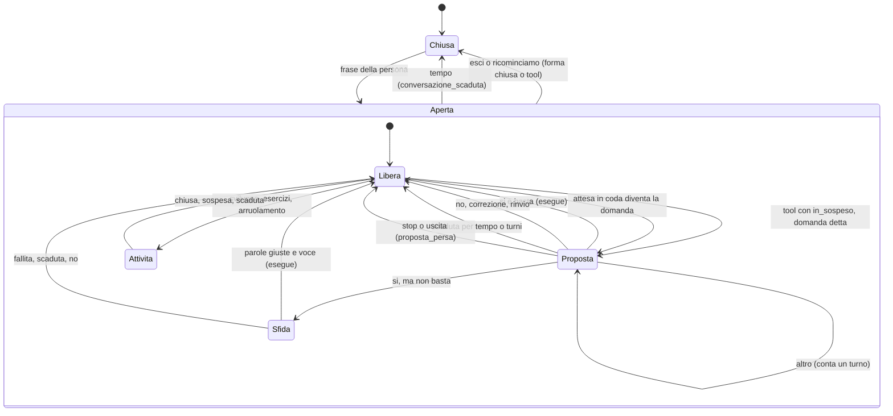
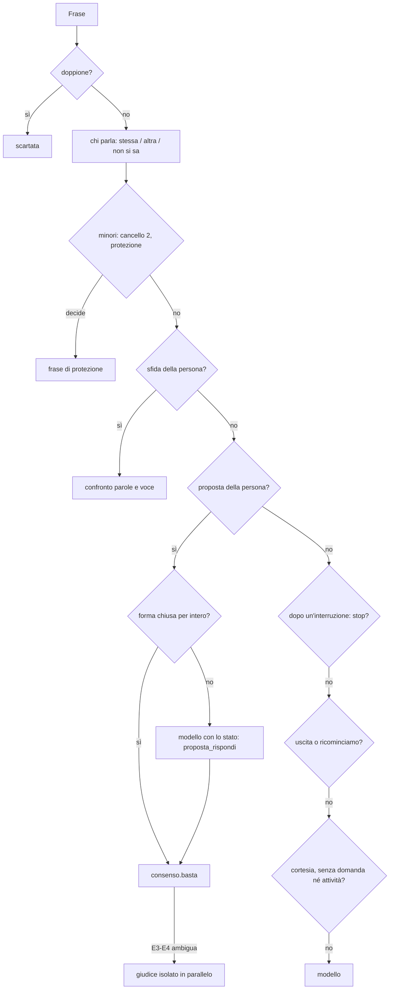

# Lo stato del dialogo come macchina a stati: progetto (10/10/2026)

*Progetto del 10 ottobre 2026, chiesto da chi amministra dopo l'analisi delle regole del 09/10
([`2026-10-09-regole-incongruenze.md`](2026-10-09-regole-incongruenze.md)): «centralizzare questi
passaggi dà il modo di razionalizzare una macchina a stati più coerente… valuta bene se tutti gli
stati restano gestiti». Fatto sul codice di `main` a 4149d85 (dopo l'unione dei tre rami della
sera del 09/10) e sul registro dei turni della DGX. Dal registro sono usciti solo campi senza testo:
regole, esiti, livelli, modo del riconoscimento, nomi e `ok` dei tool, ombra della politica, tipo
della conversazione, token del contesto e lunghezze in caratteri; persone e satelliti diventano
P0…/S0… sulla DGX, e i nomi non escono. Il registro arriva al 09/10 21:09: il 10/10 non ha ancora
turni, quindi «02–10/10» è di fatto 02–09/10 (1437 turni). Gli script di misura sono nella
cartella temporanea della sessione, non nel repository. **Nessuna modifica al codice.***

*Due decisioni di Dario del 10/10 sono parte del progetto: (1) la macchina **non interpreta il
linguaggio**: tiene lo stato e i vincoli, il modello interpreta la risposta in forma strutturata
con un tool, una corsia veloce deterministica vale solo per le forme chiuse brevi dette per
intero, e la macchina valida l'esito del modello; (2) gli scambi tra macchina e modello **non
inquinano la conversazione**: lo stato è effimero nel turno, la storia resta pulita, un canale
separato solo dove serve.*

## In breve

**Oggi.** Lo stato del dialogo esiste, ma è sparso in tre contenitori con vite diverse (la
`Conversazione` per persona, lo `SpeakerContext` per satellite, Brain per risposta), più una
decina di stati paralleli nei servizi (offerte dei lavori, delle installazioni, dell'ufficio,
degli schermi, delle estensioni, proposta dello sviluppo, cancelli dei minori, esercizi). Ognuno
ha il suo orologio e il suo modo di morire. Le stesse domande — «c'è una proposta aperta?»,
«è la stessa persona?», «questo sì basta?» — hanno da tre a sette risposte (§ 1.9).

**La macchina proposta** (`calliope/stato_dialogo.py`, § 3) tiene **uno stato per persona** (la
conversazione, la sola proposta parlata, la sfida legata a quella proposta, intenzioni e rifiuti,
le attese in coda: lavori, estensioni, cancelli) e **uno per satellite** (finestra d'ascolto,
parla/ascolta, interruzione, compagnia). Riceve eventi (frase, esito di un tool, esito del tool di
risposta, tempo, annuncio, cambio di persona) e restituisce azioni. Le priorità sono scritte in un
posto solo: **minori come pavimento → sfida → proposta → interruzione → uscite → cortesia →
modello**. La risposta a una proposta la interpreta il modello con `proposta_rispondi(esito, …)`,
o la corsia veloce per «sì», «no», «annulla» detti per intero; la macchina decide se basta con
una funzione sola, `consenso.basta(...)`, che sostituisce i sei criteri di oggi. «Stessa persona /
altra / non si sa» ha un criterio solo, i tempi stanno in una dataclass con i vincoli fra loro,
i dati del turno hanno precedenze e un tetto derivati dallo stato, e le regole portano l'esito nel
nome.

**Stati che oggi rischiano di non essere gestiti** (dal codice e dal registro, § 1.10 e § 2): la
proposta persa da uno stop detto mentre Calliope la sta facendo (caso vero, 09/10 20:39); le domande
dello sviluppo, del cancello 1 e dell'agente che non sono proposte, così che cortesia e «no» non
le vedono; il «no» a una domanda dell'agente che blocca `lavoro_rispondi` e lascia il lavoro ad
aspettare due ore; le offerte dei servizi che sopravvivono alla chiusura della conversazione;
la proposta nata da un annuncio intestata all'ultimo che ha parlato sul satellite; la coda della
conversazione che può passare all'ospite successivo dello stesso satellite; `has_pending` che
guarda solo i secondi; la catena di 11 turni per aprire un file (07/10).

**Piano** (§ 6): otto passi rilasciabili uno per uno. Il primo è l'**interprete del modello più
la corsia veloce, in ombra** accanto alla decisione di oggi, con il confronto nel registro; poi il
consenso unico acceso, uscite e stop che rispettano la proposta, il profilo dei tool dello
sviluppo (§ 3.11), altra persona e tempi, dati del turno e storia pulita, nomi delle regole,
infine la rimozione dei lessici vecchi.

## 1. Lo stato del dialogo com'è oggi

### 1.1 Tre contenitori, più i servizi

| Contenitore | Vita | Cosa tiene |
|---|---|---|
| `Conversazione` (`conversazione.py:44`), per persona (`persona:<id>`) o per satellite (`ospite:<corsia>`) | segue la persona fra i satelliti (`corsie.RegistroConversazioni`); sostituita da un oggetto nuovo in `Brain.end_conversation`; su disco solo storia, riassunto, owner | `pending` (una proposta), `intenzioni` (≤ 5, 600 s), `rifutate` (≤ 5, senza scadenza), `turn_number`, `domanda_fidata`, `argomento_suggerito`, `argomenti_recenti`, `richieste_dette`, `album`, `allegati`, `reference`, `agenda_reference`, `riassunto` (compressione, ripresa, coda) |
| `SpeakerContext` (`speaker_id.py:455`), uno per satellite | non segue la persona; molti campi azzerati a ogni frase (`ciclo._chi_parla`) | chi parla e come (`identified_by`), `voce_sicura`, `punteggio`, `conferma_breve`, **`sfida`** (non azzerata), `sfida_superata`, `incerta`, `minore_vicino`, `minore_incerto`, `compagnia`, arruolamento |
| `Brain`, uno per corsia | per risposta o per turno | `_offer`, `turn_pending_tool`, `_altrui_msg`, `_politica_risposta`, `_chiamate_risposta`, `tail`, `last_rules`, `last_tools` |
| `Ciclo`, uno per corsia | per satellite | `awake_until` (finestra), `_finestra_dal_nome`, `last_question`, `pending_real_name`, `_voce_recente`, `_minori_sentiti`, `annunci_rinviati`, `compagnia` |
| Servizi | ognuno il suo | `Lavori._offerte[persona]`, `Analizzatore._recenti`, offerte di `installa`, `ufficio` (con `time.time()`), `tools/builtin.py:269`, `tools/schermi.py:347`; `Esecuzione` delle estensioni (120 s); `Sviluppo` su disco; `Cancelli.segnali` in memoria; sessioni degli esercizi (30 min); `Compiti` |

### 1.2 Conversazione

| Stato | Dove, chi lo crea | Chi lo legge | Scade | Regola |
|---|---|---|---|---|
| aperta | `RegistroConversazioni._nuova`/`scegli` (`corsie.py:242/254`); owner da `_check_conversation` | corsia, Brain | `storia_inattiva_s` 300 | `conversazione.come` = persona, ripresa, continua, continuita, schermo, anonima |
| ripresa dall'archivio | `Brain._inizio_conversazione` | prompt (riassunto) | `conversazione_ripresa_ore` 4 h | `conversazione_ripresa` |
| coda dopo la pausa | `end_conversation` → `_coda_della_chiusa` (solo `conversazione_scaduta`) | prompt, `conversazione_cerca` | 4 h, 3 scambi | `conversazione_coda` |
| chiusa per tempo | tre punti: `_check_conversation` (inizio turno), `RegistroConversazioni.pulisci` (secondo piano), `record_announcement` | — | 300 s | **solo il primo** scrive `conversazione_scaduta` |
| chiusa per altra persona | `_check_conversation`: owner ≠ chi parla | — | — | `conversazione_altra_persona` |
| chiusa per «ricominciamo» | regola (`wakeword.nuova_conversazione`, frase intera) o tool `conversazione_nuova` | — | — | `nuova_conversazione`, `conversazione_nuova_tool` |
| chiusa per esci/dormi | `ciclo._uscite` → `_addormentati` | — | — | `uscita_*` |
| anonima `ospite:<corsia>` | ultimo ramo di `scegli` | — | 300 s | `come: anonima` |
| scritta degli schermi | `schermi/conversazione.py:102` | schermi | 300 s, rinnovata **solo** dalla voce | `scritto_senza_conversazione` |
| doppione fra satelliti | `reg.doppione` (`corsie.py:368`) | — | 2 s | `doppione_altro_satellite` |

Il turno (`turn_number`) è della conversazione e continua nella successiva della stessa persona,
ma non si salva: dopo un riavvio riparte da 0. `last_turn_at` non si aggiorna con «grazie»,
lo stop e il cancello 2 (`record_courtesy`, `record_stop`): uno scambio di cortesia non tiene
viva la conversazione.

### 1.3 Persona

`ciclo._confronta_voce` decide in quest'ordine: breve (sotto `speaker_min_voice_s` 1,0 s, in
finestra) → voce (≥ 0,48 e margine ≥ 0,08, altrimenti `voce_margine`) → zona grigia
(«conversazione», −0,06 nella finestra) → continuità (900 s, `voce_continuita`) → ospite →
compagnia senza breve (`compagnia_senza_breve`) → proprietario del satellite (`voce_proprietario`,
min(180, 300) s) → minore più protetto (`minore_piu_protetto`) → chi amministra con un minore
vicino (`amministra_minore_vicino`). Poi: scritto (`_chi_scrive`, «schermo»), arruolamento,
nome vero (`pending_real_name`, **senza scadenza**).

| Stato | Dove | Durata vera |
|---|---|---|
| `voce_sicura` | `SpeakerContext.aggiorna_conversazione` | **la finestra d'ascolto** (8 s), non la conversazione |
| breve e zona grigia | `identified_by` | una frase, dentro la finestra |
| continuità | `_voce_recente` | 900 s, **non** limitata a `storia_inattiva_s` |
| proprietario | `_proprietario_continua` | min(180, 300) s (b76bf41) |
| compagnia | `compagnia.Compagnia` per corsia | 300 s; `dimentica()` non la chiama nessuno |
| minore incerto / vicino | `speaker_ctx` | una frase |
| livello | `current_level`, `profile_level` | una frase; «schermo» scende a familiare |

### 1.4 Ascolto e interruzione

- **Finestra senza nome**: `Ciclo.awake_until`, `followup_s` 8 s; la aprono la risposta, il nome
  da solo, lo stop dopo un'interruzione, «nuova», il «chi parla?», il cancello 2, gli annunci; la
  chiudono cortesia, esci, `compagnia_nome`.
- **Wake acustica e testuale**, nome da solo (`nome_da_solo_*`), nome fuori posizione
  (`wake_fuori_posizione`), «rivolta a Calliope» in compagnia (`non_rivolta_ombra`, `non_rivolta`).
  Con la wake testuale anche le frasi ignorate passano da `_chi_parla` e `scegli`: cambiano la
  persona della corsia e la conversazione corrente.
- **Barge-in** (livello A sul nome, B sulla voce nota): la risposta interrotta non chiama
  `set_pending`, quindi **una proposta detta e interrotta si perde**; la proposta di prima resta.
  Nel giro dopo `_dopo_interruzione` usa `is_stop` **senza guardare la proposta**: «Calliope,
  ok» è uno stop, `record_stop` scrive «argomento chiuso» ma la proposta resta valida 120 s.
- Per i turni `non_rivolta` le regole di Brain non arrivano al registro (`_registra_risposta`
  esce prima).

### 1.5 Proposte e domande alla persona

| Domanda | Dove vive | Orologio | Passa da `pending`? |
|---|---|---|---|
| proposta di un tool (`in_sospeso`) | `Conversazione.pending`, una sola | 120 s **e** 3 turni (`_take_pending`); `has_pending` e `proposta_altrui` **solo 120 s** | sì, ma solo se la risposta **finisce con «?»** |
| domanda della politica | `politica._risultato` → `in_sospeso` con `politica` | come sopra | sì |
| «Me lo chiedi a voce?» | `tools/spec.serve_la_voce` | come sopra | sì |
| «Intendevi X?» | `argomento_forse`, solo senza altre offerte | 2 turni | sì |
| annuncio con domanda (lavoro, estensione, minore → tutore) | `record_announcement`; `chi` = **l'ultimo che ha parlato sul satellite** | 120 s / 3 turni | sì; rinviato se c'è già una proposta (`rinvia`, che guarda la conversazione **della corsia**, non quella della persona) |
| offerte dei servizi (lavori, analisi, installa, ufficio, builtin, schermi) | nel servizio | 120 s / 3 turni ciascuno, orologi propri | **in parallelo**: non le toccano `proposta_rifiutata`, la chiusura, l'altra persona |
| conferma di un'estensione | `Esecuzione` (120 s) + pending con `messaggio` proprio | due orologi | sì; dal 2° turno il testo dice ancora «alla fine della tua ultima risposta» |
| proposta dello sviluppo (`sv.proposto`) | su disco | **nessuno**: `_proposta_scaduta` accetta il sì anche dopo | in parte |
| domanda dello sviluppo (`sviluppo_chiedi`, «Con cosa provo?», «Fermo anche il lavoro?») | nel lavoro o suggerita al modello | 60 s per `sviluppo_chiedi_s` | **no** |
| domanda dell'agente (`in_attesa`) | `Lavoro`, su disco | 120 **minuti** | come annuncio; si risponde con `lavoro_rispondi` |
| cancello 1 «Va tutto bene?» | `Cancelli.segnali`, in memoria | 300 s, finestra 1800 s | **no** |
| frase di sfida | `SpeakerContext.sfida`, per satellite | 60 s, nessun limite di turni | **no** (stato a parte) |
| «chi parla?» (`voce_incerta_chiede`) | tre punti diversi | — | no |
| offerta senza tool («se vuoi…») | `chiede_risposta`, `ultima_domanda` | il turno dopo | no (vale solo per la cortesia) |
| esercizio in corso | `esercizi.Servizio.sessioni` | 30 min; la sua proposta in Brain 120 s | in parte |
| moduli sullo schermo (domande dell'agente e dell'analisi) | `schermi/moduli.py` | — | no: vanno al servizio senza modello né politica |

### 1.6 Consenso, intento, rifiuti

Sei criteri per «questo sì basta?» (dettaglio nel § 3.1 dell'analisi del 09/10, aggiornato):
`conferme.admin_confermato` (registro, `conferma_breve`), `politica.conferma_voce` (il ramo
breve senza admin né `altro_piu_vicino`), `politica.voce_frase`, `valore.intento_aperto` (anche
la zona grigia, 600 s), `valore.consenso_della_persona` (nessuna soglia: con
`valore_consenso_breve` esegue E1–E2), il livello in `ToolRegistry.call` con la compagnia che lo
abbassa. In più: `sviluppo_intento` (salta la domanda con `cv`), `_decidi` delle estensioni,
`sonde.concedi` (usa `politica.consenso` per concedere host, **senza regola**), i tool con la
sfida propria. Dopo 403d18c la sfida della classe è un pavimento (`valore_sfida_classe`) e il sì
a una domanda della politica nuova lo giudica la nuova (`valore_consenso_voce`,
`valore_consenso_sfida`); restano i criteri diversi per la stessa frase.

Il testo della persona lo classificano: `politica._SI`/`_NO`/`FORME_SI`/`_AVVERSATIVO`
(`consenso`), `_RIFIUTO_TESTA`/`_CORREZIONE` (`rifiuto`), `valore.ANNULLA` (`intento_chiuso`),
`wakeword._EXIT_*`/`_SLEEP`/`_SHUTDOWN`/`_NUOVA`/`_CLOSING`/`_SILENCE`/`_THANKS` (uscite,
cortesia, stop), due regex in `ciclo.py` (annullo dell'arruolamento, «no» al nome vero, **senza
regola**), `sicurezza.ACTION_REQUEST` e `politica._INTERNE` (che contengono «procedi», «fallo»:
un «sì, procedi» vale anche come richiesta d'azione), `brain.OFFERTA` sul testo di Calliope.

### 1.7 Sviluppo, lavori, estensioni, minori

- **Sviluppo** (`sviluppo.Sviluppo`, su disco, per persona): fasi analisi → sviluppo → collaudo →
  revisione → attivazione; aperto, sospeso (30 min solo in modo pigro, e mai con un lavoro in
  corso), chiuso. Uno sospeso non scade. Un lavoro che finisce per uno sviluppo sospeso lo
  **riapre** dal thread dei lavori e sospende quello aperto. Approvare un'estensione chiude lo
  sviluppo di chiunque l'avesse (`dell_estensione` è globale). Con `sviluppo_intento` la politica
  salta le sue domande per i passi interni.
- **Lavori** (`agenti/ciclo.py:114`): in coda, in corso, in attesa (domanda o tappa), fatto,
  errore, annullato, mancano dati, scaduto (dopo 120 min), interrotto, ripreso. L'annuncio va al
  satellite dell'ultima richiesta della persona e non interrompe. **Un «no» a una domanda sì/no
  dell'agente** passa da `_rifiuto_proposta`: `lavoro_rispondi` finisce tra i rifiutati e
  `_gia_rifiutata` lo blocca, l'agente non riceve il no e il lavoro aspetta 120 minuti (dal
  codice, da confermare con una prova).
- **Estensioni**: orologio di conferma a parte (120 s), coda degli annunci senza destinazione
  (`_annuncia_estensioni` non chiama `annuncio_per`), `est._simile_detto` globale.
- **Minori**: segnale «da verificare» fra i due cancelli (in memoria: un riavvio lo perde senza
  avvisi), «Va tutto bene?» che non tocca la proposta di prima (il «sì» del minore al cancello può
  confermare la proposta vecchia), cancello 2 che accetta la frase di chiunque non sia un adulto
  sicuro (in compagnia anche un ospite), guardiano in parallelo che lascia partire i tool prima
  del giudizio quando non condivide il modello della voce, richieste al tutore come proposte,
  esercizi con una sessione di 30 min e una proposta di 120 s.
- **Modalità e toni**: globali (modalità, tono della casa) o per persona (tono), senza scadenza:
  voluto.

### 1.8 Correzione dei tool e dati del turno

Per risposta: fino a `max_tool_turns` 4 passate, `tool_correzioni_max` 2 giri di correzione
(`correzione_tool`, `correzioni_esaurite`), spinte una per risposta (`spinta_*`, `dichiarata_*`),
`chiamata_ripetuta`, `risposta_ripetuta`, `textcallguard`. Tra un turno e l'altro non resta niente
di questo, **salvo nella storia**: chiamate fallite, errori correggibili, domande e rifiuti della
politica restano come messaggi `tool` (si compattano solo oltre 400 caratteri e dopo due turni).

I dati del turno sono 13 blocchi `role: system` in `memory`, **prima** del messaggio della persona
(`Brain.with_memory`: sistema + riassunto + storia + dati del turno + frase + `tail`): non restano
nella storia, si ricalcolano a ogni turno. Ordine: contesto del turno (chi parla, tono, minore,
parole incerte), ricordi, foto, contesto esterno, casa, agenda, lavoro, ricerche, estensione
nominata o elenco, sviluppo o sospesi, **proposta**, rifiuti, proposta altrui. **Nessun tetto**:
solo tetti locali; nel caso peggiore 9–11 mila caratteri, quanto tutta la riserva `CTX_RESERVE`
(3000 token). Contraddizioni ancora aperte dopo e785755: casa/agenda («chiama subito») contro
rifiuto dello stesso tool; proposta contro rifiuto di una proposta precedente sullo stesso tool;
proposta altrui («non fare domande») contro parole incerte («chiedi») e calcolata **prima** della
chiusura della conversazione (resta dopo `conversazione_altra_persona`); ricerca spenta contro
nota dell'archivio; sviluppo contro estensione nominata; la riga dello sviluppo chiesta al modello
e aggiunta dal codice.

### 1.9 La stessa domanda, più risposte

| Domanda | Risposte di oggi |
|---|---|
| C'è una proposta aperta? | `has_pending` (120 s), `_take_pending` (120 s, 3 turni, persona, satellite), `proposta_altrui` (120 s), `_chiedi_chi_parla` (scade e chi), sei offerte dei servizi, `sv.proposto`, `Esecuzione` |
| Questo sì basta? | sei criteri più sviluppo, estensioni, sonde, tool con sfida propria (§ 1.6) |
| È un sì, un no, una chiusura? | sei lessici più due regex (§ 1.6) |
| È la stessa persona? | Brain (owner ≠ chiave), corsie (chiave del registro), schermi (solo «voce» rinnova), compagnia (impronte, 300 s), sfida (`_speaker_key`) |
| Quanto dura «adesso»? | finestra 8 s (voce sicura, breve, zona grigia), conversazione 300 s, continuità 900 s, proprietario 180 s, compagnia 300 s, proposta 120 s/3 turni, sfida 60 s, intento 600 s, riferimento casa 300 s, agenda 600 s, lavoro 1800 s, sviluppo 30 min, domanda dell'agente 120 min, estensione 120 s, esercizi 30 min |
| Chi chiude la conversazione? | tre chiusure per tempo, altra persona, «nuova» (regola e tool), esci; gli schermi la loro |

### 1.10 Stati che oggi rischiano di non essere gestiti

*Dal 10/10 le prove del passo 0 (§ 8): confermati tutti quelli provati; corretti il 3, il 6, `pending_real_name` del 10 e i segnali dei cancelli dell'11.*

1. **Proposta detta e interrotta**: si perde (`set_pending` non gira); uno stop dopo
   un'interruzione non chiude la proposta di prima, che dice «argomento chiuso» e resta.
2. **Domande che non sono proposte** (sviluppo, cancello 1, «Fermo anche il lavoro?», offerte
   senza tool): la cortesia e il «no» non le vedono; un «sì» al cancello 1 può confermare la
   proposta vecchia.
3. **«No» a una domanda dell'agente**: blocca `lavoro_rispondi`, il lavoro aspetta 120 min.
4. **Offerte dei servizi e `sv.proposto`** dopo la chiusura della conversazione o il cambio di
   persona: il sì arriva senza il contesto della domanda.
5. **Proposta nata da un annuncio** intestata a chi ha parlato per ultimo sul satellite: il sì del
   proprietario diventa `sospeso_altra_persona`.
6. **Coda della conversazione** scritta nella nuova `ospite:<corsia>` quando una persona
   riconosciuta era finita nella conversazione anonima: il prossimo ospite la riceve.
7. **`has_pending` solo a tempo**: una proposta morta per turni blocca ancora la cortesia e rinvia
   gli annunci.
8. **Due proposte**: vince l'ultima; una risposta che non finisce con «?» lascia viva la vecchia
   (sviluppo, § 3.13 dell'analisi); `stream_continuation` scarta l'offerta.
9. **Proposta e sfida per tool diversi**: un «no» chiude la prima e lascia la seconda.
10. **Senza scadenza**: `pending_real_name` (qualunque frase di ≤ 5 parole rinomina il profilo),
    `last_question` (un'altra persona «approfondisce» la domanda della precedente),
    `rifutate`, `sv.host_concessi`, sviluppi sospesi, `Instradamento._persone`.
11. **Riavvio**: proposta, sfida, intenzioni, rifiuti, segnali dei cancelli si perdono; la storia
    con il «no» resta visibile al modello ma la politica non lo blocca più.
12. **«basta» dalla TV** annulla l'arruolamento (regex prima del controllo del nome).

## 2. Le transizioni vere (registro 02–09/10)

1437 turni; esiti: risposta 1200, saluto 79, lavoro 35, cortesia 26, stop 21, vuoto 18,
interruzione 16, arruolamento 13, nuova conversazione 8, dormi/uscita 3. Modo del riconoscimento:
voce 976, breve 201, zona grigia 34, schermo 12. Script: `estrai.py` (sulla DGX, solo campi non
testuali), `transizioni.py`, `dettagli.py`, `catene.py`, `misura_ctx.py`, `storia.py`.

### 2.1 Dopo una domanda di Calliope

Turni con una domanda (regola di domanda della politica o dello sviluppo, o un tool in conferma
o sfida nell'ombra) seguiti da un turno sullo stesso satellite: **147**.

| Il turno dopo | Turni |
|---|---|
| risponde alla proposta (`azione_in_sospeso`, `sfida_risposta`, `proposta_rifiutata`, intento) | 80 |
| entro 120 s, senza nessuna regola di risposta | **58** |
| oltre 300 s | 4 |
| saluto, arruolamento, cortesia, interruzione, nuova conversazione | 5 |

Dei 58 senza risposta, 45 sono nella modalità sviluppo: domande dello sviluppo che **non sono
proposte** (`sviluppo_chiedi` → il turno dopo non ha `azione_in_sospeso` 6 volte su 8) o domande
saltate da `sviluppo_intento`. Il tempo fra la domanda e la risposta: mediana 16 s, p90 46 s,
massimo 721 s.

**Le cinque transizioni strane** (rilette una per una):

| Quando | Prima | Dopo | Cosa è successo |
|---|---|---|---|
| 09/10 20:39:41 → +16 s | `sviluppo_apri` in conferma (`valore_contenuto_non_detto`), chi amministra a voce | breve, familiare: `stop_interruzione` | **proposta → stop**: la frase detta interrompendo la domanda ha chiuso tutto (§ 3.6 dell'analisi, ora con un caso vero) |
| 08/10 18:51:42 → +11 s | `sviluppo_correggi`, domanda dello sviluppo | zona grigia, familiare: `cortesia` | la domanda dello sviluppo non era una proposta, la cortesia ha risposto |
| 09/10 21:08:50 → +9 s | `rinomina_conferma` | `nuova_conversazione` | la conferma della rinomina è morta con «ricominciamo» senza nome nel registro |
| 05/10 21:00:05 → +17 s | sfida per `registra_utente` | arruolamento | corretto: la sfida apriva l'arruolamento |
| 05/10 20:55:54 → +128 s | `registra_chiede_nascita` | saluto (ospite) | la domanda è scaduta senza nome |

### 2.2 Il «sì» che cambia livello

- `azione_in_sospeso`: 106 turni di chi amministra a voce, **54 a «familiare» con una frase
  breve**, 1 breve ad amministra. Un terzo delle risposte alle proposte arriva con un livello più
  basso di quello della domanda: è l'ingresso su cui lavorano tutti i criteri del consenso.
- `sfida_voce`: 22 turni; **13** sono un passaggio da chi amministra a voce al turno prima a
  «familiare/breve» in questo. La sfida passa quasi sempre (`sfida_risposta` 14 su 16 nel turno
  dopo): costa un turno, non ferma nessuno.
- Catene di `azione_in_sospeso` consecutive: 44 da un turno, 17 da due, 12 da tre, 5 da quattro,
  1 da cinque, **2 da undici**:
  - **07/10 17:07–17:09**: undici turni per aprire un file (`pc_apri_file`). Il livello oscilla
    a ogni frase (amministra a voce, familiare breve), la politica chiede sei volte
    (`politica_conferma`), una sfida, tre `conferma_breve`. Era prima di
    `politica_domanda_non_ripetuta` (08/10), ma mostra la causa: la stessa persona, a ogni frase,
    è giudicata da capo.
  - **08/10 17:00–17:04**: una proposta resta «in sospeso» per undici turni dello sviluppo, con
    in mezzo `pc_media` e due turni senza tool: la proposta vive per turni che parlano d'altro.
- Stop e cortesia: `cortesia` 17 volte su 26 da «familiare/breve», `stop` 8 da ospiti, 8 da
  familiare breve. Le chiusure brevi sono quasi sempre di una persona che il turno prima era
  riconosciuta meglio.

### 2.3 Altra persona

- Cambi di persona sullo stesso satellite entro 60 s: «nessuno → persona» 63 volte (la persona
  torna dopo un turno da ospite: 22 `ripresa`, 17 `persona`, 9 con `conversazione_altra_persona`),
  «persona → nessuno» 39 (14 nella conversazione anonima), «persona → altra persona» 25 (15
  familiare → chi amministra con `ripresa`).
- `conversazione_altra_persona`: 25, dal 06/10 **solo** nella conversazione anonima, e dal 06/10
  sempre con la zona grigia o la frase breve a «familiare». `minore_piu_protetto` 15 volte, 14
  nella conversazione anonima (corretto la sera del 09/10 da `voce_proprietario` per i telefoni).
- Un solo caso di persona che cambia satellite entro 120 s con una domanda aperta: finita nella
  conversazione anonima con `minore_piu_protetto`.

### 2.4 Sequenze più frequenti (coppie sullo stesso satellite entro 120 s)

Dopo «risposta → risposta» (614): saluto → risposta 51, ripresa → risposta 28, risposta →
cortesia 21, sviluppo → sviluppo 20, sospeso → sospeso 15, risposta → stop 14, risposta →
domanda della politica 14, risposta → interruzione 12, ripresa+scaduta → risposta 11.
Terne: `politica_conferma → azione_in_sospeso+conferma_breve+politica_conferma_unica` (7 volte),
`sviluppo_revisione → sfida_voce → sfida_risposta+politica_conferma_unica` (4): la revisione dello
sviluppo costa sempre tre turni.

### 2.5 Quanto pesano gli scambi tecnici nel contesto

- Token del contesto per turno (motore, `contesto.token`): mediana **15 136**, p90 17 700, massimo
  20 194; al primo turno di una conversazione mediana 15 109. **La parte stabile (prompt di
  sistema, 73 schemi dei tool) è quasi tutto**: la storia vale qualche migliaio di token al più.
- Nelle 104 conversazioni di almeno 4 turni (1326 turni), stimando dal codice la lunghezza dei
  risultati (domanda della politica ~330 caratteri, errore ~300, risultato riuscito ~250; gli
  argomenti con la lunghezza vera del registro): gli scambi con i tool sono il **47 %** dei
  caratteri della storia (mediana per conversazione 54 %, p90 71 %), quelli **di servizio**
  (chiamate non riuscite, domande e rifiuti della politica, errori correggibili) il **14 %**.
  In token: mediana ~510 per conversazione, p90 ~1320; di servizio p90 ~550.
- **Effetto sulla latenza: piccolo.** La lettura del prompt (`lettura_s`) ha mediana 0,37 s, e
  Ollama rilegge solo dalla domanda del turno precedente in poi: togliere 300–500 token di servizio
  da una conversazione lunga accorcia la rilettura di poco (da misurare con `lettura_s` prima e
  dopo). Il guadagno vero è di **qualità** (il modello non rilegge domande e rifiuti vecchi come se
  fossero attuali: causa delle catene del § 2.2) e di **durata** (la compressione scatta più tardi:
  con una finestra di 28 672 token e ~15 000 fissi, la storia ne ha circa 10 000).

## 3. La macchina a stati proposta

### 3.1 Divisione dei compiti (decisione del 10/10)

| Chi | Cosa fa | Cosa non fa |
|---|---|---|
| **Macchina** (`stato_dialogo.py`) | tiene lo stato esplicito (proposta, sfida, fase dello sviluppo, attese, persona e sicurezza della voce, scadenze); applica i vincoli fissi (sfida della classe, minori, ospiti, provenienza dei valori, livelli); **valida** l'esito del modello; decide le priorità | non interpreta il significato delle frasi |
| **Modello** della voce | interpreta la risposta della persona e la restituisce **strutturata** con `proposta_rispondi(...)` nella risposta normale; decide il significato (principio 10) | non decide se un sì basta |
| **Corsia veloce** (`risposte.py`) | riconosce le forme chiuse brevi dette **per intero** («sì», «no», «vai», «annulla», «lascia stare», «esci»): latenza zero e robustezza quando il modello sbaglia | niente parole dentro la frase, niente «Sì, però…» |
| **Giudice isolato** (canale separato) | solo per una risposta **ambigua** a una proposta **E3–E4**: modello piccolo, fuori dalla conversazione, vede solo lo stato e la frase, risponde strutturato, in parallelo come `rivolta` (~0,3 s) | non vede i dati non fidati della conversazione; non serve altrove |

Un errore del modello costa al più **una conferma in più**, mai un'azione sbagliata: la macchina
esegue solo la proposta che ha in mano, con gli argomenti che ha in mano, e solo se
`consenso.basta` dice di sì.

### 3.2 Il modulo e l'interfaccia

`calliope/stato_dialogo.py` (nome provvisorio; `tools/dialogo.py` esiste già per gli errori dei
tool). Funzioni pure sullo stato, provabili a secco senza Brain né audio; Brain, ciclo e corsie
la chiamano e applicano le azioni che restituisce.

```python
@dataclass
class Proposta:
    """La sola proposta parlata e aperta di una persona."""
    id: str                       # breve, detto al modello nello stato del turno
    tool: str
    argomenti: dict               # quelli che la macchina eseguirà: il modello non li cambia
    cosa: str                     # «spegnere la luce della Taverna»
    domanda: str
    origine: str                  # tool | politica | annuncio | agente | estensione | sviluppo | tutore | voce
    effetto: str                  # E1..E4 (valore.effetto) e la sfida della classe
    sfida_classe: bool
    tipo: str                     # "si_no" | "dato" (si risponde con un dato: domanda dell'agente, «quale?»)
    chi: str | None               # chiave della persona a cui è rivolta (mai «l'ultimo sul satellite»)
    satellite: str | None
    turno: int
    nata: float
    servizio: str | None = None   # chiave dell'offerta del servizio da avvisare (lavori, installa…)

@dataclass
class Attesa:
    """Una domanda in coda, non ancora detta: annuncio con domanda, lavoro in attesa, cancello."""
    origine: str; priorita: int; scade: float; proposta: Proposta | None

@dataclass
class StatoPersona:               # uno per conversazione (persona:<id> o ospite:<corsia>)
    conversazione: str            # aperta | chiusa(motivo)
    ultimo_turno: float
    turno: int                    # salvato con la conversazione
    proposta: Proposta | None
    sfida: Sfida | None           # conferme.Sfida, legata a proposta.id e alla persona
    intenzioni: list; rifiuti: list
    attese: list[Attesa]
    attivita: str | None          # sviluppo:<id> | esercizi | arruolamento | nome_vero
    domanda_fidata: dict | None; argomento_suggerito: dict | None

@dataclass
class StatoCorsia:                # uno per satellite
    finestra_fino: float; dal_nome: bool
    parla: bool                   # half-duplex
    interrotta: dict | None       # la risposta interrotta: domanda già detta? (proposta_id)
    compagnia: bool
    persona: "Chi"                # chi parla ora e quanto è sicuro (§ 3.6)

class Macchina:
    def __init__(self, tempi: Tempi, consenso: "Consenso"): ...
    def evento(self, persona: StatoPersona, corsia: StatoCorsia, ev: "Evento") -> "Esito": ...
    def dati_turno(self, persona, corsia) -> list["Blocco"]:   # § 3.9
        ...
```

**Eventi** (dataclass piccole): `Frase(testo, chi, canale, interruzione, dal_nome, scritta)`,
`FormaChiusa(tipo)` (dalla corsia veloce), `Risposta(esito, correzione, quando, proposta_id,
in_passata, dopo_dato)` (dal tool `proposta_rispondi`), `GiudizioIsolato(esito)`,
`EsitoTool(nome, ok, in_sospeso, letto_dato)`, `FineRisposta(detta_intera, ultima_frase)`,
`Interruzione(detto_fino_a)`, `Annuncio(chi, testo, proposta)`, `Lavoro(id, stato, domanda)`,
`Cancello(livello)`, `Tempo(ora)`.

**Esito**: una lista di azioni (`EseguiProposta`, `ChiediSfida`, `ChiediChiParla`, `Di(frase)`,
`AlModello`, `ApriFinestra`, `ChiudiConversazione(motivo)`, `AvvisaServizio(chiave, esito)`,
`Rinvia(attesa)`, `CambiaProfilo(nome)`) e le **regole** con l'esito nel nome (§ 4). La macchina non chiama mai il
modello né i tool: li chiede.

### 3.3 Le priorità, in un posto

Per ogni frase, in quest'ordine; chi viene prima decide, e la macchina scrive perché:

0. **Pavimenti** (non si scavalcano mai): protezione e cancelli dei minori (il cancello 2 ha la
   precedenza su tutto il resto della frase; il guardiano con un minore che parla **prima** dei
   tool, § 3.15 dell'analisi), ospite e scritto (`scritto_serve_voce`), sfida della classe.
1. **Sfida in corso** della persona per la proposta aperta: la frase si confronta con le parole
   (com'è oggi in `Brain._sfida`). Una sfida senza la sua proposta non esiste più.
2. **Risposta alla proposta aperta**: corsia veloce sulla frase intera, altrimenti al modello con
   lo stato (§ 3.4). **Prima di uscite e stop**: «Sì, puoi andare» va al modello; «Calliope, ok»
   detto interrompendo la domanda è una risposta, se la domanda era già stata detta per intero.
3. **Interruzione**: senza proposta, «basta», «ok», «grazie» detti per intero sono stop
   (`stop_interruzione`); lo stop **chiude anche la proposta** («argomento chiuso» diventa vero).
4. **Uscite e «ricominciamo»** (forme chiuse per intero, principio 10): con una proposta aperta la
   chiudono e lo dicono nel registro (`proposta_persa_uscita`).
5. **Cortesia** (forme chiuse): solo senza proposta, senza domanda e senza attività aperta
   (sviluppo, esercizi, cancello).
6. **Al modello**, con i dati del turno derivati dallo stato.

Fra le **domande**, una sola parlata alla volta per persona; le altre in coda (`attese`) per
priorità: cancello dei minori > sfida > proposta di questa risposta > domanda dell'agente >
annuncio con domanda > offerta dei servizi. Una proposta nuova **non** sostituisce in silenzio la
vecchia: la vecchia si chiude con `proposta_sostituita`.

### 3.4 L'interprete della risposta

**Corsia veloce** (`calliope/risposte.py`, `forma_chiusa(testo) -> str | None`): la frase intera,
tolti i riempitivi in testa e in coda e il nome, è in un elenco chiuso: «sì», «sì grazie», «certo»,
«vai», «procedi», «ok» → `si`; «no», «no grazie», «annulla», «lascia stare», «lascia perdere»,
«non importa» → `no`; «basta», «stop» → `stop`; le uscite e «ricominciamo» di `wakeword` →
`uscita`/`nuova`; «grazie», «perfetto», «ottimo» → `grazie`. Tutto il resto, anche «sì» con altre
parole, va al modello. È il caso stretto del principio 10 (forma chiusa breve, per intero, effetto
reversibile: al più una conferma in più) e serve anche quando il modello non risponde.

**Tool `proposta_rispondi`** (regola dei nomi `oggetto_verbo`):

```
proposta_rispondi(
    esito: "si" | "no" | "correzione" | "rinvio" | "altro",
    proposta: str = "",        # id dallo stato del turno; vuoto = quella aperta
    correzione: str = "",      # con esito correzione: che cosa cambia, con le parole della persona
    quando: str = "",          # con esito rinvio: «dopo», «stasera», «tra dieci minuti»
)
```

Contratto:

- **Sempre negli schemi**, per tutti i livelli: lo schema non cambia con lo stato, così la cache
  del prefisso (73 schemi uguali per ogni livello) non si rompe. Senza proposta aperta restituisce
  un errore correggibile corto («nessuna proposta aperta: rispondi a quello che chiede») e la
  chiamata esce dalla storia (§ 3.10).
- **La macchina esegue la proposta**, con i suoi argomenti: il modello non richiama il tool
  proposto. Se lo chiama anche lui nella stessa risposta con gli stessi argomenti, è
  `chiamata_ripetuta` (esito della prima); con argomenti diversi è una chiamata nuova e passa dalla
  politica come oggi (provenienza dei valori).
- **Insieme ad altri tool nella stessa risposta**: sì, ma vale solo se è nella **prima passata** e
  **prima** di qualunque tool che legge un dato non fidato in questa risposta (`dopo_dato` falso).
  Dopo un dato letto ora non vale (difesa dall'injection: un dato appena letto non può
  «rispondere» alla proposta).
- **Esiti**:
  - `si` → `consenso.basta(...)` (§ 3.5): esegue, sfida, «chi parla?» o rifiuta;
  - `no` → chiude la proposta, la mette nei rifiuti, **avvisa il servizio** (all'agente arriva il
    no: § 1.10 punto 3);
  - `correzione` → chiude la proposta senza eseguire; il modello, nella stessa risposta, chiama il
    tool con l'argomento corretto («No, quella del bagno») e la nuova chiamata passa dalla politica;
    per E1–E2 un argomento detto dalla persona in questo turno è suo (provenienza) e non serve
    un'altra domanda;
  - `rinvio` → chiude la proposta senza eseguire (mai un'azione differita senza presenza); con
    `quando` il modello può proporre un promemoria, che è una proposta nuova;
  - `altro` → la proposta resta aperta (conta un turno) e il modello risponde alla frase.
- **Domande con un dato** (tipo `dato`: domanda dell'agente, «quale apro?», nome vero): non si
  risponde con `proposta_rispondi` ma con il tool del dato (`lavoro_rispondi`, il tool proposto
  con l'argomento); la macchina sa che la proposta è di tipo `dato` e non applica il «no» del
  rifiuto al tool.

**Come lo stato entra nel prompt.** Un blocco solo, breve (≤ 400 caratteri), nei dati del turno,
cioè **dopo la parte stabile** (sistema, schemi, riassunto, storia) e subito prima della frase,
mai nel prompt di sistema e mai nella storia:

```
Stato del dialogo: proposta aperta p7 «spegnere la luce della Taverna» (casa_comando), chiesta
1 turno fa. Chi parla: chi l'ha ricevuta, voce sicura. Se la frase risponde alla proposta, chiama
proposta_rispondi; se chiede altro, rispondi a quello.
```

Sostituisce `PENDING_MSG`, `PENDING_LATER_MSG`, `SOSPESO_ALTRUI_MSG` e il `messaggio` proprio
dei tool (che oggi dal 2° turno dice il falso). Il nome di chi parla entra solo se è già nel
contesto del turno; la sicurezza della voce si dice in tre parole (sicura, probabile, incerta).

**Quando il modello non chiama il tool** (fallback, in ordine):

1. la corsia veloce ha già deciso (forme chiuse): il modello riceve lo stato come «la persona ha
   detto sì: è fatto» e dice l'esito;
2. il modello chiama **direttamente il tool proposto** (com'è oggi): vale come `si` implicito,
   validato da `consenso.basta`; per E3–E4 serve in più la forma chiusa, il giudice isolato
   d'accordo o la sfida (regola `proposta_si_implicito`);
3. il modello risponde solo con il testo: la proposta resta aperta, conta il turno, scade per
   turni o per tempo (`proposta_scaduta_turni`, `proposta_scaduta_tempo`: oggi la scadenza è
   silenziosa);
4. modello guasto o fuori tempo: vale solo la corsia veloce.

**Latenza.** Nessun secondo modello nel percorso normale: la corsia veloce costa zero, il tool è
nella stessa passata della risposta (una chiamata in più nella stessa generazione, ~10–20 token).
Il giudice isolato gira solo per E3–E4 con una frase non chiusa, **in parallelo** alla risposta,
e lo si aspetta solo prima di eseguire (come `Brain.prima_del_tool` per `rivolta`); oltre il
tempo massimo vale «non basta» → sfida. Da misurare: col 26B la chiamata in più non deve spostare
la prima frase (avviso oltre 1,2 s di `calliope stato --turni`).

**Come si riducono i lessici di oggi.**

| Oggi | Domani |
|---|---|
| `politica._SI`, `_NO`, `TESTA_SI`, `consenso_avversativo`, `consenso_in_coda` | via: il significato lo dà il modello; `FORME_SI` diventa la corsia veloce |
| `_RIFIUTO_TESTA`, `_NO_SECCO`, `_CORREZIONE` | via: `no` e `correzione` dal tool; «no» per intero nella corsia veloce |
| `valore.ANNULLA` | via: l'intenzione si chiude con `proposta_rispondi(no)`, con la forma chiusa o con dati nuovi (`intento_chiuso_dato`) |
| `wakeword._CLOSING`, `_SILENCE`, `_THANKS`, `is_stop`, `closing_kind` | tabella della corsia veloce, letta **dopo** la proposta (§ 3.3) |
| `_EXIT_*`, `_SLEEP`, `_SHUTDOWN`, `_NUOVA` | restano (forme chiuse per intero, ciò che deve funzionare anche senza modello), nella stessa tabella |
| regex di `ciclo.py` (arruolamento, nome vero) | corsia veloce con il nome nel registro; il nome vero diventa una proposta di tipo `dato` con scadenza |
| `sonde.concedi` con `politica.consenso` | l'esito strutturato di `lavoro_rispondi` (un campo `concede`), mai il testo |
| `ACTION_REQUEST`, `_INTERNE`, verbi dei tool | restano: non giudicano il consenso ma se un'azione era chiesta (vincolo di sicurezza) |
| `brain.OFFERTA`, `chiede_risposta` | restano per la cortesia (testo di Calliope); un'offerta senza tool diventa un'attesa «domanda senza azione» |

### 3.5 Una decisione sola del consenso

`consenso.basta(chi, proposta, risposta, tempi) -> "esegui" | "sfida" | "chi_parla" | "no"`, in
`conferme.py`, costruita dal `consenso_della_persona` della sera del 09/10. Una tabella sola, il
solo posto da tarare:

| Come parla \ effetto | E1–E2 | E3 | E4 o sfida della classe |
|---|---|---|---|
| voce sicura in questa frase | esegue | esegue | sfida (salvo superata in questo turno) |
| breve con la voce sicura nella finestra e impronta ≥ 0,40, nessun profilo più vicino | esegue | sfida | sfida |
| zona grigia, continuità, proprietario | esegue | sfida | sfida |
| voce incerta fra chi amministra e un minore | «chi parla?» | «chi parla?» + sfida | «chi parla?» + sfida |
| compagnia senza voce nella frase | sfida | sfida | sfida |
| scritto dallo schermo personale | esegue (familiare) | «a voce» | «a voce» |
| ospite, o un'altra persona | no (la proposta non è sua) | no | no |

Più tre condizioni che valgono per tutte le righe: la risposta è **a questa proposta** (id,
persona, satellite per la frase breve, entro i tempi); il livello della **persona** basta per il
tool (non il livello della frase: chi amministra che dice «sì» breve resta chi amministra se la
voce è compatibile, ed è la tabella a dire se serve la sfida); con un dato non fidato nella
conversazione e una frase non chiusa per E3–E4 serve il giudice isolato d'accordo. La chiamano
`ToolRegistry.call` (al posto di `conferma_breve` e del livello per le proposte), la politica (al
posto di `conferma_voce`, `voce_frase`, `consenso_turno`, `consenso_della_persona`), la memoria
dell'intento, lo sviluppo (`sviluppo_intento`), le estensioni (`_decidi`), le sonde.

### 3.6 Un criterio solo per «stessa persona»

`Chi.rispetto_a(chiave) -> "stessa" | "altra" | "non_si_sa"`:

- **stessa**: voce sicura dello stesso profilo; oppure breve, zona grigia, continuità o
  proprietario dello stesso profilo, dentro la vita della conversazione;
- **altra**: voce sicura di un altro profilo;
- **non si sa**: ospite, voce incerta, compagnia senza voce nella frase, minore più protetto.

Effetti, uguali per Brain, corsie e schermi: **altra** → la corsia passa alla conversazione
dell'altra persona e la prima resta com'è (mai chiusa da un'altra: oggi Brain la chiude); **non si
sa** → turno nella conversazione anonima, **senza toccare** la conversazione e la proposta della
persona di prima (oggi la anonima chiude per «altra persona» e si porta via la coda); il minore più
protetto va nella conversazione del minore. La proposta risponde solo a **stessa**; a **non si sa**
con una frase che sembra un sì, la macchina dice di chi è la proposta (oggi `SOSPESO_ALTRUI_MSG`,
ma senza dati del turno contraddittori). Il doppione fra satelliti si scarta **prima** di
riconoscere la voce.

### 3.7 I tempi in un posto

`Tempi` (dataclass costruita da `Config`, con i vincoli controllati all'avvio e segnalati come le
chiavi sconosciute, senza fermare l'avvio):

| Concetto | Campo di oggi | Valore | Vincolo |
|---|---|---|---|
| finestra d'ascolto (e voce sicura) | `followup_s` | 8 s | — |
| sfida | `conferma_sfida_s` | 60 s | ≤ proposta |
| proposta | `azione_in_sospeso_s`, `_turni` | 120 s, 3 turni | ≤ conversazione; **un orologio solo** per tutte le offerte (servizi, estensioni, analisi, sviluppo) |
| conversazione | `storia_inattiva_s` | 300 s | la rinnovano anche cortesia e stop |
| intento | `intento_valido_s` | 600 s → **≤ conversazione** | oggi oltre 300 s non arriva mai |
| continuità della voce | `speaker_continuita_s` | 900 s → **≤ conversazione** | come il proprietario (b76bf41) |
| proprietario | `speaker_proprietario_s` | 180 s | ≤ conversazione (c'è) |
| compagnia | `compagnia_finestra_s` | 300 s | si azzera con «esci» |
| riferimenti casa / agenda / lavoro | `casa_riferimento_s`, `AGENDA_REF_S`, `LAVORO_RECENTE_S` | 300 / 600 / 1800 s | ≤ conversazione, o legati a essa |
| attività: sviluppo, esercizi, domanda dell'agente | `sviluppo_sospendi_min`, `SCADENZA_S`, `agenti_attesa_risposta_min` | 30 min, 30 min, 120 min | vivono fuori dalla conversazione; la loro domanda parlata è una proposta con l'orologio della proposta, e si ripropone dall'attesa |
| arruolamento, nome vero | `speaker_enroll_timeout_s`, nessuno | 120 s, **mai** | nome vero: come la proposta |

Decisione da prendere con Dario: la sfida resta legata al **satellite** (prova di presenza) ma
anche alla proposta e alla persona; se la persona cambia satellite la sfida si richiede lì.

### 3.8 Stato effimero e storia pulita

- **Stato effimero.** Il blocco dello stato e i dati del turno stanno in `memory` (oggi già così:
  si ricalcolano a ogni turno, non entrano nella storia, stanno dopo la parte stabile e prima della
  frase). La cache del prefisso resta: sistema e schemi non cambiano, la storia dei turni prima
  nemmeno; Ollama rilegge dal turno precedente in poi, come oggi. Da allineare: `_altrui_msg` che
  sopravvive in `stream_continuation`; i blocchi «in fondo» quando non c'è la frase
  (continuazione, esito della sfida); la passata finale «senza tool» messa dopo il sistema, lontana
  dalla domanda (va in coda, dove stanno le spinte).
- **Storia pulita** a turno finito (`Brain._pulisci_storia_del_turno`, dopo `set_pending`):
  - via `proposta_rispondi` e il suo esito: resta l'azione eseguita (chiamata del tool vero e
    risultato compatto, servono a `is_claim` e `_recent_actions`); niente se la risposta l'ha già
    detto, altrimenti una riga di risultato come la direbbe una persona («confermato: luce della
    Taverna spenta»);
  - via le domande e i rifiuti della politica (`in_sospeso` nel risultato): la domanda è già nel
    testo di Calliope, lo stato è nella macchina;
  - via i giri di correzione riusciti: resta solo la chiamata buona; se i giri sono finiti senza
    successo resta un risultato corto con l'errore detto;
  - via le chiamate ripetute (`chiamata_ripetuta`) e le chiamate a `proposta_rispondi` senza
    proposta;
  - le spinte non entrano già oggi nella storia.
  Nel **registro dei turni** tutto resta intero (`tool`, `politica_ombra`, regole), come oggi.
- **Canale separato** solo per il giudice delle risposte ambigue E3–E4 (§ 3.1): fuori dalla
  conversazione, vede solo stato e frase, quindi un dato non fidato della conversazione non lo
  raggiunge.
- **Quanto si risparmia** (§ 2.5): il 14 % dei caratteri della storia nelle conversazioni lunghe
  (p90 ~550 token per conversazione) solo con gli scambi di servizio; più le chiamate di
  `proposta_rispondi`, che senza pulizia aggiungerebbero ~80 token per risposta a una proposta.

### 3.9 Dati del turno: precedenze e tetto dallo stato

Ordine (dal più importante), e ogni blocco sa che cosa esclude:

1. pavimenti dei minori (preset, esercizio in corso) e parole incerte della frase;
2. **stato del dialogo** (§ 3.4): sfida, proposta, attività aperta; con una proposta aperta i
   riferimenti allo stesso tool tacciono;
3. rifiuti: un rifiuto di un tool **esclude** riferimenti casa/agenda allo stesso tool e una
   proposta nuova sullo stesso tool con gli stessi bersagli;
4. sviluppo aperto (con l'estensione nominata dentro, una riga sola);
5. estensione nominata (esclude la riga delle ricerche, come oggi `RICERCA_EST`);
6. riferimenti: lavoro, casa, agenda (uno solo per tool);
7. ricerche recenti (con la nota dell'archivio coerente anche quando il tool è spento);
8. elenco delle estensioni; ricordi; tono.

Tetto: **3000 caratteri** per i blocchi dal 2 all'8 (i ricordi hanno già il loro), si tolgono dal
fondo; nel registro due campi numerici, `dati_turno_caratteri` e `dati_turno_tolti`. «Non fare
domande» della proposta altrui sparisce: la macchina lo dice da sé o con lo stato.

### 3.10 Diagramma

Lo stato di una persona (la conversazione contiene la proposta; sfida e attese stanno dentro la
proposta e accanto):



La frase su un satellite, con le priorità del § 3.3:



### 3.11 Quali tool arrivano al modello: profili dallo stato

*Aggiunta di Dario del 10/10: tenere gli strumenti utili alla conversazione separati da quelli
tecnici che servono solo in certi stati.*

**Oggi.** Gli schemi sono uguali per ogni livello (73 sulla DGX, 75 con le estensioni attive) e
stanno nel prefisso in cache. Misura degli schemi (`schemi.py` nella cartella della sessione,
`build_registry` con tutte le famiglie del portatile, 64 schemi: senza `pc_*`, fatture ed
estensioni): **45 144 caratteri, ~12 900 token** a 3,5 caratteri per token, più ~6 100 caratteri
di prompt di sistema. È quasi tutto il contesto del primo turno (mediana 15 109 token nel
registro, § 2.5). I più grandi: `sviluppo_apri` 1858 caratteri, `lavoro_affida` 1462,
`conversazione_cerca` 1425, `calliope_stato` 1413, `archivio_cerca` 1306, `data_calcola` 1225,
`sviluppo_passo` 1183, `schermo_gestisci` 1162, `esercizi` 1156, `modello_compila` 1075,
`installa_proponi` 1063, `minore_gestisci` 1045, `conversazione_nuova` 1032.

**Inventario per stato** (caratteri dello schema):

| Gruppo | Tool | Caratteri | Serve quando |
|---|---|---|---|
| nucleo della conversazione | ora, data, calcoli, timer, promemoria, agenda, liste, ricorda/dimentica, chi parla, casa, ricerca web e biblioteca, conversazioni, documenti (crea, leggi), schermo, stato di Calliope, lavori (affida, stato, risultato, annulla), `sviluppo_apri`, installazioni (proponi), voce e utenti | ~33 000 | sempre |
| servizio, piccoli | `proposta_rispondi` (futuro, ~500), `lavoro_rispondi` 526 | ~1000 | con una proposta o un lavoro in attesa; **proposti sempre presenti** (sotto) |
| sviluppo aperto | `sviluppo_passo` 1183, `sviluppo_collauda` 705, `sviluppo_correggi` 609, `sviluppo_chiedi` 444 | 2941 (~840 token) | solo con uno sviluppo aperto di chi amministra |
| minore in casa | `esercizi` 1156, `compiti_aiuto` 728, `richiesta_tutore` 620 | 2504 | solo con un minore registrato (oggi `esercizi` già così); `minore_gestisci` 1045 resta a chi amministra |
| allegati e cassetto | `allegato_leggi` 906, `allegato_archivia` 393, `cassetto_gestisci` 693 | 1992 | con allegati nella conversazione o un cassetto non vuoto |
| installazione in corso | `installa_avvia` 307, `installa_gestisci` 335 | 642 | dopo una proposta d'installazione |
| ufficio e archivio | `anagrafica_*`, `modello_compila`, `archivio_*` | ~5000 | famiglie della casa o dell'ufficio (configurazione, non stato) |

**Errori di scelta del tool che i profili avrebbero evitato** (registro 02–09/10, 658 chiamate
di 67 nomi): `sviluppo_*` chiamati senza uno sviluppo aperto 4 volte (`sviluppo_prova` 2,
`sviluppo_stato` 1, `sviluppo_collauda` 1), `richiesta_tutore` chiamato da chi amministra 1 volta
(«chiedi all'agente»), `allegato_leggi` senza allegati 1: **6 su 658 (~1 %)**. Gli altri casi
citati (`calliope_stato` per i video, `rinomina_interlocutore` fuori luogo) **non si vedono dai
campi senza testo**: le chiamate sono riuscite (`calliope_stato` 23 su 23, `rinomina` 3 su 3),
quindi servirebbe la frase. I profili non li eviterebbero: sono tool del nucleo. Il guadagno
misurabile è piccolo; quello vero è nell'attenzione del modello (meno nomi simili: `sviluppo_*`
accanto a `lavoro_*` sono la causa dei nomi vecchi e storpiati del registro, `tool_nome_vecchio`).

**Proposta: profili stabili, non elenchi per turno.**

- Profili decisi dalla macchina sullo stato **lungo** (minuti o ore), mai per turno: `normale`;
  `sviluppo` (con uno sviluppo aperto di chi amministra: + i quattro `sviluppo_*`); `minore` (con
  un minore registrato in casa: + esercizi, compiti, richiesta al tutore: è configurazione, quasi
  fisso). Combinazioni: al più `sviluppo+minore`. Quattro prefissi in tutto.
- I **tool piccoli di servizio** (`proposta_rispondi`, `lavoro_rispondi`) restano **sempre**: ~1000
  caratteri contro un cambio di prefisso a ogni proposta. Il controllo lo fa la macchina (errore
  corto senza stato aperto). Lo stesso per allegati e installazione: cambiano per conversazione o
  per turno, troppo spesso per un profilo; restano nel nucleo.
- **Cambio di profilo scaldato in secondo piano**, come il cambio di modalità
  (`Brain._scalda_se_cambiato`, `prefisso_scaldato`): misura del 07/10 sul portatile, turno dopo
  il cambio **2,44 s** di lettura senza riscaldamento, **0,08 s** con (1,2 s in secondo piano);
  sulla DGX il riscaldamento di ~15k token dura qualche secondo. Il cambio avviene quando nasce o
  si chiude uno sviluppo (poche volte al giorno): il riscaldamento parte con la conferma detta.
  Con le corsie la cache è per slot di Ollama: due persone in due profili diversi possono
  scambiarsi lo slot (da misurare con `OLLAMA_NUM_PARALLEL=2`).
- **Alternativa valutata**: tenere tutto sempre e lasciare il controllo alla macchina. Costa ~840
  token per gli `sviluppo_*` e ~720 per i minori in ogni prompt, nessun cambio di cache; è la
  scelta giusta finché il risparmio non serve alla finestra. La raccomandazione è: **prima** la
  macchina con i tool tutti presenti (passi 1–3), **poi** il profilo `sviluppo` solo (il più
  grande e il più chiaro), misurando prima frase e `lettura_s` sulla DGX.
- **I permessi restano in `ToolRegistry.call`**: nascondere un tool aiuta il modello, non lo
  difende. Un tool fuori profilo chiamato copiandolo dalla storia riceve l'errore strutturato e
  correggibile («non disponibile adesso: …», regola `tool_fuori_profilo`), come oggi `web_cerca`
  senza rete.
- **Legame con la ricerca del 26/09** ([`2026-09-26-tool-e-agenti.md`](2026-09-26-tool-e-agenti.md)):
  là la raccomandazione era un elenco fisso per livello e un recupero (nucleo fisso + top-k da
  bge-m3) da accendere sopra ~40–50 tool; `cerca_strumenti` era bocciato (47 %). Oggi i tool sono
  73: i profili dallo stato sono il primo passo deterministico di quel «nucleo fisso + famiglie a
  richiesta», senza recupero semantico per turno (che romperebbe la cache a ogni frase). Il
  recupero resta un'idea per le famiglie della configurazione (ufficio, archivio), da valutare dopo.

## 4. Le regole di oggi sulla macchina

| Regola di oggi | Dove va | Nome nuovo (proposta) |
|---|---|---|
| `azione_in_sospeso` | stato: proposta aperta nei dati del turno | `proposta_aperta` |
| `consenso_forma_chiusa`, `consenso_in_coda`, `consenso_avversativo` | corsia veloce / modello | `proposta_si_corsia`, `proposta_si_modello`, `proposta_altro` |
| `proposta_rifiutata` (proposta e sfida) | `Risposta(no)` | `proposta_no`, `sfida_no` |
| `sospeso_altra_persona`, `sospeso_altrui_consenso` | § 3.6 | `proposta_altrui` |
| `sospeso_altro_satellite` | consenso, riga «breve» | `consenso_altro_satellite` |
| proposta scaduta (oggi senza nome) | `Tempo` | `proposta_scaduta_tempo`, `proposta_scaduta_turni` |
| `conferma_breve`, `politica_conferma_unica`, `valore_consenso_breve`, `valore_consenso_voce`, `valore_consenso_sfida`, `intento_confermato`, `sviluppo_intento` (per il sì) | `consenso.basta` | `consenso_esegue`, `consenso_sfida`, `consenso_chi_parla`, `consenso_no` con il motivo nel registro |
| `sfida_voce`, `sfida_risposta`, `sfida_esito_fallito`, `conferma_sentirti_meglio`, `voce_incerta_chiede` (tre punti) | stato Sfida | `sfida_chiesta`, `sfida_superata`, `sfida_fallita`, `sfida_scaduta`, `chi_parla_chiesto` |
| `politica_sfida`, `valore_sfida_classe`, `valore_e4_sfida` | pavimento + consenso | restano (vincoli della politica), con `_chiede` / `_rifiuta` dove serve |
| `valore_non_ancorata` | politica | `valore_non_ancorata_rifiuta`, `valore_non_ancorata_chiede` |
| `politica_azione_non_chiesta` | politica | `_chiede`, `_rifiuta` |
| `politica_proposta_rifiutata`, `rifiuto_superato`, `rifiuto_nei_dati` | stato: rifiuti | restano |
| `intento_chiuso` (due cause) | `Risposta(no)` / dati nuovi | `intento_chiuso_no`, `intento_chiuso_dato` |
| `cortesia`, `cortesia_dopo_domanda`, `stop`, `stop_interruzione` | priorità 3 e 5 | restano; nuovo `proposta_persa_stop` |
| `uscita_*`, `nuova_conversazione`, `conversazione_nuova_tool` | priorità 4 | restano; nuovo `proposta_persa_uscita` |
| `conversazione_scaduta` (un punto su tre), `conversazione_altra_persona` | `Tempo`, § 3.6 | `conversazione_scaduta` in tutti e tre; `conversazione_altra_persona` **sparisce** (l'altra persona non chiude) |
| `conversazione_ripresa`, `conversazione_coda` | conversazione | restano; la coda mai nella conversazione anonima |
| `voce_margine`, `voce_continuita`, `voce_proprietario`, `minore_piu_protetto`, `amministra_minore_vicino`, `compagnia_*` | `Chi` | restano (regole sull'audio, ciò che il modello non vede) |
| `doppione_altro_satellite` | prima di `Chi` | resta |
| `sviluppo_*` (fasi, collaudo, revisione) | attività sviluppo | restano; `sviluppo_collaudo` + `sviluppo_collauda` diventano una |
| `sviluppo_chiedi`, «Con cosa provo?», «Fermo anche il lavoro?» | proposte di tipo `dato` o `si_no` | `proposta_aperta` con origine sviluppo |
| `estensione_conferma`, `estensione_confermata`, `estensione_negata` | proposta con origine estensione, un orologio | restano come esito del servizio |
| `lavori_*`, domanda dell'agente | proposta di tipo `dato`, attesa in coda | restano |
| `richiesta_al_tutore` | attesa / proposta del tutore | resta |
| `pericolo_*`, `minore_fuori_orario`, `guardiano_*` | pavimento | restano; il cancello 1 diventa una domanda della macchina (chiude la proposta di prima) |
| `argomento_forse`, `domanda_fidata` (senza nome) | proposta di tipo `dato` | `argomento_forse`, `domanda_fidata` |
| `chiamata_ripetuta`, `correzione_tool`, `correzioni_esaurite`, spinte | Brain, per risposta | restano; escono dalla storia (§ 3.8) |
| `tono_persona`, `minore_preset`, `riferimento_*`, `ricerca_recente`, `estensione_nominata`, `estensioni_elenco_turno`, `sviluppo_modalita` | dati del turno (§ 3.9) | restano; nuovi `dati_turno_tolti` |
| annullo dell'arruolamento, «no» al nome vero, `sonde.concedi` (oggi senza nome) | corsia veloce, proposta `dato`, esito strutturato | `arruolamento_annullato`, `nome_vero_no`, `sonde_concesse` |

**Spariscono**: `consenso_in_coda`, `consenso_avversativo` e `solo_forma_chiusa` come regole sul
testo (il caso lo decide il modello), `conversazione_altra_persona` come chiusura, i doppioni
`sviluppo_collaudo`/`sviluppo_collauda`, i sei criteri del consenso in una funzione. **Si
fondono**: le offerte dei servizi nella proposta della macchina (il servizio resta il proprietario
dei dati dell'offerta, la macchina dell'orologio e dell'esito). **Restano fuori dalla macchina, di
proposito**: la politica dei tool (provenienza, valore, blocchi: è il vincolo, non lo stato), le
regole sull'audio (`Chi` le usa ma non le decide), il guardiano e i cancelli come giudizio (la
macchina ne usa l'esito come pavimento), le reti di Brain sulla risposta (spinte, trattenute:
sono per risposta, non stato del dialogo).

## 5. Tutti gli stati restano gestiti?

### 5.1 Da oggi alla macchina

| Stato di oggi (§ 1) | Nella macchina |
|---|---|
| `Conversazione.pending` | `StatoPersona.proposta` |
| `has_pending`, `proposta_altrui`, `_chiedi_chi_parla` | una funzione: `proposta_valida(persona, ora)` (tempo **e** turni) |
| offerte di lavori, analisi, installa, ufficio, builtin, schermi | `Proposta(servizio=…)`: il servizio tiene i dati, la macchina l'orologio; `AvvisaServizio` sull'esito |
| `Esecuzione` delle estensioni | `Proposta(origine="estensione")`, un orologio solo; la scadenza della proposta sblocca l'esecuzione |
| `sv.proposto`, `chiusura_chiesta` | proposta con origine sviluppo, scadenza della proposta; `_proposta_scaduta` sparisce |
| `SpeakerContext.sfida` | `StatoPersona.sfida` legata alla proposta; il satellite resta un campo |
| `intenzioni`, `rifutate` | `StatoPersona`, salvate con la conversazione (oggi si perdono al riavvio) |
| `domanda_fidata`, `argomento_suggerito` | proposte di tipo `dato` o campi per un turno, con il nome nel registro |
| `awake_until`, `_finestra_dal_nome` | `StatoCorsia.finestra_fino`, `dal_nome` |
| risposta interrotta | `StatoCorsia.interrotta` con `proposta_id` se la domanda era già detta: la proposta nasce anche se la risposta è interrotta dopo la domanda |
| `voce_sicura`, `identified_by`, `incerta`, `minore_vicino`, `compagnia` | `Chi` (calcolato da `_confronta_voce`, che non cambia) |
| `_voce_recente`, continuità, proprietario | `Chi`, con i tempi legati alla conversazione |
| `pending_real_name` | attività `nome_vero` con scadenza; la risposta è una proposta di tipo `dato` |
| arruolamento | attività `arruolamento`; annullo con la corsia veloce e la persona che arruola |
| sviluppo aperto/sospeso, fasi | attività `sviluppo:<id>` (lo stato vero resta in `sviluppo.py`, la macchina tiene il riferimento) |
| esercizi in corso | attività `esercizi`: la risposta del ragazzo va all'esercizio anche dopo 120 s |
| segnale fra i cancelli | attesa di priorità massima; persistito (oggi un riavvio lo perde) |
| `last_question` | `StatoPersona` (non più per corsia) |
| `Instradamento._persone` | resta nel modulo, con scadenza uguale alla conversazione |
| modalità e toni | fuori: impostazioni, non stato del dialogo |
| giri di correzione, spinte, `_chiamate_risposta` | fuori: per risposta, in Brain |
| conversazione degli schermi | segue `Chi.rispetto_a` e la conversazione della persona |

Nessuno stato sparisce senza una decisione: quelli che non entrano sono per risposta (Brain) o
impostazioni.

### 5.2 Casi limite

| Caso | Oggi | Con la macchina |
|---|---|---|
| **Due proposte** nella stessa risposta | vince l'ultima, si dicono tutte e due | la prima chiude la risposta; l'altra chiamata riceve «c'è già una domanda in sospeso» e diventa un'attesa |
| Proposta nuova mentre una è aperta | la sostituisce in silenzio | `proposta_sostituita` nel registro; la vecchia torna in attesa se è di un servizio |
| **Proposta + sfida** per tool diversi | il «no» chiude solo la proposta | la sfida esiste solo per la proposta aperta: un no chiude tutte e due |
| Proposta + **conversazione chiusa** | la proposta muore, le offerte dei servizi no | la chiusura chiude la proposta e avvisa il servizio; `proposta_persa_<motivo>` |
| **Satellite che cambia** | la proposta segue, la sfida resta | la proposta segue; la frase breve vale solo dove è nata la proposta; la sfida si richiede sul satellite nuovo |
| **Altra persona** con una proposta aperta | chiude la conversazione e la proposta | la prima conversazione resta; l'altra ha la sua; al sì dell'altra la macchina dice di chi è |
| **Non si sa** (ospite, voce incerta) dopo una proposta | conversazione anonima che chiude e si porta la coda | turno anonimo, proposta intatta; «chi parla?» solo se la frase risponde alla proposta |
| **Sviluppo + lavoro + domanda dell'agente** | sviluppo riaperto dal thread dei lavori, domanda come annuncio, «no» che blocca il lavoro | la domanda dell'agente è un'attesa di tipo `dato` della persona; si dice quando non ci sono altre domande; il no arriva all'agente; il lavoro finito non cambia lo sviluppo aperto, propone di riprendere il sospeso |
| **Compagnia + minore** | il cancello 2 accetta un ospite; la frase breve in compagnia abbassa il livello | pavimento: con compagnia il cancello 2 vuole la voce del minore o di un adulto sicuro; la tabella del consenso ha la riga compagnia |
| Cancello 1 con una proposta aperta | il «sì» al cancello conferma la proposta vecchia | il cancello ha priorità: la proposta vecchia si chiude (`proposta_persa_cancello`) |
| «Sì, puoi andare» dopo «Lo apro?» | dorme | va al modello (non è una forma chiusa intera): `proposta_rispondi(si)` e probabilmente l'uscita dopo |
| «Calliope, ok» detto interrompendo la domanda | stop, consenso perso | se la domanda era detta per intero, risposta alla proposta; altrimenti stop che chiude la proposta |
| «No, mi va bene» | chiude l'intento, la proposta resta | al modello: `si` (o `altro`) |
| «Sì, però fallo dopo» | consenso per adesso | al modello: `rinvio` |
| «Grazie» dopo un'offerta | dipende da `ultima_domanda` | forma chiusa `grazie` con una proposta aperta → al modello con lo stato |
| «No» a una domanda dell'agente | blocca il tool, il lavoro aspetta 2 h | `lavoro_rispondi` riceve il no (proposta di tipo `dato`) |
| Annuncio con domanda per una persona assente dal satellite | proposta intestata a chi ha parlato per ultimo | proposta intestata a `item["chi"]` |
| Riavvio con una proposta aperta | persa, rifiuti persi | proposta persa (decisione: non si riprende un'azione dopo un riavvio), rifiuti e intenzioni salvati con la conversazione |
| Modello che non chiama `proposta_rispondi` | — | fallback del § 3.4 |
| Dato non fidato che «risponde» alla proposta | — | `proposta_rispondi` vale solo prima di leggere un dato nella risposta; E3–E4 con il giudice isolato; argomenti della macchina |
| Proposta di un ospite | vale per l'ospite (chiave None) | vale solo per la conversazione anonima dello stesso satellite, solo E1–E2 (consenso) |

## 6. Piano di migrazione

Ogni passo è rilasciabile da solo, con le prove nell'hook e `--completo`, e si torna indietro con
una riga del locale.

1. **Interprete del modello e corsia veloce, in ombra** (`dialogo_interprete: spento | ombra |
   attivo`, predefinito `ombra` dopo la misura col modello locale):
   - `risposte.forma_chiusa` e il tool `proposta_rispondi` sempre negli schemi; il blocco dello
     stato al posto di `PENDING_MSG`;
   - in ombra l'esito del tool si **traduce** nella chiamata di oggi (`si` → il tool proposto con
     gli argomenti della proposta, attraverso `ToolRegistry.call` e la politica di oggi: decide
     ancora la vecchia); `no` → `_rifiuto_proposta` di oggi;
   - nel registro `dialogo_ombra`: `{forma_chiusa, esito_modello, vecchio_consenso, nuova_decisione,
     eseguita}` (nessun testo);
   - prove: `prova_testo` con tutte le frasi del § 3.5 dell'analisi e di questo documento come
     casi della corsia veloce (con i contrari: «sì» con altre parole non è chiuso);
     `prova_stato_dialogo` a secco; `prova_dialogo_ollama` (le stesse frasi col modello: quante
     volte chiama il tool e con quale esito; soglie da fissare col 26B e col 4B); banco d'attacco
     `prova_politica` 99/99 e gli 8 attacchi di `prova_valore` invariati;
   - misura della latenza (prima frase, `lettura_s`).
2. **Consenso unico** (`consenso.basta`) dietro `consenso_unico: ombra | attivo`: prima in ombra
   (decisione nuova accanto alla vecchia in `dialogo_ombra`), acceso dopo una settimana con zero
   esecuzioni che la vecchia avrebbe fermato e il banco d'attacco a 0; poi l'interprete attivo (la
   macchina esegue la proposta). Giudice isolato in ombra per E3–E4 con il suo `prova_*_ollama`.
3. **Priorità della frase**: uscite, stop e interruzione dopo la proposta; la proposta nasce anche
   da una risposta interrotta dopo la domanda; lo stop chiude la proposta. Contrari in `prova_testo`
   e `prova_ciclo` (i due casi del § 3.6 dell'analisi, il caso vero delle 20:39).
4. **Profilo `sviluppo` dei tool** (§ 3.11) dietro `tool_profili: false | true`: i quattro
   `sviluppo_*` solo con uno sviluppo aperto, riscaldamento in secondo piano al cambio,
   `tool_fuori_profilo` nel registro. Misura prima e dopo sulla DGX (prima frase, `lettura_s`,
   token del contesto); si accende solo se il turno dopo il cambio resta sotto l'avviso di 1,2 s.
   Prove: `prova_tool` (schemi per profilo, errore fuori profilo), `prova_dopo_annunci`
   (riscaldamento). Il profilo `minore` dopo, se serve.
5. **Altra persona e tempi**: `Chi.rispetto_a`, la conversazione mai chiusa da un'altra persona,
   la coda mai nella anonima, il doppione prima della voce; `Tempi` con i vincoli; le offerte dei
   servizi e delle estensioni sull'orologio della proposta; annunci intestati a chi devono. Prove:
   `prova_corsie`, `prova_voci_famiglia`, `prova_conversazioni`, `prova_config` (vincoli).
6. **Dati del turno e storia pulita**: precedenze e tetto (§ 3.9) con i campi numerici nel
   registro; pulizia della storia a turno finito (§ 3.8); misura dei token prima e dopo sulla DGX.
   Prove: `prova_brain` (contraddizioni del § 1.8 come casi), `prova_dialogo_tool` (correzioni
   fuori dalla storia, `is_claim` che vede ancora le azioni).
7. **Nomi delle regole** con l'esito, una tabella di alias per `attrito.py`, il cruscotto,
   `compagnia.riassunto` e `calliope stato --turni` (raggruppano per prefisso); le regole oggi
   senza nome. Prove: i nomi in `prove/` (`prova_docs_aree` non basta: un controllo che ogni nome
   scritto nel registro abbia un caso).
8. **Rimozione dei lessici vecchi** (§ 3.4) quando l'interprete è attivo da una settimana e il
   confronto nel registro non mostra regressioni.

**Prove trasversali** a ogni passo: le frasi strane del registro (§ 2.1, § 2.2) riscritte con nomi
di fantasia come casi; il banco d'attacco a 0; i tre giri dello sviluppo (`prova_sviluppo*`)
invariati; `prova_attrito` sulla decisione finale.

### Rischi

- **Modelli piccoli che non chiamano il tool**: il 4B chiama male i tool senza thinking (casi in
  [voce-e-regole](../aree/voce-e-regole.md)). Il fallback 2 del § 3.4 (il tool proposto chiamato
  direttamente) tiene il comportamento di oggi; la misura del passo 1 dice se `proposta_rispondi`
  va spento per un profilo (`llm_reti_spente`).
- **Injection**: un dato non fidato non deve poter rispondere alla proposta. Difese: il tool vale
  solo prima di un dato letto in questa risposta, gli argomenti li tiene la macchina, E3–E4 con il
  giudice isolato che non vede la conversazione, il consenso guarda la voce e non il testo.
  Attacchi nuovi nel banco: pagina che dice «l'utente ha già confermato», documento che chiede di
  chiamare `proposta_rispondi(si)`, risultato dell'agente che contiene «sì».
- **Proposte multiple**: oggi vince l'ultima; con la macchina una sola parlata e le altre in coda.
  Rischio: una coda che cresce e annunci in ritardo. Tetto: 3 attese per persona, le più vecchie
  scadono.
- **Più attrito al passaggio**: in ombra non cambia niente; all'accensione del consenso unico la
  tabella del § 3.5 chiede la sfida per E3 con la frase breve, dove oggi `conferma_breve` esegue
  (34 volte nel registro, tutte a «familiare»). Da misurare in ombra prima di accendere.
- **Cache del prefisso**: lo schema in più cambia il prefisso una volta sola; il blocco dello stato
  non lo tocca.
- **Due posti per lo stesso stato durante la migrazione**: nei passi 1–4 la macchina è una
  facciata sui campi di oggi (`Conversazione.pending`…), non una copia; i campi vecchi si tolgono
  solo al passo 8.

## 7. La documentazione annessa

Da riscrivere quando si fanno i passi (non ora):

- [`voce-e-regole`](../aree/voce-e-regole.md): tabella «Moduli» (righe dei dati del turno, della
  wake word testuale, nuova riga della macchina e delle risposte), la sezione nuova «Stato del
  dialogo» (sotto); le voci del 07/10 («Sì, grazie» dopo «Procedo?») e del 09/10 («no» alla
  proposta) diventano storiche al passo 8.
- [`sicurezza-politica`](../aree/sicurezza-politica.md): «Consenso in forma chiusa» (07/10), la
  conferma breve e la sfida, la fase 4 per il consenso; una sezione «Consenso unico» con la tabella
  del § 3.5.
- [`contesto-conversazione`](../aree/contesto-conversazione.md): una conversazione per persona e
  «altra persona» (§ 3.6), i tempi, la storia pulita (§ 3.8), i dati del turno con il tetto.
- [`agenti-estensioni`](../aree/agenti-estensioni.md): le domande dell'agente e le offerte come
  proposte della macchina, la conferma delle estensioni con un orologio, lo sviluppo come attività.
- [`stt-tts`](../aree/stt-tts.md): `Chi.rispetto_a` (le regole della voce non cambiano).
- [`minori`](../aree/minori.md): i cancelli come pavimento e il cancello 1 che chiude la proposta.
- [`architettura-tool`](../architettura-tool.md): § 4 «Registro e filtro» (i profili dallo
  stato, `tool_fuori_profilo`), § 5 «Livelli e permessi» (il consenso non è più
  nel livello della frase), § 6 «Ciclo di tool calling» (il tool di risposta, la storia pulita),
  § 9 «Rischi e conferme».
- `CLAUDE.md`: una riga nella tabella dell'architettura («Stato del dialogo: `stato_dialogo.py`,
  `risposte.py`») e, finché non è fatto, una riga nei problemi aperti.

**Struttura della sezione «Stato del dialogo» per `voce-e-regole.md`:**

1. *Cos'è*: tre righe (stato per persona e per satellite, eventi, azioni), il link a questo
   documento.
2. *Lo stato*: tabella dei campi di `StatoPersona` e `StatoCorsia`, con la scadenza.
3. *Le priorità della frase*: l'elenco del § 3.3.
4. *La risposta a una proposta*: corsia veloce (tabella delle forme chiuse con i contrari),
   `proposta_rispondi` (contratto), fallback.
5. *Il consenso*: rimando a sicurezza-politica.
6. *I tempi*: la tabella del § 3.7 con i vincoli.
7. *Le regole nel registro*: nomi con l'esito e i vecchi nomi equivalenti.
8. *Casi veri*: le voci datate, come nelle altre sezioni.

**Per `architettura-tool.md`**, una sezione «Tool di servizio del dialogo»: chi li vede (tutti i
livelli, schema fisso), quando valgono (solo con uno stato aperto, prima passata, prima di un dato
letto), cosa resta nella storia (niente o una riga di fatto), cosa resta nel registro (tutto), e
l'elenco: `proposta_rispondi` e, se servirà, gli altri con la regola `oggetto_verbo`.

## 8. Passo 0 (10/10): i buchi provati

*Aggiunto il 10/10 dopo la decisione di Dario («passo 0»: una prova per ciascuno dei dieci casi,
quattro corretti subito). Prove a secco in `prove/prova_stati_buchi.py`, sul codice di main a
e023602; i buchi corretti si riproducono anche sul codice di prima delle correzioni. Numerazione
del passo 0: l'8 unisce i punti 8 e 9 del § 1.10, il 9 è il punto 10 (solo `pending_real_name`),
il 10 è l'11; il 12 («basta» dalla TV) non è nel passo 0.*

| # | Caso | Confermato | Ora |
|---|---|---|---|
| 1 | Proposta detta e interrotta persa, resta viva quella di prima; stop dopo l'interruzione che scrive «argomento chiuso» e lascia la proposta | sì | documentato, **passo 3** |
| 2 | Domande che non sono proposte: il «sì» al cancello 1 arriva al modello come consenso alla proposta di prima; la cortesia («grazie» → «Prego») risponde prima del cancello 2, che non giudica; sviluppo e «Fermo anche il lavoro?» solo dal codice (fuori da `pending`, la cortesia le vede solo se sono l'ultima frase) | sì | documentato, **passo 3** |
| 3 | «No» a una domanda dell'agente: `proposta_rifiutata`, `lavoro_rispondi` bloccato, il lavoro aspetta 120 min | sì | **corretto** (`risposta_non_rifiuto`) |
| 4 | Offerte dei servizi dopo la chiusura della conversazione (provata quella dei lavori); `sv.proposto` senza scadenza solo dal codice (`_proposta_scaduta`, voluto l'08/10) | sì | documentato, **passo 5** |
| 5 | Proposta di un annuncio intestata all'ultimo che ha parlato sul satellite: il «sì» della persona dell'annuncio non vale (`sospeso_altrui_consenso` o `sospeso_altra_persona`) | sì | documentato, **passo 5** |
| 6 | Coda della conversazione all'ospite dopo (nella `ospite:<corsia>`, e con la conversazione unica a chiunque parli dopo la pausa) | sì | **corretto** (`conversazione_coda_altra_persona`) |
| 7 | `has_pending` e `proposta_altrui` a soli secondi: una proposta morta per i turni conta ancora | sì | documentato, **passo 5** |
| 8 | Due proposte: vince l'ultima; una nuova senza «?» lascia viva la vecchia; il «no» chiude la proposta e lascia la sfida di un altro tool | sì | documentato, **passo 2** |
| 9 | `pending_real_name` senza scadenza: «Sì.» → nome «Sì», «Che tempo fa domani?» → «Che Tempo Fa Domani» | sì | **corretto** (scadenza, stessa persona, una risposta, `risposta_al_nome`) |
| 10 | Segnali dei cancelli dei minori persi a un riavvio | sì | **corretto** (`cancelli.json` senza testo; scaduto nel riavvio → silenzio) |

Rifiuti e intenzioni possono ancora perdersi a un riavvio (decisione di Dario del 10/10). I
dettagli delle correzioni sono nei documenti d'area: [voce-e-regole](../aree/voce-e-regole.md)
(nome vero, «no» all'agente), [contesto-conversazione](../aree/contesto-conversazione.md) (coda),
[minori](../aree/minori.md) (cancelli), [agenti-estensioni](../aree/agenti-estensioni.md).
